# Примеры

Рассмотрим несколько примеров использования триггеров в {{ tracker-name }}:

- Как [автоматически назначать исполнителя задачи](#assign_ticket) в зависимости от статуса или компонента.

- Как [автоматически призывать исполнителя задачи](#summon_ticket) в зависимости от статуса и значения поля.

- Как [автоматически изменять статус задачи](#new-link), если к ней была добавлена связь определенного типа. 

- Как [автоматически отправлять пользователю уведомление](#notify_mail) после создания задачи из обращения в службу поддержки по почте.

- Как [автоматически отправлять пользователю уведомление](#notify_form) после создания задачи из обращения в службу поддержки через {{ forms-full-name }}.

- Как [автоматически добавлять форму](#insert_form) в комментарии задачи.

- Как [автоматически добавлять задачи на доску](#board).

- Как [настроить уведомления в мессенджеры](#section_vsn_mb2_d3b) через HTTP-запросы.


## Автоматически назначать исполнителя задачи {#assign_ticket}

Часто за выполнение разных этапов работы отвечают определенные сотрудники. Когда сотрудник выполняет свою часть работы, он передает задачу следующему исполнителю. Если команда ведет работу в {{ tracker-name }}, то каждому этапу работы соответствует статус задачи. Когда задача переходит в определенный статус, с помощью триггера можно автоматически назначать исполнителя, который отвечает за выполнение этого этапа работы.

Другой вариант организации работы — когда выделенные сотрудники отвечают за разные направления. Например, каждый сотрудник службы поддержки работает с обращениями по своему продукту. В этом случае в очереди можно [настроить компоненты](components.md), которые соответствуют продуктам компании. Когда в задачу добавляется определенный компонент, с помощью триггера можно автоматически назначать исполнителя, который отвечает за работу с этим продуктом.

Настроим триггер для автоматического назначения исполнителя задачи:


1. Убедитесь, что у всех сотрудников, которые могут быть назначены исполнителями задач, есть [полный доступ к {{ tracker-name }}](../access.md).


1. Перейдите в настройки очереди и в разделе **Триггеры** нажмите кнопку [**Создать триггер**](../user/create-trigger.md).

1. Введите название триггера. 

1. Задайте условия, чтобы триггер срабатывал при изменении параметров задачи <q>Статус</q> или <q>Компоненты</q>:

    1. Выберите опцию **Будут выполнены условия** → **Все**.

    1. Добавьте условие **Событие** → **Задача изменилась**.

    1. Чтобы назначать исполнителя задачи при изменении статуса, добавьте условие **Системные** → **Статус** → **стало равно** и укажите статус. Доступные статусы зависят от [воркфлоу](workflow.md), который настроен для очереди. 

        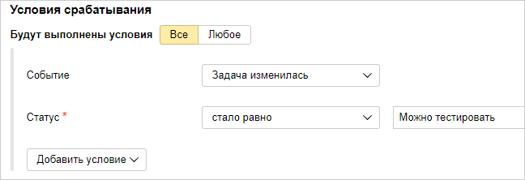

        Чтобы назначать исполнителя задачи при изменении компонентов, добавьте условие **Системные** → **Компоненты** → **стало равно** и укажите компоненты.

        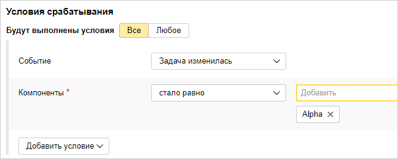

        

        Триггер с таким условием сработает, только если в задаче указан один компонент.

        

1. Задайте действие триггера: 

    1. Добавьте действие **Изменить значения в полях**.

    1. Выберите поле **Системные** → **Исполнитель** → **Установить значение** и укажите сотрудника, который должен быть назначен исполнителем при срабатывании триггера. 

        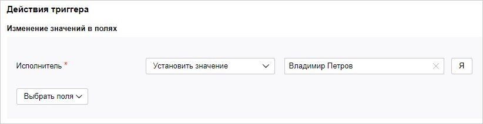

1. Сохраните триггер. 
   Чтобы проверить работу триггера, измените статус или компоненты у любой задачи из очереди, в которой вы настроили триггер.

## Автоматически призывать исполнителя задачи {#summon_ticket}

Выполнив задачу, сотрудник может забыть указать важную информацию, например, затраченное время. В этом случае можно настроить триггер, который будет автоматически призывать исполнителя, если задача закрыта и не указано затраченное время:

1. Перейдите в настройки очереди и в разделе **Триггеры** нажмите кнопку [**Создать триггер**](../user/create-trigger.md).

1. Введите название триггера.

1. Задайте условия, чтобы триггер срабатывал при закрытии задачи в случае, если поле <q>Затраченное время</q> не заполнено:

    1. Выберите опцию **Будут выполнены условия** → **Все**.

    1. Добавьте условие **Системные** → **Статус** → **стало равно** → **Закрыт**. Доступные статусы зависят от [воркфлоу](workflow.md), который настроен для очереди. 

    1. Добавьте условие **Учёт Времени** → **Затрачено времени** → **Значение поля пусто**.

1. Задайте действия триггера:

    1. Добавьте действие **Добавить комментарий**.

    1. Нажмите 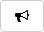 и в строке **Призвать пользователей из поля** введите <q>Исполнитель</q>.

    1. Введите текст комментария, который должен увидеть исполнитель, и выберите опцию **Отправлять от имени робота**.

1. Сохраните триггер, нажав кнопку **Создать**.

    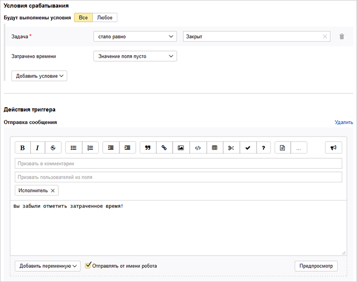

При закрытии любой задачи, где не указано затраченное время, робот будет создавать комментарий и призывать исполнителя.

## Изменять статус задачи после создания связи {#new-link}

Во многих проектах задачи зависят друг от друга, даже когда над ними работают разные люди. Если задача влияет на выполнение одной или нескольких других, важно оповестить коллег о возникших проблемах. Например, связать такие задачи между собой и установить [тип связи](../user/links.md) **Блокирует**.

Настроим триггер, который будет изменять статус задачи и добавлять комментарий для автора, если появилась связь **Блокирует**:

1. Перейдите в настройки очереди и в разделе **Триггеры** нажмите кнопку [**Создать триггер**](../user/create-trigger.md).

1. Введите название триггера.

1. Задайте условия, чтобы триггер срабатывал при появлении связи **Блокирует**:

    1. Выберите опцию **Будут выполнены условия** → **Все**.

    1. Добавьте условие **Действие со связью** → **Связь создана** → **Блокирующая задача**.

    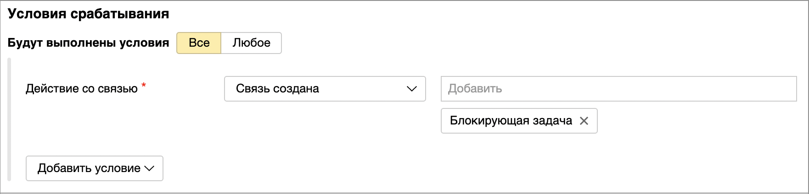

1. Задайте действия триггера:

    1. Добавьте действие **Изменить статус задачи**.

    1. В поле **Новый статус задачи** выберите статус, который будет установлен у задачи после выполнения условия. Например, **Требуется информация**. Доступные статусы зависят от [воркфлоу](workflow.md), который настроен для очереди. 

    1. Добавьте действие **Добавить комментарий**.

    1. Нажмите  и в строке **Призвать пользователей из поля** введите <q>Автор</q>.

    1. Введите текст комментария, который должен увидеть автор задачи, и выберите опцию **Отправлять от имени робота**. Иначе комментарий будет отправлен от имени пользователя, который запустил действие триггера — добавил связь. 

    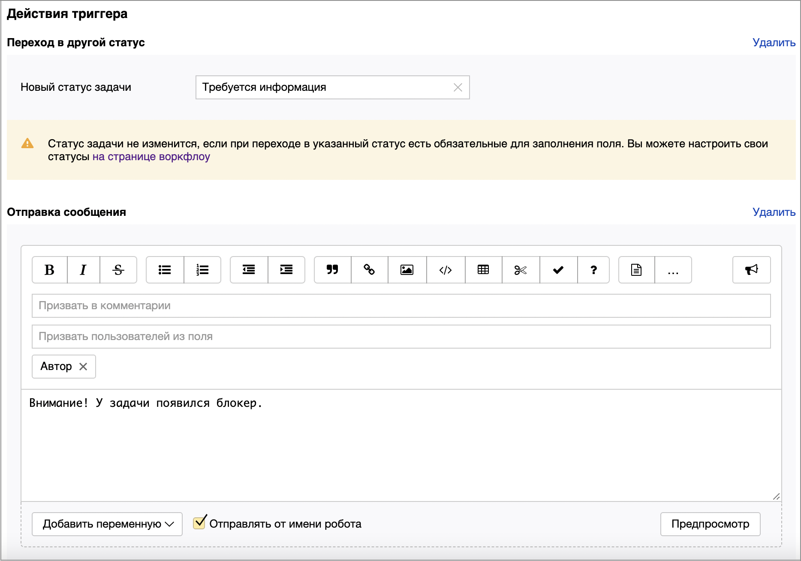

1. Сохраните триггер, нажав кнопку **Создать**.

## Отправлять уведомление о создании задачи из письма {#notify_mail}

Предположим, что сотрудники службы поддержки регистрируют обращения в {{ tracker-name }}. Пользователи пишут в службу поддержки по почте, и на основе их писем создаются задачи в {{ tracker-name }}.

Настроим триггер, который после создания задачи будет оправлять пользователю письмо о том, что его обращение зарегистрировано:

#### Шаг 1. Настроить интеграцию с почтой

Чтобы отправлять письма из {{ tracker-name }} и создавать задачи из входящих писем, настройте интеграцию с почтой:

1. [Настройте почтовый адрес для очереди](queue-mail.md#section_gwv_hqb_hgb), в которой будут создаваться задачи по обращениям пользователей.

    Если добавление адреса очереди недоступно, значит у вашей организации нет домена. Домен нужен для создания почтовых ящиков и рассылок, в том числе чтобы создать адрес очереди. Домен можно бесплатно [подключить в сервисе Яндекс 360 для бизнеса]({{ support-business-domain }}).

1. [Настройте псевдонимы и подписи](queue-mail.md#send_outside), если нужно.


1. Если пользователи не являются сотрудниками организации:

    1. [Разрешите принимать письма с внешних ящиков](queue-mail.md#mail_tasks).

    1. [Разрешите отправку писем из задач на внешние адреса](queue-mail.md#send_outside).


#### Шаг 2. Настроить триггер для отправки писем

Настройте триггер, который при создании новой задачи из письма будет отправлять пользователю уведомление по почте:

1. Перейдите в настройки очереди и в разделе **Триггеры** нажмите кнопку [**Создать триггер**](../user/create-trigger.md).

1. Введите название триггера.

1. Задайте условия, чтобы триггер срабатывал при создании новой задачи из входящего письма:

    1. Выберите опцию **Будут выполнены условия** → **Все**.

    1. Добавьте условие **Событие** → **Создана задача**.

    1. Добавьте условие **Email** → **Создано по письму на адрес** → **Равно строке** и введите почтовый адрес очереди.

    1. Включите опцию **Игнорировать регистр** на случай, если пользователь введет адрес очереди с заглавной буквы.

    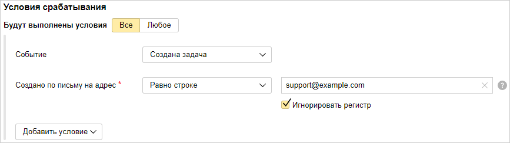

1. В качестве действия триггера задайте отправку письма:

    1. Выберите действие **Добавить комментарий**.

    1. Включите опцию **Письмо**.

    1. В поле **Кому** добавьте переменную с адресом пользователя, от которого пришло обращение. Для этого выберите поле **Кому**, нажмите кнопку **Добавить переменную** и выберите **Email** → **От**.

    1. Напишите текст письма. Вы можете добавить в письмо [параметры задачи](../user/vars.md) с помощью кнопки **Добавить переменную**.

    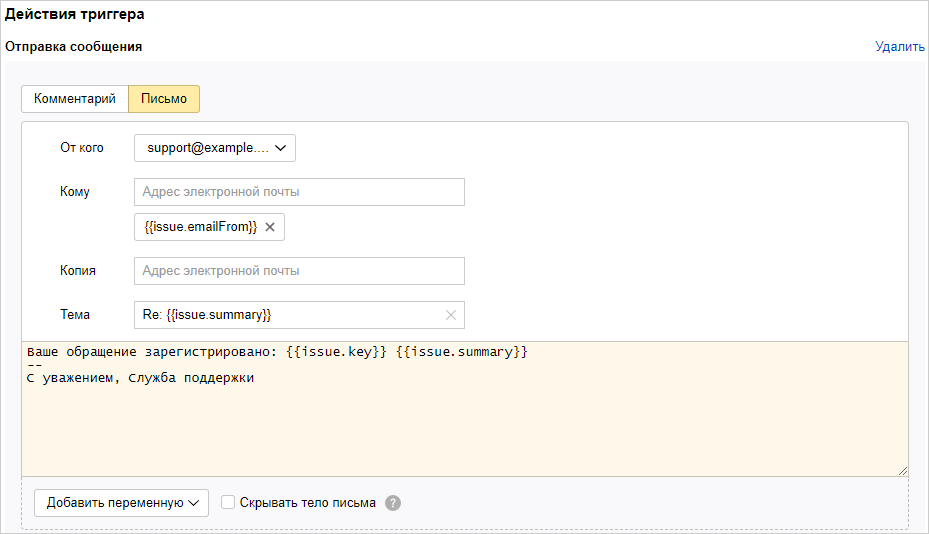

1. Сохраните триггер. 

    Чтобы проверить работу триггера, отправьте письмо на почтовый адрес очереди.

## Отправлять уведомление о создании задачи через форму {#notify_form}

Предположим, что сотрудники службы поддержки регистрируют обращения в {{ tracker-name }}. Пользователи обращаются в службу поддержки через форму обратной связи, которая создана в сервисе [{{ forms-full-name }}]({{ link-forms }}). На основе заполненной формы создаются задачи в {{ tracker-name }}.

Настроим триггер, который после создания задачи будет оправлять пользователю письмо о том, что его обращение зарегистрировано:

#### Шаг 1. Настроить интеграцию с почтой

Чтобы отправлять письма из {{ tracker-name }}, настройте интеграцию с почтой:

1. [Настройте почтовый адрес для очереди](queue-mail.md#section_gwv_hqb_hgb), в которой будут создаваться задачи по обращениям пользователей.

   Если добавление адреса очереди недоступно, значит у вашей организации нет домена. Домен нужен для создания почтовых ящиков и рассылок, в том числе чтобы создать адрес очереди. Домен можно бесплатно [подключить в сервисе Яндекс 360 для бизнеса]({{ support-business-domain }}).

1. [Настройте псевдонимы и подписи](queue-mail.md#send_outside), если нужно.

1. Если пользователи не являются сотрудниками организации, [разрешите отправку писем из задач на внешние адреса](queue-mail.md#send_outside).
   
#### Шаг 2. Настроить форму для регистрации обращений

Чтобы создавать задачи из обращений через форму:

1. Перейдите в сервис [{{ forms-full-name }}]({{ link-forms }}) и создайте новую форму.

1. Добавьте на форму вопросы, чтобы пользователь мог сообщить информацию, которая нужна для регистрации обращения.

    Чтобы узнать почтовый адрес пользователя, добавьте вопрос **Почта** и сделайте его обязательным.

    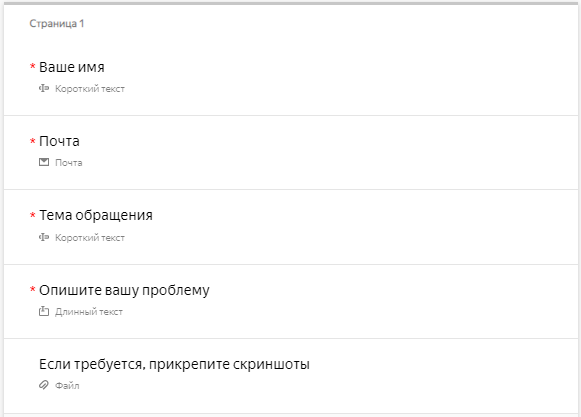

1. Настройте для формы [интеграцию с {{ tracker-name }}](../../forms/create-task.md):        

    1. Укажите очередь и другие параметры задачи.

    1. В поле **Описание задачи** добавьте ответы на вопросы формы.

    1. Чтобы сохранить в параметрах задачи почтовый адрес пользователя, добавьте поле **От** и выберите **Переменные** → **Ответ на вопрос** → **Почта**.
        
    1. Сохраните параметры интеграции.        

    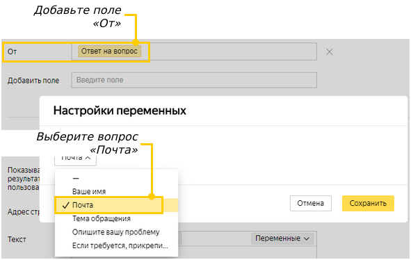

1. [Опубликуйте](../../forms/publish.md#section_link) форму.

#### Шаг 3. Настроить триггер для отправки писем

Настройте триггер, который при создании новой задачи через форму будет отправлять пользователю уведомление по почте:

1. Перейдите в настройки очереди и в разделе **Триггеры** нажмите кнопку [**Создать триггер**](../user/create-trigger.md).

1. Введите название триггера.

1. Задайте условия, чтобы триггер срабатывал при создании новой задачи из входящего письма:

    1. Выберите опцию **Будут выполнены условия** → **Все**.

    1. Добавьте условие **Событие** → **Создана задача**.

    1. Добавьте условие **Email** → **От** → **Значение поля установлено**.

    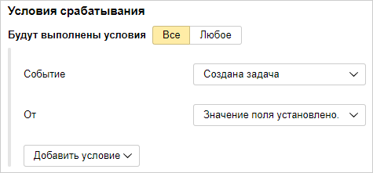

1. В качестве действия триггера задайте отправку письма:

    1. Выберите действие **Добавить комментарий**.

    1. Включите опцию **Письмо**.

    1. В поле **Кому** добавьте переменную с адресом пользователя, от которого пришло обращение. Для этого выберите поле **Кому**, нажмите кнопку **Добавить переменную** и выберите **Email** → **От**.

    1. Напишите текст письма. Вы можете добавить в письмо [параметры задачи](../user/vars.md) с помощью кнопки **Добавить переменную**.

    

1. Сохраните триггер. 

    Чтобы проверить работу триггера, заполните форму, в которой вы настроили интеграцию с {{ tracker-name }}.

## Автоматически добавлять форму в комментарии задачи {#insert_form}

С помощью триггера в комментарии задачи можно добавлять форму с автоматическим предзаполнением полей. Для этого в текст комментария нужно добавить специальный код со ссылкой на форму. Значения в поля формы можно передавать через [GET-параметры](../../forms/get-params.md). Например, передавать параметры задачи с помощью [переменных](../user/vars.md), которые доступны в триггере.

Настроим триггер, который после закрытия задачи будет добавлять форму обратной связи в комментарии и призывать исполнителя:

#### Шаг 1. Создать форму обратной связи

1. Перейдите в сервис [{{ forms-full-name }}]({{ link-forms }}) и создайте форму. 

1. Добавьте на форму вопросы, чтобы исполнитель мог сообщить необходимую информацию.

#### Шаг 2. Создать триггер для добавления формы

1. Перейдите в настройки очереди и в разделе **Триггеры** нажмите кнопку [**Создать триггер**](../user/create-trigger.md).

1. Задайте условия, чтобы триггер срабатывал при закрытии задачи:

    1. Выберите опцию **Будут выполнены условия** → **Все**.

    1. Добавьте условие **Статус** → **стало равно** → **Закрыт**.

    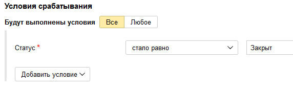

1. Добавьте действие **Добавить комментарий**.

1. В текст комментария вставьте код:

   
    ```
   {{=<% %>=}}/iframe/(src="https://forms.yandex.ru/surveys/<id_формы>/?iframe=1&<id_вопроса>=<значение>" frameborder=0 width=500)
    ```


    - Где `<id формы>` — ID формы, которую необходимо добавить;

    - `<id_вопроса>` — [идентификатор вопроса](../../forms/question-id.md#sec_question);

    - `<значение>` — значение, которое нужно подставить в поле формы.

      Чтобы передать в форму параметры задачи, в качестве значений используйте [переменные](../user/vars.md): внизу окна нажмите кнопку **Добавить переменную** и выберите  параметр задачи, затем вокруг имени переменной замените символы `not_var{{ }}` на `<% %>`.

      Например, чтобы передать ключ задачи, используйте значение `<%issue.key%>`. Чтобы передать логин исполнителя задачи, используйте значение `<%issue.assignee.login%>`.

    Пример кода, в котором в поле формы передается ключ задачи:

    
    ```
    {{=<% %>=}}/iframe/(src="https://forms.yandex.ru/surveys/68417/?iframe=1&answer_short_text_584943=<%issue.key%>" frameborder=0 width=100% height=660px scrolling=no)
    ```
   


1. Нажмите  и в строке **Призвать пользователей из поля** введите <q>Исполнитель</q>.

1. Включите опцию **Отправлять от имени робота**.


1. Сохраните триггер, нажав кнопку **Создать**.

#### Шаг 3. Добавить в очередь yndx-forms-cnt-robot@

Для корректной вставки формы дайте доступ к очереди роботу yndx-forms-cnt-robot@. Подробнее о настройке доступа читайте в разделе [Настроить доступ к очереди](queue-access.md).


После закрытия задачи робот будет создавать комментарий с формой и призывать исполнителя.

## Автоматически добавлять задачи на доску {#board}

При использовании [новой версии доски задач](agile-new.md) пока нет возможности настроить на доске фильтр, по которому задачи будут автоматически добавляться на доску. Если вам нужна такая возможность, ее можно реализовать с помощью триггера.

Вместо триггера также можно [настроить автодействие](../user/create-autoaction.md) с аналогичными условием и действием. При использовании автодействия задачи, подходящие под условие, будут добавляться на доску не сразу, а с  заданной периодичностью. 



Триггеры и автодействия работают только для задач той очереди, в которой они настроены.




Рассмотрим пример триггера, который добавляет  задачу на доску при назначении исполнителем определенного пользователя:

1. Перейдите в настройки очереди и в разделе **Триггеры** нажмите кнопку [**Создать триггер**](../user/create-trigger.md).

1. Введите название триггера.

1. Задайте условие: **Исполнитель** → **стало равно** → `<Имя пользователя>`.

   

   Триггер с таким условием сработает также в том случае, если будет создана новая задача с указанным исполнителем. 

   

1. Задайте действие:

    1. Выберите действие **Изменить значения в полях**.

    1. Выберите поле **Доски**.

    1. Выберите действие **Добавить к списку** и укажите доску, на которую нужно добавлять задачу.

   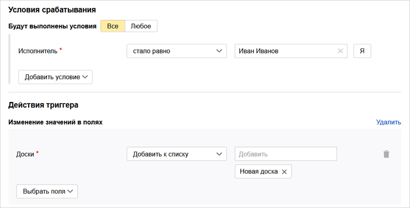

1. Сохраните триггер.


## Отправлять уведомления в мессенджеры {#section_vsn_mb2_d3b}

Для быстрого оповещения сотрудников о важных событиях удобно использовать мессенджеры. Если у мессенджера есть API, в {{ tracker-name }} можно настроить триггер, который отправляет в API мессенджера HTTP-запросы при наступлении определенных событий. Например, если в очереди создается ошибка с критическим приоритетом.

Примеры настройки триггеров для отправки уведомлений в Slack и Telegram приведены в разделе [{#T}](../messenger.md).


