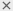

# Переходы между статусами

С помощью переходов вы можете настроить правила изменения статусов задачи: условия перехода между статусами, автоматические действия, которые выполняются при изменении статуса, экран перехода для заполнения заданных полей пользователем.

Редактировать переходы в рабочих процессах очереди может владелец очереди и пользователи, которым он выдал [доступ к настройкам очереди](queue-access.md).

## Настройки перехода {#set-transition}

В визуальном редакторе рабочих процессов можно настраивать переходы между статусами в рамках рабочего процесса. Чтобы открыть редактор рабочих процессов:

1. Перейдите на страницу очереди.

1. В верхнем правом углу нажмите  **{{ ui-key.startrek.ui_components_PageQueue_header.settings }}**.

1. Перейдите на вкладку **{{ ui-key.startrek.ui_components_page-queue-admin_QueueAdminPageContent.menu-item-workflows }}** и нажмите на название рабочего процесса, переходы которого вы хотите редактировать.

Откроется визуальный редактор рабочих процессов. Здесь можно редактировать уже добавленные переходы — для этого достаточно нажать на переход на схеме, и откроется страница с его настройками. Кроме того, на схему можно [добавлять новые переходы](#add-action).

### Автоматизация {#automatization}

Вы можете настроить автоматические действия, которые выполняет {{ tracker-name }} при переходе из статуса в статус. Это может быть отправка письма, изменение полей задачи, установка резолюций и так далее.

Чтобы добавить автоматическое действие:

1. В настройках перехода откройте раздел **{{ ui-key.startrek.ui_components_queue-admin-tab-workflows_TransitionEdit.settings-functions }}** и нажмите **{{ ui-key.startrek.ui_components_workflow-functions_WorkflowFunctionMenu.menu-title }}**.

1. Выберите из списка необходимые автоматизации и настройте их. Если подходящей автоматизации не нашлось, настройте [триггер](../user/trigger.md).

Доступные автоматизации при смене статуса задачи:
* **{{ ui-key.startrek.ui_components_workflow-functions.type-SendEmailFunction }}** — отправлять письма конкретным сотрудникам или пользователям, выполняющим роли в задаче (например, автору или исполнителю задачи).
* **{{ ui-key.startrek.ui_components_workflow-functions.type-AddCommentFunction }}** — оставлять в задаче комментарий от отпределенного пользователя (сотрудника или робота).
* **{{ ui-key.startrek.ui_components_workflow-functions.type-SetActiveSprintFunction }}** — добавить задачу в активный спринт на выбранной доске.
* **{{ ui-key.startrek.ui_components_workflow-functions.type-SetCurrentTimeFunction }}** — записать время выполнения перехода в выбранное поле.
* **{{ ui-key.startrek.ui_components_workflow-functions.type-CalculateFieldFunction }}** — просуммировать содержимое нескольких полей и записать результат в другое поле.
* **{{ ui-key.startrek.ui_components_workflow-functions.type-MoveUsersFunction }}** — переместить или скопировать пользователей из одного поля в другое.
* **{{ ui-key.startrek.ui_components_workflow-functions.type-RemoveUsersFromCcFunction }}** — убрать пользователя из наблюдателей задачи, например, если от него была получена нужная информация и дальнейшее участие в задаче не требуется. 
* **{{ ui-key.startrek.ui_components_workflow-functions.type-AddTextToFieldFunction }}** — заполнить поле в задаче. При настройке этого вида автоматизации вам поможет фильтр по типу заполняемого в поле значения.
* **{{ ui-key.startrek.ui_components_workflow-functions.type-RemoveFieldValueFunction }}** — убрать содержимое любого поля в задаче.
* **{{ ui-key.startrek.ui_components_workflow-functions.type-UnsetResolutionFunction }}** — если задача была завершена с некоторой резолюцией, эта резолюция будет отменена.

### Условия перехода {#conditions}

Вы можете настроить условия, при которых переход будет активен:

* Предыдущий переход был из статуса, в который ведет этот переход.
* Задача связана с задачей из указанной очереди.
  * Переход доступен только для связанных задач из выбранной очереди.
* Переход выполняет пользователь из группы, включая подгруппы
  * Переход могут выполнять только пользователи выбранной [группы](../access.md#group-access) и подгруппы. Условие доступно для организаций {{ yandex-360 }} для бизнеса.
* Пользователь указан в поле
  * Переход доступен пользователям из выбранного [поля](../user/create-param.md) задачи.
* Переход выполняет владелец очереди.
* Переход выполняет пользователь из списка.
  * Переход могут выполнять отдельно указанные пользователи организации.

Чтобы добавить условия перехода:

1. В настройках перехода откройте раздел **{{ ui-key.startrek.ui_components_queue-admin-tab-workflows_TransitionEdit.settings-conditions }}** и нажмите **{{ ui-key.startrek.ui_components_workflow-conditions_ConditionsMenu.add-condition }}**.

1. Выберите из списка подходящие условия и настройте их. Чтобы настроить группу условий с помощью операций **И** и **ИЛИ**, нажмите **{{ ui-key.startrek.ui_components_workflow-conditions_WorkflowGroupCondition.add-conditions-group }}**.

### Экран перехода {#screen}

Экран перехода — это всплывающее окно, с помощью которого вы можете предложить пользователю изменить определенные параметры задачи. Например, на экране перехода можно попросить пользователя проставить резолюцию, оставить комментарий или записать потраченное время.

Чтобы добавить экран перехода:

1. В настройках перехода откройте раздел **{{ ui-key.startrek.ui_components_queue-admin-tab-workflows_TransitionEdit.settings-screen }}** и активируйте опцию **{{ ui-key.startrek.ui_components_queue-admin-tab-workflows_TransitionEditPageScreen.enable-transition-screen }}**.

1. Настройте экран перехода:
   * **{{ ui-key.startrek.blocks-desktop_workflow-editor--action_tab_screen.screen-title--label-ru }}** — текст в заголовке всплывающего окна.
   * **{{ ui-key.startrek.blocks-desktop_workflow-editor--action_tab_screen.screen-title--label-en }}** — текст в заголовке всплывающего окна в английском интерфейсе.
   * **{{ ui-key.startrek.blocks-desktop_workflow-editor--action_tab_screen.screen-elements-title }}** — выберите поля, которые можно будет настроить на экране перехода. При необходимости задайте для полей значения по умолчанию. Чтобы сделать поле обязательным для заполнения, поставьте отметку справа от поля.
   * **{{ ui-key.startrek.blocks-desktop_workflow-editor--action_tab_screen.worklogs-enable }}** — включите опцию, чтобы на экране перехода появилась форма учета времени.
   * **{{ ui-key.startrek.blocks-desktop_workflow-editor--action_tab_screen.linking-enable }}** — включите опцию, чтобы на экране перехода появилась форма добавления связей с другим и задачами.
   * **{{ ui-key.startrek.blocks-desktop_workflow-editor--action_tab_screen.comment-enable }}** — включите опцию, чтобы на экране перехода появилось поле для комментария.

### Копирование настроек перехода {#copy-transition-settings}

Вы можете применять настройки одного перехода для других переходов. Для этого:

1. В настройках перехода нажмите .
1. Нажмите  **{{ ui-key.startrek.ui_components_queue-admin-tab-workflows_TransitionEdit.action-export-settings }}** или  **{{ ui-key.startrek.ui_components_queue-admin-tab-workflows_TransitionEdit.action-import-settings }}**.
1. Выберите из списка переход для вставки или копирования настроек.

## Добавить переход между статусами {#add-action}

Чтобы добавить переход между добавленными в рабочий процесс статусами:

1. Перейдите на страницу очереди.

1. В верхнем правом углу нажмите  **{{ ui-key.startrek.ui_components_PageQueue_header.settings }}**.

1. Перейдите на вкладку **{{ ui-key.startrek.ui_components_page-queue-admin_QueueAdminPageContent.menu-item-workflows }}** и нажмите на название рабочего процесса. Откроется визуальный редактор рабочих процессов.

1. На верхней панели визуального редактора процессов нажмите **Добавить переход**. Заполните поля **{{ ui-key.startrek.ui_components_queue-admin-tab-workflows_TransitionEdit.field-from-status }}** и **{{ ui-key.startrek.ui_components_queue-admin-tab-workflows_TransitionEdit.field-to-status}}** значениями из списков. Если вы хотите добавить переход для статусов, которых еще нет в рабочем процессе, сначала [добавьте их](./workflow-status-edit.md#add-status).

1. Заполните поля:
   * **Название** — будет автоматически подставлено название **Исходного статуса**. При необходимости вы можете его исправить.
   * **Название на английском** — будет сформировано автоматически из названия на русском.

1. Настройте [автоматизацию](#automatization), [условия](#conditions) и [экран перехода](#screen).

Также добавить переход можно прямо на схеме, соединив стрелкой два статуса. Для этого нужно навести курсор на свободную точку на блоке с исходным статусом, зажать курсор и довести его до свободной точки другого статуса.

Чтобы изменить точку входа/выхода перехода, зажмите курсор на линии перехода возле статуса и проведите стрелку до нужной точки.

## Удалить переход {#remove-action}

Убедитесь, что после удаления перехода не окажется статусов, в которые нельзя перейти.

1. Нажмите  рядом с названием перехода.

1. Подтвердите удаление.
