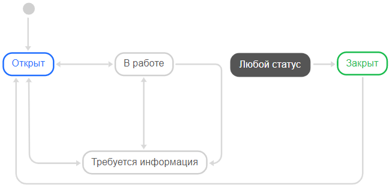
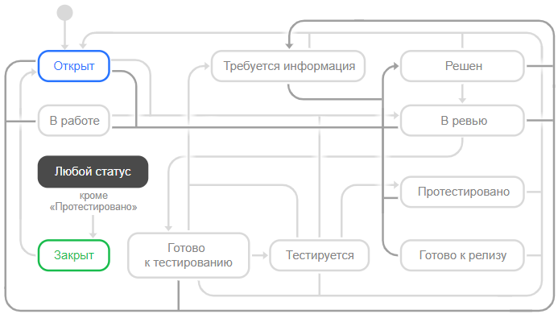
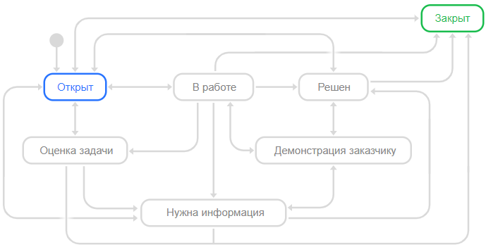
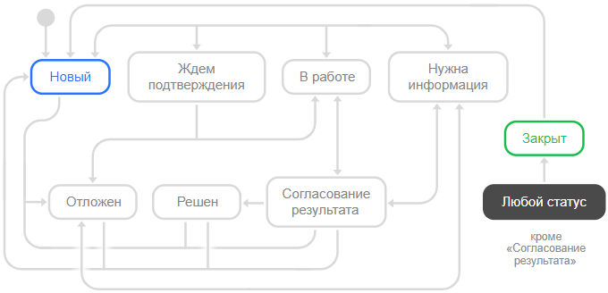
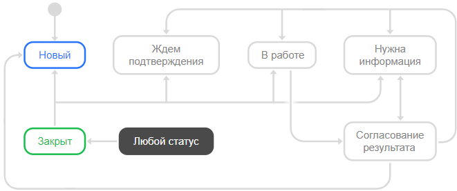
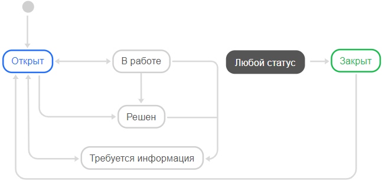
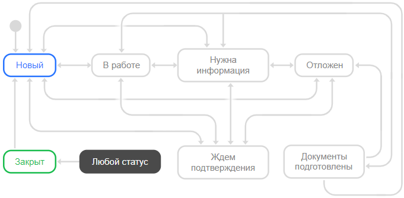
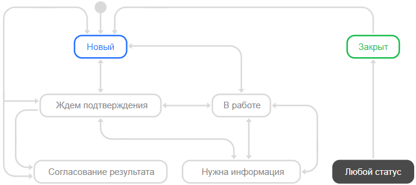
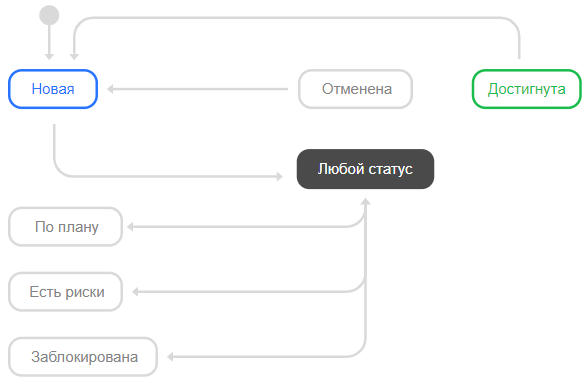

# Шаблоны очередей

Чтобы вам было проще настроить {{ tracker-name }} для работы с вашими задачами, в {{ tracker-name }} предусмотрено несколько шаблонов очередей для распространенных процессов. Шаблон очереди включает [воркфлоу](workflow.md) с предварительно настроенными типами задач и статусами. В некоторых шаблонах настроена [доска задач](agile.md#sec_boards).

## Начните прямо сейчас {#section_now}

Шаблон очереди с простым воркфлоу, который подойдет для первого знакомства с возможностями {{ tracker-name }}. Если вы выберете этот шаблон, позже можно будет настроить воркфлоу под ваши задачи.

При выборе этого шаблона автоматически создается [простая доска задач](agile.md#sec_boards).

Воркфлоу включает один тип задач: **{{ ui-key.startrek.blocks-desktop_queue-new-presets.preset--task-type--task }}**.

Задачи могут иметь статусы:

- **{{ ui-key.startrek-backend.applinks.samsara.status.open }}**;
- **{{ ui-key.startrek-backend.applinks.samsara.status.in.progress }}**;
- **{{ ui-key.startrek-backend.applinks.samsara.status.need.info }}**;
- **{{ ui-key.startrek-backend.applinks.samsara.status.closed }}**.

Возможные переходы между статусами:

При переходе задачи в статус **{{ ui-key.startrek-backend.applinks.samsara.status.closed }}** пользователю будет предложено оставить комментарий и выбрать одну из резолюций:

- **{{ ui-key.startrek-backend.applinks.samsara.resolution.resolved }}**;
- **{{ ui-key.startrek-backend.applinks.samsara.resolution.rejected }}**;
- **{{ ui-key.startrek-backend.applinks.samsara.resolution.duplicate }}**.

## Базовая разработка {#section_q5d_3rm_qz}

Этот шаблон очереди оптимизирован для разработки приложений внутри компании, когда нет внешнего заказчика.

При выборе этого шаблона автоматически создается [простая доска задач](agile.md#sec_boards).

Воркфлоу включает типы задач:

- **{{ ui-key.startrek.blocks-desktop_queue-new-presets.preset--task-type--task }}**;
- **{{ ui-key.startrek.blocks-desktop_queue-new-presets.preset--task-type--improvement }}**;
- **{{ ui-key.startrek.blocks-desktop_queue-new-presets.preset--task-type--bug }}**;
- **{{ ui-key.startrek.blocks-desktop_queue-new-presets.preset--task-type--release }}**.

Задачи могут иметь статусы:

- **{{ ui-key.startrek-backend.presets.devPreset.board.column.open }}**;
- **{{ ui-key.startrek-backend.applinks.samsara.status.in.progress }}**;
- **{{ ui-key.startrek-backend.presets.developmentPreset.board.column.need.info }}**;
- **{{ ui-key.startrek-backend.presets.developmentPreset.board.column.review }}**;
- **{{ ui-key.startrek-backend.presets.developmentPreset.board.column.ready.for.test }}**;
- **{{ ui-key.startrek-backend.presets.developmentPreset.board.column.testing }}**;
- **{{ ui-key.startrek-backend.applinks.samsara.status.resolved }}**;
- **{{ ui-key.startrek-backend.presets.developmentPreset.board.column.tested }}**;
- **{{ ui-key.startrek-backend.presets.developmentPreset.board.column.release.candidate }}**;
- **{{ ui-key.startrek-backend.presets.devPreset.board.column.closed }}**.

Возможные переходы между статусами:

При переходе задачи в статус **{{ ui-key.startrek-backend.presets.devPreset.board.column.closed }}** пользователю будет предложено оставить комментарий и выбрать одну из резолюций:

- **{{ ui-key.startrek-backend.applinks.samsara.resolution.resolved }}**;
- **{{ ui-key.startrek-backend.applinks.samsara.resolution.rejected }}**;
- **Не воспроизводится**;
- **{{ ui-key.startrek-backend.applinks.samsara.resolution.duplicate }}**;
- **Позже**.

## Разработка на заказ {#sec_outsource_dev}

Этот шаблон очереди оптимизирован для разработки приложений, у которых есть внешний заказчик.

Воркфлоу включает типы задач:

- **{{ ui-key.startrek.blocks-desktop_queue-new-presets.preset--task-type--task }}**;
- **{{ ui-key.startrek.blocks-desktop_queue-new-presets.preset--task-type--improvement }}**;
- **{{ ui-key.startrek.blocks-desktop_queue-new-presets.preset--task-type--bug }}**;
- **{{ ui-key.startrek.blocks-desktop_queue-new-presets.preset--task-type--project }}**.

Задачи могут иметь статусы:

- **{{ ui-key.startrek-backend.presets.devPreset.board.column.open }}**;
- **{{ ui-key.startrek-backend.presets.developmentPreset.board.column.need.info }}**;
- **Оценка задачи**;
- **{{ ui-key.startrek-backend.presets.devPreset.board.column.in.progress }}**;
- **{{ ui-key.startrek-backend.applinks.samsara.status.resolved }}**;
- **Демонстрация заказчику**;
- **{{ ui-key.startrek-backend.presets.developmentPreset.board.column.release.candidate }}**;
- **{{ ui-key.startrek-backend.presets.devPreset.board.column.closed }}**.

Возможные переходы между статусами:

При переходе задачи в статус **{{ ui-key.startrek-backend.presets.devPreset.board.column.closed }}** пользователю будет предложено оставить комментарий и выбрать одну из резолюций:

- **{{ ui-key.startrek-backend.applinks.samsara.resolution.resolved }}**;
- **{{ ui-key.startrek-backend.applinks.samsara.resolution.rejected }}**;
- **Не воспроизводится**;
- **{{ ui-key.startrek-backend.applinks.samsara.resolution.duplicate }}**.

## Скрам {#sec_scrum}

Этот шаблон очереди подойдет вам, если вы используете методологию [Скрам]({{ link-wiki-scrum }}).

При выборе этого шаблона автоматически создается [доска задач <q>Скрам</q>](agile.md#sec_boards), на которой можно планировать [спринты](create-agile-sprint.md), [оценивать задачи](planning-poker.md) и смотреть [диаграмму сгорания задач](burndown.md).

Воркфлоу включает типы задач:

- **{{ ui-key.startrek.blocks-desktop_queue-new-presets.preset--task-type--task }}**;
- **{{ ui-key.startrek.blocks-desktop_queue-new-presets.preset--task-type--bug }}**;
- **{{ ui-key.startrek.blocks-desktop_queue-new-presets.preset--task-type--epic }}**;
- **{{ ui-key.startrek.blocks-desktop_queue-new-presets.preset--task-type--story }}**.

Задачи могут иметь статусы:

- **{{ ui-key.startrek-backend.presets.devPreset.board.column.open }}**;
- **{{ ui-key.startrek-backend.presets.scrumDevelopmentPreset.board.column.in.progress }}**;
- **{{ ui-key.startrek-backend.presets.scrumDevelopmentPreset.board.column.need.info }}**;
- **{{ ui-key.startrek-backend.presets.scrumDevelopmentPreset.board.column.review }}**;
- **{{ ui-key.startrek-backend.presets.scrumDevelopmentPreset.board.column.ready.for.test }}**;
- **{{ ui-key.startrek-backend.presets.scrumDevelopmentPreset.board.column.testing }}**;
- **{{ ui-key.startrek-backend.applinks.samsara.status.resolved }}**;
- **{{ ui-key.startrek-backend.presets.scrumDevelopmentPreset.board.column.tested }}**;
- **{{ ui-key.startrek-backend.presets.scrumDevelopmentPreset.board.column.release.candidate }}**;
- **{{ ui-key.startrek-backend.presets.devPreset.board.column.closed }}**.

Возможные переходы между статусами:

При переходе задачи в статус **{{ ui-key.startrek-backend.presets.devPreset.board.column.closed }}** пользователю будет предложено оставить комментарий и выбрать одну из резолюций:

- **{{ ui-key.startrek-backend.applinks.samsara.resolution.resolved }}**;
- **{{ ui-key.startrek-backend.applinks.samsara.resolution.rejected }}**;
- **{{ ui-key.startrek-backend.applinks.samsara.resolution.duplicate }}**.

## Канбан {#section_lnl_jrm_qz}

Этот шаблон очереди подойдет вам, если вы используете методологию [Канбан]({{ link-wiki-kanban }}).

При выборе этого шаблона автоматически создается [доска задач <q>Канбан</q>](agile.md#sec_boards).

Воркфлоу включает типы задач:

- **{{ ui-key.startrek.blocks-desktop_queue-new-presets.preset--task-type--task }}**;
- **{{ ui-key.startrek.blocks-desktop_queue-new-presets.preset--task-type--bug }}**;
- **{{ ui-key.startrek.blocks-desktop_queue-new-presets.preset--task-type--epic }}**;
- **{{ ui-key.startrek.blocks-desktop_queue-new-presets.preset--task-type--story }}**.

Задачи могут иметь статусы:

- **{{ ui-key.startrek-backend.presets.devPreset.board.column.open }}**;
- **{{ ui-key.startrek-backend.presets.kanbanDevelopmentPreset.board.column.in.progress }}**;
- **{{ ui-key.startrek-backend.presets.kanbanDevelopmentPreset.board.column.need.info }}**;
- **{{ ui-key.startrek-backend.presets.kanbanDevelopmentPreset.board.column.review }}**;
- **{{ ui-key.startrek-backend.presets.kanbanDevelopmentPreset.board.column.ready.for.test }}**;
- **{{ ui-key.startrek-backend.presets.kanbanDevelopmentPreset.board.column.testing }}**;
- **{{ ui-key.startrek-backend.applinks.samsara.status.resolved }}**;
- **{{ ui-key.startrek-backend.presets.kanbanDevelopmentPreset.board.column.tested }}**;
- **{{ ui-key.startrek-backend.presets.kanbanDevelopmentPreset.board.column.release.candidate }}**;
- **{{ ui-key.startrek-backend.presets.devPreset.board.column.closed }}**.

Возможные переходы между статусами:

При переходе задачи в статус **{{ ui-key.startrek-backend.presets.devPreset.board.column.closed }}** пользователю будет предложено оставить комментарий и выбрать одну из резолюций:

- **{{ ui-key.startrek-backend.applinks.samsara.resolution.resolved }}**;
- **{{ ui-key.startrek-backend.applinks.samsara.resolution.rejected }}**;
- **{{ ui-key.startrek-backend.applinks.samsara.resolution.duplicate }}**.

## Сфера услуг {#section_service}

Этот шаблон очереди подойдет организациям, которые оказывают услуги компаниям и частным клиентам.

Воркфлоу включает типы задач: 

- **{{ ui-key.startrek.blocks-desktop_queue-new-presets.preset--task-type--task }}**;
- **{{ ui-key.startrek.blocks-desktop_queue-new-presets.preset--task-type--project }}**.

Задачи могут иметь статусы: 

- **{{ ui-key.startrek-backend.applinks.samsara.status.new }}**;
- **{{ ui-key.startrek-backend.applinks.samsara.status.need.info }}**;
- **Ждем подтверждения**;
- **{{ ui-key.startrek-backend.applinks.samsara.status.in.progress }}**;
- **Согласование результата**;
- **{{ ui-key.startrek-backend.applinks.samsara.resolution.resolved }}**;
- **{{ ui-key.startrek-backend.applinks.samsara.status.on.hold }}**;
- **{{ ui-key.startrek-backend.applinks.samsara.status.closed }}**.

Возможные переходы между статусами:

При переходе задачи в статус **{{ ui-key.startrek-backend.applinks.samsara.status.closed }}** пользователю будет предложено оставить комментарий и выбрать одну из резолюций:

- **{{ ui-key.startrek-backend.applinks.samsara.resolution.resolved }}**;
- **{{ ui-key.startrek-backend.applinks.samsara.resolution.rejected }}**;
- **{{ ui-key.startrek-backend.applinks.samsara.resolution.duplicate }}**.

## Производство {#section_production}

Этот шаблон очереди подойдет компаниям и подразделениям, которые производят материальные продукты.

Воркфлоу включает типы задач:

- **{{ ui-key.startrek.blocks-desktop_queue-new-presets.preset--task-type--task }}**;
- **{{ ui-key.startrek.blocks-desktop_queue-new-presets.preset--task-type--project }}**.

Задачи могут иметь статусы:

- **{{ ui-key.startrek-backend.applinks.samsara.status.new }}**;
- **{{ ui-key.startrek-backend.applinks.samsara.status.need.info }}**;
- **Ждем подтверждения**;
- **{{ ui-key.startrek-backend.applinks.samsara.status.in.progress }}**;
- **Согласование результата**;
- **{{ ui-key.startrek-backend.applinks.samsara.status.closed }}**.

Возможные переходы между статусами:

При переходе задачи в статус **{{ ui-key.startrek-backend.applinks.samsara.status.closed }}** пользователю будет предложено оставить комментарий и выбрать одну из резолюций:

- **{{ ui-key.startrek-backend.applinks.samsara.resolution.resolved }}**;
- **{{ ui-key.startrek-backend.applinks.samsara.resolution.rejected }}**;
- **{{ ui-key.startrek-backend.applinks.samsara.resolution.duplicate }}**.

## Маркетинг и реклама {#section_marketing}

Этот шаблон очереди подойдет организациям и подразделениям, которые проводят маркетинговые кампании.

При выборе этого шаблона автоматически создается [простая доска задач](agile.md#sec_boards).

Воркфлоу включает типы задач:

- **{{ ui-key.startrek.blocks-desktop_queue-new-presets.preset--task-type--task }}**;
- **{{ ui-key.startrek.blocks-desktop_queue-new-presets.preset--task-type--project }}**.

Задачи могут иметь статусы:

- **{{ ui-key.startrek-backend.applinks.samsara.status.open }}**;
- **{{ ui-key.startrek-backend.applinks.samsara.status.in.progress }}**;
- **{{ ui-key.startrek-backend.applinks.samsara.status.need.info }}**;
- **{{ ui-key.startrek-backend.applinks.samsara.resolution.resolved }}**;
- **{{ ui-key.startrek-backend.applinks.samsara.status.closed }}**.

Возможные переходы между статусами:

При переходе задачи в статус **{{ ui-key.startrek-backend.applinks.samsara.status.closed }}** пользователю будет предложено оставить комментарий и выбрать одну из резолюций:

- **{{ ui-key.startrek-backend.applinks.samsara.resolution.resolved }}**;
- **{{ ui-key.startrek-backend.applinks.samsara.resolution.rejected }}**;
- **{{ ui-key.startrek-backend.applinks.samsara.resolution.duplicate }}**.

## Документооборот {#section_docflow}

Этот шаблон очереди предназначен для процесса согласования документов.

Воркфлоу включает один тип задач: **{{ ui-key.startrek.blocks-desktop_queue-new-presets.preset--task-type--task }}**.

Задачи могут иметь статусы:

- **{{ ui-key.startrek-backend.applinks.samsara.status.new }}**;
- **{{ ui-key.startrek-backend.applinks.samsara.status.need.info }}**;
- **Ждем подтверждения**;
- **{{ ui-key.startrek-backend.applinks.samsara.status.in.progress }}**;
- **Документы подготовлены**;
- **{{ ui-key.startrek-backend.applinks.samsara.status.on.hold }}**;
- **{{ ui-key.startrek-backend.applinks.samsara.status.closed }}**.

Возможные переходы между статусами:

При переходе задачи в статус **{{ ui-key.startrek-backend.applinks.samsara.status.closed }}** пользователю будет предложено оставить комментарий и выбрать одну из резолюций:

- **{{ ui-key.startrek-backend.applinks.samsara.resolution.resolved }}**;
- **{{ ui-key.startrek-backend.applinks.samsara.resolution.rejected }}**;
- **{{ ui-key.startrek-backend.applinks.samsara.resolution.duplicate }}**.

## Кадровые процессы {#section_hr}

Этот шаблон очереди предназначен для задач отдела кадров.

Воркфлоу включает типы задач:

- **{{ ui-key.startrek.blocks-desktop_queue-new-presets.preset--task-type--absence }}**;
- **{{ ui-key.startrek.blocks-desktop_queue-new-presets.preset--task-type--mission }}**;
- **{{ ui-key.startrek.blocks-desktop_queue-new-presets.preset--task-type--changes }}**;
- **{{ ui-key.startrek.blocks-desktop_queue-new-presets.preset--task-type--documents }}**;
- **{{ ui-key.startrek.blocks-desktop_queue-new-presets.preset--task-type--request }}**.

Задачи могут иметь статусы:

- **{{ ui-key.startrek-backend.applinks.samsara.status.new }}**;
- **{{ ui-key.startrek-backend.applinks.samsara.status.need.info }}**;
- **Ждем подтверждения**;
- **{{ ui-key.startrek-backend.applinks.samsara.status.in.progress }}**;
- **Документы подготовлены**;
- **{{ ui-key.startrek-backend.applinks.samsara.status.on.hold }}**;
- **{{ ui-key.startrek-backend.applinks.samsara.status.closed }}**.

Возможные переходы между статусами:

При переходе задачи в статус **{{ ui-key.startrek-backend.applinks.samsara.status.closed }}** пользователю будет предложено оставить комментарий и выбрать одну из резолюций:

- **{{ ui-key.startrek-backend.applinks.samsara.resolution.resolved }}**;
- **{{ ui-key.startrek-backend.applinks.samsara.resolution.rejected }}**;
- **{{ ui-key.startrek-backend.applinks.samsara.resolution.duplicate }}**.

## Подбор персонала {#section_hire}

Этот шаблон очереди предназначен для процесса найма сотрудников.

Воркфлоу включает типы задач:

- **{{ ui-key.startrek.blocks-desktop_queue-new-presets.preset--task-type--vacancy }}**;
- **{{ ui-key.startrek.blocks-desktop_queue-new-presets.preset--task-type--candidate }}**.

Задачи могут иметь статусы: 
- **{{ ui-key.startrek-backend.applinks.samsara.status.new }}**;
- **{{ ui-key.startrek-backend.applinks.samsara.status.need.info }}**;
- **Ждем подтверждения**;
- **{{ ui-key.startrek-backend.applinks.samsara.status.in.progress }}**;
- **Согласование результата**;
- **{{ ui-key.startrek-backend.applinks.samsara.status.on.hold }}**;
- **{{ ui-key.startrek-backend.applinks.samsara.status.closed }}**.

Возможные переходы между статусами:

При переходе задачи в статус **{{ ui-key.startrek-backend.applinks.samsara.status.closed }}** пользователю будет предложено оставить комментарий и выбрать одну из резолюций:

- **{{ ui-key.startrek-backend.applinks.samsara.resolution.resolved }}**;
- **{{ ui-key.startrek-backend.applinks.samsara.resolution.rejected }}**;
- **{{ ui-key.startrek-backend.applinks.samsara.resolution.duplicate }}**.

## Управление целями {#section_goals}

Этот шаблон очереди предназначен для постановки целей компании или подразделения и контроля над их выполнением.

Воркфлоу включает типы задач:

- **{{ ui-key.startrek.blocks-desktop_queue-new-presets.preset--task-type--task }}**;
- **{{ ui-key.startrek.blocks-desktop_queue-new-presets.preset--task-type--project }}**.

Задачи могут иметь статусы:

- **{{ ui-key.startrek.lib_goals-info.status--NEW }}**;
- **{{ ui-key.startrek.lib_goals-info.status--PLANNED }}**;
- **{{ ui-key.startrek.lib_goals-info.status--RISK }}**;
- **{{ ui-key.startrek.lib_goals-info.status--CANCELLED }}**;
- **{{ ui-key.startrek.lib_goals-info.status--REACHED }}**;
- **{{ ui-key.startrek.lib_goals-info.status--BLOCKED }}**.

Возможные переходы между статусами:

При переходе задачи в статус **{{ ui-key.startrek-backend.applinks.samsara.status.closed }}** пользователю будет предложено оставить комментарий и выбрать одну из резолюций:

- **Успешно**; 
- **Перевыполнено**;
- **{{ ui-key.startrek-backend.applinks.samsara.resolution.duplicate }}**; 
- **Позже**;
- **Не делаем**.
