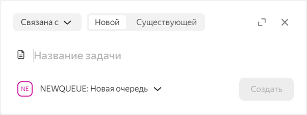

# История изменений в {{ tracker-full-name }} в июне 2023

* [Обновления](#top-news)
* [Исправления и улучшения](#fixes)

## Обновления {#top-news}

### Настройка цвета задач по статусу на диаграмме Ганта для фильтра задач {#gantt-colour-status}

В настройках [диаграммы Ганта для фильтра задач](../gantt/search.md) в разделе **Цвет** добавлена опция **по типам статусов**. Теперь именно она включена по умолчанию и устанавливает цвет задач в зависимости от типа их статуса:

* 
* 
* 
* 
* 



Тип статуса настраивается в [редакторе рабочих процессов](../manager/workflow.md).



Чтобы изменить настройку цвета задач, на странице с диаграммой Ганта нажмите **Настройки диаграммы**, в разделе **Цвет** выберите нужный пункт и нажмите **Применить**.

### Показ кнопок изменения статуса задачи {#change-status-bottoms}

Теперь в задачах можно настроить отображение кнопок изменения статуса:
- **Если включены в настройках очереди** (по умолчанию) — кнопки смены статуса будут отображаться, только если администратор очереди установил такую настройку для конкретной очереди.
- **Всегда** — кнопки смены статуса будут отображаться во всех задачах вне зависимости от настроек очереди.

Чтобы изменить персональные настройки показа кнопок, на боковой панели нажмите **Настройки** → **Интерфейс** и воспользуйтесь переключателем **Показывать кнопки изменения статуса задачи**.

Администратор очереди может настроить кнопки изменения статуса так, что они будут отображаться у всех пользователей во всех задачах этой очереди. Чтобы сделать это, перейдите на страницу очереди, нажмите кнопку **Настройки очереди** и в разделе **Основные** воспользуйтесь переключателем **Дублировать переходы из текущего статуса** под названием задачи.

### Фильтрация задач по типу статуса {#status-type-filter}
Для задач доступен новый фильтр — **Тип статуса**. У него есть следующие значения:
- **Начальный** — задачу создали и не взяли в работу.
- **В процессе** — задачу взяли в работу.
- **На паузе** — работу над задачей приостановили.
- **Завершен** — задачу выполнили и закрыли.
- **Отменен** — задачу не выполнили и закрыли.

Новый фильтр доступен в любых списках задач, при автодобавлении задач на доску и в задачах проектов.

### Обновленное всплывающее окно создания задачи {#create-task-pop-up}

Во всплывающем окне быстрого создания задачи добавлены новые возможности:
- Слева от поля **Название задачи** появилась кнопка выбора типа задачи.
- В правом верхнем углу появилась кнопка  для открытия полной формы создания задачи.

Всплывающее окно также появляется, когда для существующих задач создается новая связь. В таких случаях в левом верхнем углу окна дополнительно появляется список, в котором можно выбрать тип связи.

Добавить связь к текущей задачи можно следующими способами:

- На странице задачи нажать кнопку  **Добавить связь**.
- На странице очереди выделить одну или несколько задач и в появившемся внизу страницы разделе нажать **Добавить связь**.
- В [воркфлоу](../manager/add-workflow.md) очереди в настройках [экрана перехода](../manager/workflow-action-edit.md) выбрать опцию **Добавление связей на экране перехода**. Всплывающее окно будет появляться при смене статуса в соответствии с выставленными настройками.

### Меню действий с задачами в проектах {#task-actions-menu}

На странице проекта, на вкладках **Список задач** и **Диаграмма Ганта**, для каждой задачи добавлена кнопка . При нажатии на нее появляется всплывающее окно со списком действий, которые можно выполнить над задачей:

- **Скопировать ссылку**
- **Перенести наверх списка**
- **Перенести вниз списка**
- **Удалить из проекта**



Кнопки **Перенести наверх списка** и **Перенести вниз списка** доступны, только если на странице включена ручная сортировка.



Кнопка  появляется при наведении курсора на задачу.

### Добавление организации {{ ya-360 }} {#add-ya-360}

Добавлена возможность подключить организацию {{ ya-360 }} в интерфейсе {{ tracker-name }}. Сделать это можно на странице **Администрирование** → **Организации** в разделе **{{ ya-360 }}**. Изменения синхронизируются в течение 30 минут после добавления организации. 

## Исправления и улучшения {#fixes}

### Уведомления о призывах внутри {{ tracker-name }} {#notifications}

В разделе **Уведомления** на панели слева теперь отображаются оповещения о призывах в задачи.

### Сохранение выбора сортировки на странице проектов {#save-sorting-parametres}

На странице списка проектов теперь сохраняется сортировка. При повторном открытии списка проектов используются те же параметры сортировки, которые были установлены в прошлый раз.



Сохраненные параметры сортировки применяются, если переходить на страницу проектов по [прямой ссылке]({{ link-tracker }}/pages/projects) или на боковой панели нажать **Проекты** → **Все проекты**.



### Новый интерфейс настроек очереди {#new-queue-settings}

Страница **Настройки очереди** → **Основные** теперь доступна в новом интерфейсе.

### Горизонтальная прокрутка диаграммы Ганта для задач проекта {#gantt-horizontal-scrolling}

Добавлена возможность прокручивать диаграмму Ганта для задач проекта по горизонтали. Чтобы сделать это, наведите указатель на диаграмму, зажмите **Shift** и прокрутите колесо мыши.

Теперь эта функция доступна во [всех диаграммах Ганта в {{ tracker-name }}](../gantt/overview.md)

### Зачеркивание ключа отмененных и завершенных задач {#strikethrough-key}

В проектах и на досках теперь зачеркиваются ключи задач со статусами типа **Завершен** или **Отменен**.

Если задача закрыта с некоторой резолюцией, ее ключ, как и раньше, зачеркивается.