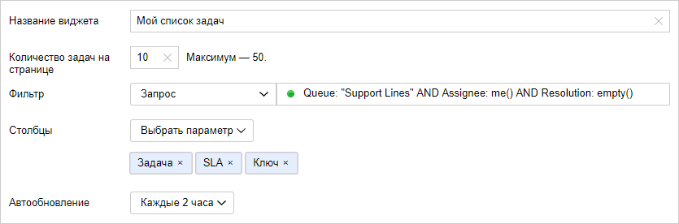
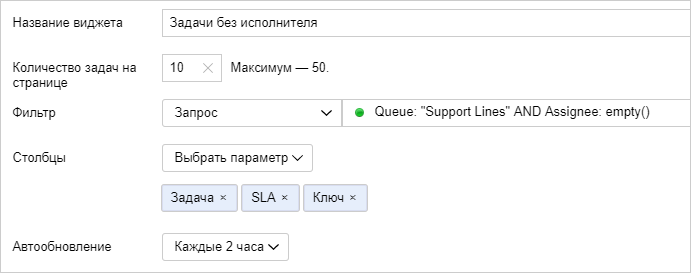
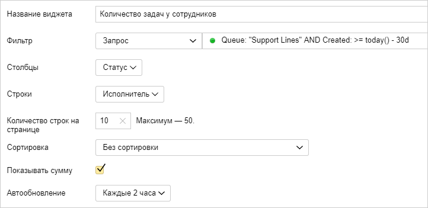
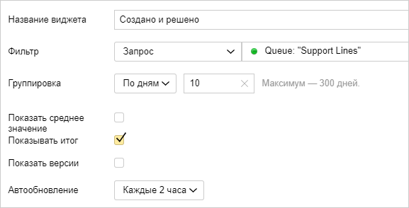
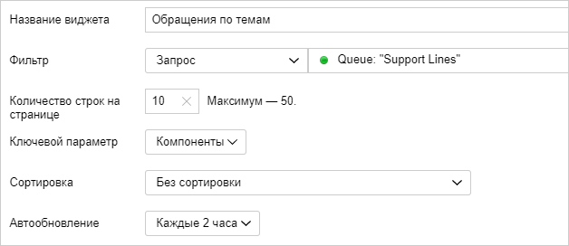

# Собирать статистику по обращениям

Руководителям и сотрудникам службы поддержки для работы нужна различная информация о текущих задачах и статистика по решенным обращениям. В {{ tracker-name }} вы можете просматривать полезную информацию и статистику на дашборде. Для этого [создайте дашборд](user/create-dashboard.md#section_cv2_ck3_pz) и добавьте на него [виджеты](user/widgets.md#section_ll1_zdp_pz) — списки задач, таблицы и графики, которые строятся автоматически по заданным фильтрам.

Например, руководитель может добавить на свой дашборд список обращений без исполнителя и статистику открытых и решенных обращений за определенный период. Сотруднику службы поддержки будет полезен список задач, в которых он назначен исполнителем, и список задач без исполнителя, которые нужно взять в работу.

Рассмотрим примеры виджетов для службы поддержки:

### Список моих задач {#widget-my-tickets}

На личный дашборд сотрудника службы поддержки добавьте виджет со списком задач, в которых он назначен исполнителем:

1. На странице дашборда нажмите  → **Редактировать**.

1. Добавьте виджет типа **Задачи**.

1. В поле **Фильтр** выберите **Запрос** и введите [текст запроса](user/query-filter.md#query-format):

    ```
    Queue: "<название_очереди>" AND Assignee: me() AND Resolution: empty()
    ```

    Этот фильтр найдет в заданной очереди незакрытые задачи, в которых вы назначены исполнителем.

1. Чтобы отобразить в списке задач [таймер правил SLA](#sla), в поле **Столбцы** добавьте параметр **{{ ui-key.startrek-backend.types.types.sla.settings }}**.

    

1. Сохраните виджет.

### Список задач без исполнителя {#widget-no-assignee}

Чтобы сотрудники службы поддержки могли быстро найти обращения, у которых нет исполнителя, и взять их в работу, добавьте на дашборд список таких задач:

1. На странице дашборда нажмите  → **Редактировать**.

1. Добавьте виджет типа **Задачи**.

1. В поле **Фильтр** выберите **Запрос** и введите [текст запроса](user/query-filter.md#query-format):

    ```
    Queue: "<название_очереди>" AND Assignee: empty()
    ```

    Этот фильтр найдет в заданной очереди задачи, у которых нет исполнителя.

1. Чтобы отобразить в списке задач [таймер правил SLA](#sla), в поле **Столбцы** добавьте параметр **{{ ui-key.startrek-backend.types.types.sla.settings }}**.

    

1. Сохраните виджет.

### Таблица с количеством задач по исполнителям {#widget-worker-tasks}

Чтобы получить статистику о том, какое количество задач было назначено на сотрудников за последние 30 дней, добавьте на дашборд виджет с таблицей:

1. На странице дашборда нажмите  → **Редактировать**.

1. Добавьте виджет типа **Сводная таблица**.

1. В поле **Фильтр** выберите **Запрос** и введите [текст запроса](user/query-filter.md#query-format):

    ```
    Queue: "<название_очереди>" AND Created: >= today() - 30d
    ```

    Этот фильтр найдет в заданной очереди все задачи, созданные за последние 30 дней.

1. В поле **Столбцы** выберите **Статус**, а в поле **Строки** выберите **Исполнитель**. Тогда в ячейках таблицы будет отображаться количество задач с определенным статусом у каждого исполнителя.

1. Чтобы отображать в таблице сумму по столбцам и строкам, включите опцию **Показывать сумму**.

    

1. Сохраните виджет.

### Статистика открытых и решенных обращений {#widget-created-resolved}

Чтобы наблюдать за динамикой создания и решения обращений, добавьте на дашборд график:

1. На странице дашборда нажмите  → **Редактировать**.

1. Добавьте виджет типа **График «Создано/Решено»**.

1. В поле **Фильтр** выберите **Запрос** и введите [текст запроса](user/query-filter.md#query-format):

    ```
    Queue: "<название_очереди>"
    ```

    Этот фильтр найдет все задачи в заданной очереди.

1. В поле **Группировка** выберите **По дням** и укажите количество дней, которое будет отображаться на графике.

1. Чтобы отображать на графике общее количество созданных и решенных обращений, включите опцию **Показывать сумму**. 

    

1. Сохраните виджет.

### Статистика обращений по темам {#widget-components}

Если вы используете компоненты для [группировки задач по темам](#group), вы можете построить диаграмму количества задач с разными компонентами:

1. На странице дашборда нажмите  → **Редактировать**.

1. Добавьте виджет типа **Статистика по задачам**.

1. В поле **Фильтр** выберите **Запрос** и введите [текст запроса](user/query-filter.md#query-format):

    ```
    Queue: "<название_очереди>"
    ```

    Этот фильтр найдет все задачи в заданной очереди.

1. В поле **Ключевой параметр** выберите **Компоненты**. 

    

1. Сохраните виджет.