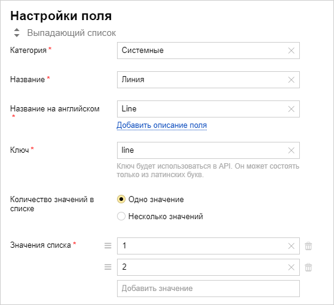
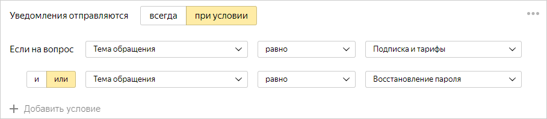
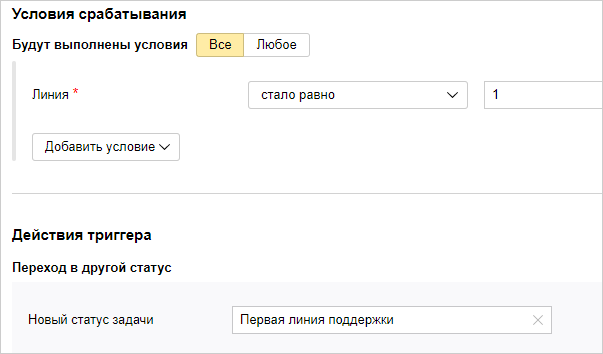

# Настроить многоуровневую структуру поддержки 

Служба поддержки часто имеет многоуровневую структуру:

- Первая линия поддержки принимает обращения пользователей, собирает необходимую информацию и решает относительно простые проблемы. Более сложные проблемы передаются на вторую линию.

- Вторая линия поддержки — это квалифицированные специалисты, которые решают сложные технические проблемы.

- В некоторых случаях организуют третью линию поддержки, которая решает наиболее сложные проблемы.

Чтобы распределять обращения между линиями поддержки и определять, на какой линии они находятся, в {{ tracker-name }} можно использовать статусы задачи или поле задачи с обозначением линии.

## Использовать статусы

Каждой линии поддержки можно сопоставить свой статус задачи. Например, в шаблоне очереди [<q>{{ ui-key.startrek.blocks-desktop_queue-new-presets.preset-title--tiered-support-preset }}</q>](manager/workflows.md#section_sup_lines) предусмотрены статусы задач <q>Первая линия поддержки</q> и <q>Вторая линия поддержки</q>. Если вам нужно организовать третью линию поддержки, [настройте дополнительный статус](manager/workflow.md).

## Использовать поле задачи

В некоторых случаях для обозначения линии поддержки удобно [создать новое поле задачи](user/create-param.md#section_pxn_fp4_xgb). Рассмотрим пример, когда пользователи [отправляют обращения через форму](#form), и нужно автоматически переводить их на первую или вторую линию поддержки в зависимости от темы обращения. При создании задачи через форму нельзя назначить ей статус, соответствующий одной из линий поддержки, потому что все новые задачи имеют статус <q>{{ ui-key.startrek.blocks-desktop_b-page-agile-admin-tab_type_card-settings.issue-status-open }}</q>. Но можно задать значение поля задачи, если в форме выбрана определенная тема обращения. В зависимости от значения поля можно автоматически изменить статус задачи.

Чтобы настроить этот процесс в {{ tracker-name }}:

### Шаг 1. Создайте новое поле задачи

Перейдите в настройки {{ tracker-name }} и [создайте новое поле](user/create-param.md#section_pxn_fp4_xgb) со следующими параметрами:

- Тип поля: **{{ ui-key.startrek.blocks-desktop_field-create-form.field-type-option-list }}**.

- Категория: **{{ ui-key.startrek-backend.fields.issue.fields.system }}**.

- Название: <q>Линия</q>. Английское название и ключ задайте на ваше усмотрение, например Line.

- Количество значений в списке: **{{ ui-key.startrek.blocks-desktop_field-create-form.value--one }}**.

- Значения списка: 1, 2 (для двухуровневой службы поддержки).

### Шаг 2. Настройте форму для приема обращений

1. Перейдите в сервис [{{ forms-full-name }}]({{ link-forms }}) и создайте новую форму.

1. Добавьте на форму вопросы, чтобы пользователь мог сообщить информацию, которая нужна для регистрации обращения.

    Чтобы распределять запросы между линиями поддержки, добавьте на форму выпадающий список <q>Тема обращения</q> и задайте популярные темы.

1. В настройках интеграции формы настройте [создание задачи в {{ tracker-name }}](../forms/create-task.md) первой линии поддержки:

    1. Настройте [условие отправки уведомления](../forms/notifications.md), в списке <q>Тема обращения</q> выбраны темы для первой линии поддержки.

        

    1. Добавьте поле задачи <q>Линия</q> и задайте значение 1.

        

    1. Чтобы назначить исполнителем задачи сотрудника, ответственного за указанную линию поддержки, укажите его логин в поле **{{ ui-key.startrek.components_FormCreateIssue.field--assignee }}**.

    1. Сохраните параметры интеграции.

1. Добавьте новую группу уведомлений и настройте условие создания задачи для второй линии поддержки и ее параметры так же, как для первой линии.

1. Сохраните настройки интеграции.

### Шаг 3. Настройте триггер для изменения статуса задач

В очереди службы поддержки создайте два триггера, которые будут изменять статус задачи при изменении поля **Линия**:

1. Перейдите в настройки очереди и в разделе **{{ ui-key.startrek.blocks-desktop_b-page-queue-admin-tab_type_triggers.title }}** нажмите кнопку [**{{ ui-key.startrek.blocks-desktop_b-page-queue-admin-tab_type_triggers.button-create }}**](user/create-trigger.md).

1. Добавьте условие **{{ ui-key.startrek-backend.fields.issue.fields.system }}** → **Линия** → **{{ ui-key.startrek-backend.messages.trigger.condition.type.fieldBecameEqual }}** → **1**.

1. Добавьте действие **{{ ui-key.startrek.blocks-desktop_trigger-action.select-action--transition }}** → **Первая линия поддержки**.

1. Сохраните триггер. 

    

1. Создайте аналогичный триггер для второй линии поддержки.

Теперь задачи, созданные через форму, будут автоматически переводиться на первую или вторую линию поддержки в зависимости от темы обращения.