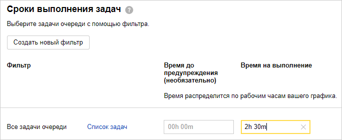
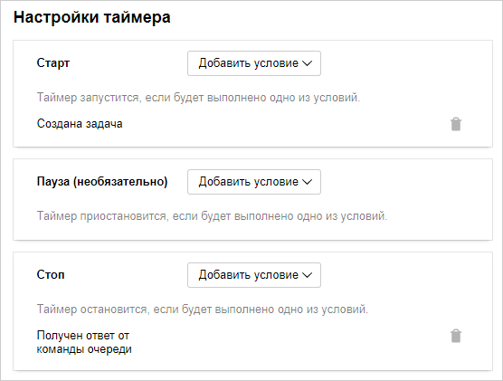
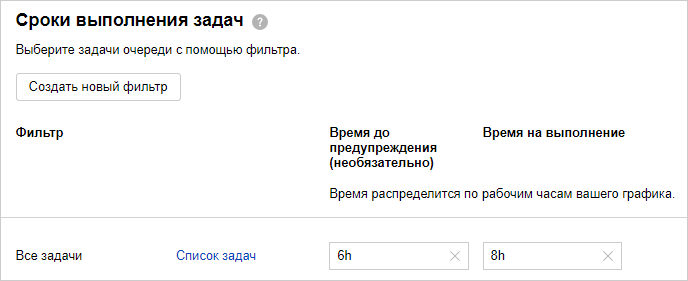
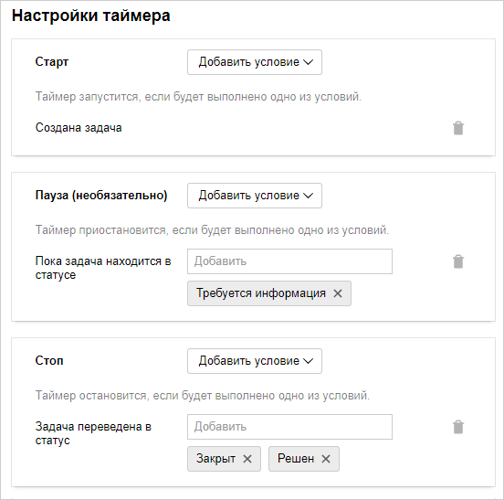

# Отслеживать время обработки обращений 

Чтобы оценить эффективность работы службы поддержки, часто измеряют время первого ответа службы поддержки и общее время обработки обращений. Чем меньше эти показатели, тем быстрее пользователи получают решение своих проблем.

Чтобы контролировать время обработки обращений в {{ tracker-name }}, [настройте правила SLA](manager/sla.md) для задач вашей очереди. В правиле можно задать допустимое время обработки задачи и настроить таймер, который запускается и останавливается при наступлении определенных событий, например при создании задачи, изменении статуса, назначении исполнителя и так далее.

Настроим правила SLA, которые будут измерять время первого ответа службы поддержки и общее время обработки обращений.

### Время первого ответа

Чтобы измерить время первого ответа службы поддержки, настройте таймер, который запускается при создании задачи и останавливается, когда сотрудник отправляет со страницы задачи комментарий или письмо.

1. Перейдите в настройки очереди и в разделе **SLA** нажмите кнопку [**Создать правило**](manager/sla.md).

1. Задайте имя правила и выберите [график работы](manager/schedule.md) — таймер будет отсчитывать время только в рабочие часы.

1. В блоке **Сроки выполнения задач** для всех задач очереди задайте: 

    - В поле **Время на выполнение** — максимальное допустимое время первого ответа. Например, чтобы указать 2 часа 30 минут, введите `2h 30m`.

    - В поле **Время до предупреждения** — время, по истечении которого нужно отправлять уведомления на почту.

    

    Чтобы настроить разное допустимое время ответа для отдельных групп задач, нажмите кнопку **Создать новый фильтр** и задайте параметры для группировки задач.

    

    

1. Настройте условия запуска и остановки таймера:

    1. В блоке **Старт** добавьте условие **{{ ui-key.startrek-backend.messages.sla.issue.created.timer.trigger.condition.type }}**.

    1. В блоке **Стоп** добавьте условие **{{ ui-key.startrek-backend.messages.sla.team.commented.timer.trigger.condition.type }}**.

    

1. Чтобы ответственный сотрудник получал оповещение по почте, если превышено допустимое время первого ответа, в блоке **Оповещение** → **Срыв сроков** выберите **{{ ui-key.startrek-backend.messages.sla.send.mail.threshold.excess.function.type }}** и укажите имя или логин сотрудника.

1. Сохраните правило.

Теперь после создания задачи в очереди службы поддержки будет включаться таймер. Он будет отсчитывать время, пока кто-то из сотрудников службы поддержки из [команды очереди](manager/queue-team.md) не отправит комментарий или письмо со страницы задачи.

### Общее время обработки обращения

Чтобы измерить общее время обработки обращения, настройте таймер, который запускается при создании задачи и останавливается, когда задача переходит в статус <q>{{ ui-key.startrek-backend.applinks.samsara.status.resolved }}</q> или <q>{{ ui-key.startrek-backend.applinks.samsara.status.closed }}</q>. Чтобы исключить из времени обработки ожидание информации от пользователя, можно ставить таймер на паузу, пока задача находится в статусе <q>{{ ui-key.startrek-backend.applinks.samsara.status.need.info }}</q>.

1. Перейдите в настройки очереди и в разделе **SLA** нажмите кнопку [**Создать правило**](manager/sla.md).

1. Задайте имя правила и выберите [график работы](manager/schedule.md) — таймер будет отсчитывать время только в рабочие часы.

1. В блоке **Сроки выполнения задач** для всех задач очереди задайте: 

    - В поле **Время на выполнение** — максимальное допустимое время решения задачи. Например, чтобы указать 8 рабочих часов, введите `8h`.

    - В поле **Время до предупреждения** — время, по истечении которого нужно отправлять уведомления на почту. Например, чтобы указать 6 рабочих часов, введите `6h`.

    

    Чтобы настроить разное допустимое время решения для отдельных групп задач, нажмите кнопку **Создать новый фильтр** и задайте параметры для группировки задач.

    

    

1. Настройте условия запуска и остановки таймера:

    1. В блоке **Старт** добавьте условие **{{ ui-key.startrek-backend.messages.sla.issue.created.timer.trigger.condition.type }}**.

    1. В блоке **Пауза** добавьте условие **{{ ui-key.startrek-backend.messages.sla.issue.on.status.timer.trigger.condition.type }}** → **{{ ui-key.startrek-backend.applinks.samsara.status.need.info }}**.

    1. В блоке **Стоп** добавьте условие **{{ ui-key.startrek-backend.messages.sla.status.changed.timer.trigger.condition.type }}** и выберите статусы **{{ ui-key.startrek-backend.applinks.samsara.status.resolved }}** и **{{ ui-key.startrek-backend.applinks.samsara.status.closed }}**.

    

1. В блоке **Оповещения** настройте отправку уведомлений о превышении сроков:

    - Если в блоке **Сроки выполнения задач** вы указали время отправки предупреждения, для отправки уведомлений через заданное время в поле **Предупреждение** выберите **{{ ui-key.startrek-backend.messages.sla.send.mail.threshold.excess.function.type }}** и укажите имя или логин сотрудника.

    - Чтобы ответственный сотрудник получал уведомление по почте, если превышено допустимое время решения задачи, в поле **Срыв сроков** выберите **{{ ui-key.startrek-backend.messages.sla.send.mail.threshold.excess.function.type }}** и укажите имя или логин сотрудника.

1. Сохраните правило.

Теперь после создания задачи в очереди службы поддержки будет включаться таймер. Он будет отсчитывать время, пока задача не перейдет в статус <q>{{ ui-key.startrek-backend.applinks.samsara.status.resolved }}</q> или <q>{{ ui-key.startrek-backend.applinks.samsara.status.closed }}</q>. Если сотрудники службы поддержки запросят у пользователя дополнительную информацию и переведут задачу в статус <q>{{ ui-key.startrek-backend.applinks.samsara.status.need.info }}</q>, таймер остановится и будет запущен, когда задача перейдет в другой статус.