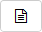

# Добавить комментарии к задаче

С помощью комментариев вы можете оставлять заметки о ходе работы, уточнять условия задачи и призывать коллег к обсуждению.



Если обсуждать задачу только в комментариях, у вас всегда будет доступ к полной истории обсуждений.



## Оставить комментарий {#leave-comment}



- Веб-интерфейс

    Чтобы прокомментировать задачу, введите текст в поле в нижней части страницы и нажмите кнопку **Отправить**. В комментариях вы можете использовать [разметку текста](markup.md), а также прикреплять к ним изображения и файлы.

    В комментарии к задаче можно указать ключ любой другой задачи — тогда {{ tracker-name }} автоматически их свяжет. Ключ задачи необходимо вводить заглавными буквами.

    
    
    

    Если в тексте вам необходимо вставить ссылку на другую задачу, но при этом избежать связывания, перед ключом задачи укажите `st:` (например, `st:TEST-1234`). В таком случае в тексте появится [магическая ссылка](wiki.md#magic-link-descr), но связь между задачами создана не будет.
    Полностью отключить автоматическое связывание задач из разных очередей можно в [настройках очереди](../manager/edit-queue-general.md).

    

    

    Если вы не отправили комментарий и закрыли либо перезагрузили страницу, текст вашего комментария сохранится в поле ввода. Продолжите вводить комментарий или удалите текст.

- Мобильное приложение

    Чтобы прокомментировать задачу, введите текст в поле **Написать комментарий** в нижней части экрана и нажмите кнопку . В комментариях вы можете использовать [разметку текста](markup.md), а также [прикреплять к ним изображения и файлы](#sec_file). Чтобы развернуть поле с комментарием на весь экран, нажмите на значок .

    В комментарии к задаче можно указать ключ любой другой задачи — тогда {{ tracker-name }} автоматически их [свяжет](ticket-links.md#add-link).



## Ответить на комментарий {#answer-comment}



- Веб-интерфейс

    1. Наведите указатель на комментарий и нажмите кнопку  **Ответить**. Комментарий, на который вы отвечаете, будет добавлен в ответ в виде цитаты. 

    1. Внесите изменения и нажмите кнопку **Отправить**.

- Мобильное приложение

    1. Нажмите  напротив комментария и выберите **Ответить**. Комментарий, на который вы отвечаете, будет добавлен в ответ в виде цитаты. 

    1. Внесите изменения и нажмите кнопку .



## Отредактировать комментарий {#edit-comment}



- Веб-интерфейс

    1. Наведите указатель на комментарий и нажмите кнопку  **Редактировать комментарий**.

    1. Внесите изменения и нажмите кнопку **Сохранить**.

    Все изменения комментариев сохраняются в [Истории изменений](history.md).

- Мобильное приложение

    1. Нажмите  напротив комментария и выберите **Редактировать**.
    
    1. Внесите изменения и нажмите кнопку .

    Все изменения комментариев сохраняются в [Истории изменений](history.md).



## Призвать в комментарии {#call-comment}



- Веб-интерфейс

    Чтобы пригласить других пользователей к обсуждению задачи:

    1. В нижней части поля ввода комментария нажмите кнопку  **Призвать**.

    1. Введите логин или имя пользователя, которого вы хотите призвать в комментарии. Чтобы добавить еще одного пользователя, снова нажмите кнопку  **Призвать**.

    1. Введите текст комментария.

    1. Нажмите кнопку **Отправить**.

- Мобильное приложение

    Чтобы пригласить других пользователей к обсуждению задачи:

    1. Выберите поле **Написать комментарий** в нижней части экрана и нажмите .

    1. Введите логин или имя пользователя, которого вы хотите призвать в комментарии, и нажмите кнопку **Сохранить**. Вы можете призвать несколько пользователей одновременно. 

    1. Введите текст комментария и нажмите кнопку .


   
Пользователи, которых вы призвали в комментарии, получат уведомление по почте, и их имена будут добавлены в поле задачи **Нужен ответ пользователя**.



Если в поле **Нужен ответ пользователя** добавить пользователя, но не призвать его при отправке комментария к задаче, уведомление по почте отправлено не будет.



## Прикрепить файл {#sec_file}



- Веб-интерфейс

    Перетащите файлы в область ввода комментария или нажмите на значок .

    Чтобы прикрепить изображение, в поле ввода комментария на панели инструментов нажмите иконку . Затем добавьте изображение по ссылке или загрузите с устройства. 

- Мобильное приложение

    Чтобы прикрепить файл к комментарию:

    1. Выберите поле **Написать комментарий** в нижней части экрана и нажмите . 
    
       * Чтобы добавить фото или видео с камеры телефона, нажмите на иконку **Камера**. Когда все будет готово, нажмите **ОК**. Чтобы переснять фото или видео, нажмите **Повтор**.

       * Чтобы добавить приложения из памяти телефона, нажмите на иконку **Файлы** и выберите файлы.

       

       Если вы добавляете файлы в приложении впервые, подтвердите разрешение для доступа к камере и файлам на вашем телефоне.

       

    1. Введите текст комментария и нажмите кнопку .

    Прикрепленные файлы отображаются под комментарием.



## Поделиться комментарием {#share-comment}



- Веб-интерфейс

    Чтобы скопировать ссылку на комментарий, наведите на него указатель и нажмите кнопку  →  **Скопировать ссылку**. Вы также можете нажать на дату рядом с именем автора комментария: ссылка появится в адресной строке браузера.

- Мобильное приложение
    
    Чтобы скопировать ссылку на комментарий, напротив него нажмите кнопку  и выберите **Скопировать ссылку**.



## Удалить комментарий {#delete-comment}



- Веб-интерфейс

    Чтобы удалить комментарий, наведите на него указатель и нажмите кнопку  →  **Удалить**.

- Мобильное приложение

    Чтобы удалить комментарий, нажмите  напротив комментария и выберите **Удалить**.



 ## Создать комментарий письмом {#create-comment-from-mail}

Чтобы создать комментарий по почте, ответьте на любое уведомление об изменении задачи:

1. Откройте письмо с уведомлением об изменении задачи.

1. Напишите текст комментария в теле письма.

1. Нажмите кнопку **Отправить**.

Комментарий создастся автоматически после отправки письма.



## Использовать шаблоны {#template-comment}

#### Создать шаблон {#create-template}

Если вам часто приходится оставлять похожие комментарии, создайте для них шаблон. Вы можете создать шаблон на [специальной странице](ticket-template.md) или из текста комментария:

1. Введите комментарий, который вы хотите сделать шаблоном.

1. Нажмите кнопку .

1. Выберите **Создать шаблон из комментария** из выпадающего списка.

1. Введите имя шаблона.

1. Если вы хотите, чтобы шаблон был доступен только в этой очереди, выберите опцию **Привязать шаблон к очереди**.

1. Нажмите кнопку **Создать**.

#### Использовать шаблон {#use-template}

Чтобы создать комментарий из шаблона:

1. Убедитесь, что поле для комментариев не содержит текста.

1. Нажмите кнопку .

1. Выберите шаблон из выпадающего списка и нажмите кнопку **Выбрать**.

1. При необходимости отредактируйте комментарий. Чтобы опубликовать его, нажмите кнопку **Отправить**.

## Создать задачу на основе комментария {#create-task}

Если при обсуждении возникла необходимость в новой задаче, вы можете создать ее прямо из комментария:

1. Нажмите на комментарий, на основе которого будет создана задача.

1. Нажмите кнопку **Создать задачу** и выберите тип связи.

1. Заполните поля так же, как при обычном [создании задачи](create-ticket.md#create-task).

1. Нажмите кнопку **Создать**.



## Настроить порядок комментариев {#order-comments}

По умолчанию комментарии следуют в хронологическом порядке. Чтобы помещать последние комментарии в начале списка, справа от блока **Активность** нажмите кнопку  **Сначала новые**.

Записи об изменениях задачи, которые отображаются при выборе варианта **История**, будут также следовать в порядке от последнего к первому.

## Отправить комментарий на почтовый адрес пользователя {#send-comment}

Отправка писем из комментариев возможна, если настроена [интеграция с почтой](../manager/queue-mail.md).



Отправлять комментарии **внешним** пользователям можно, только если это разрешено [настройками очереди](../manager/edit-queue-general.md).



Вы можете отправлять письма внешним и внутренним пользователям прямо со страницы задачи. Текст письма прикрепится к задаче в виде комментария.

Чтобы отправить письмо со страницы задачи:

1. На панели над полем для нового комментария выберите опцию **Письмо**.

1. Выберите из списка, с какого адреса будет отправлено письмо:

    * Адрес очереди

        В поле <q>От кого</q> получатель увидит адрес очереди. Ответ на такое письмо станет комментарием к задаче. 
        
        Для очереди можно [настроить](../manager/queue-mail.md) несколько почтовых адресов: на домене организации или любом другом почтовом сервере.

    * Личный адрес пользователя {{ tracker-name }}

        В поле <q>От кого</q> получатель увидит ваше имя и личный почтовый адрес, который привязан к аккаунту в {{ tracker-name }}. Ответ на такое письмо придет на ваш личный почтовый адрес.

1. Для адреса очереди вы можете выбрать **Псевдоним**. Псевдоним используется, когда письмо необходимо отправить не от имени человека, а, например, от всей организации или сервиса.
   
   Создайте один или несколько псевдонимов в настройках [почтового адреса очереди](../manager/queue-mail.md).

1. Укажите адресата и введите текст письма.

   Чтобы отправить копию письма другому получателю, нажмите кнопку **+ Копия** и выберите адрес.

1. Нажмите кнопку **Отправить**.

Ответ пользователя автоматически отразится в комментарии к задаче.
