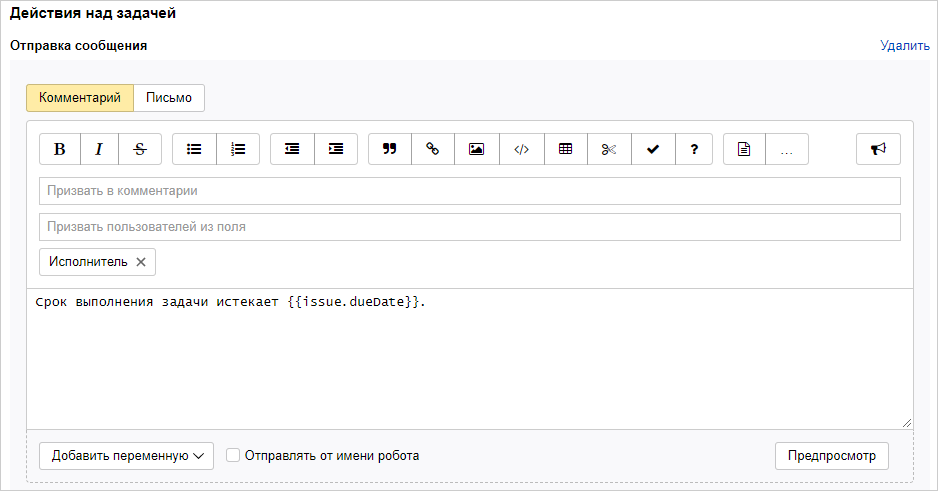

# Автоматическое обновление задач

В {{ tracker-name }} можно периодически обновлять задачи очереди, которые подходят под условия заданного фильтра. Например, с помощью автодействия можно каждый час проверять задачи с определенными компонентами и назначать исполнителя, если он не назначен. Или призывать ответственных в комментарии, если задача давно не обновлялась.



При срабатывании автодействия обрабатываются только первые 100 задач, подходящие под заданные условия.



## Настроить автоматическое обновление задач {#section_eh1_zlr_kgb}

1.  

1. В правом верхнем углу нажмите  **{{ ui-key.startrek.ui_components_PageQueue_header.settings }}**.

1. На панели слева выберите **{{ ui-key.startrek.blocks-desktop_b-page-queue-admin.group-title--automatization }}** → **{{ ui-key.startrek.blocks-desktop_b-page-queue-admin-tab_type_autoactions.title }}** и нажмите кнопку **{{ ui-key.startrek.blocks-desktop_b-page-queue-admin-tab_type_autoactions.button-create }}**.

1. Выберите тип **{{ ui-key.startrek.blocks-desktop_b-page-queue-admin-tab_type_autoaction-editor.type-toggle--update }}**.

1. Задайте название для автодействия.

1. Задайте периодичность автоматического обновления задач в часах или днях.

1. Чтобы отобрать задачи, к которым будет применяться автодействие, настройте параметры фильтра одним из способов:
    - Нажмите кнопку **{{ ui-key.startrek.blocks-desktop_b-page-queue-admin-tab_type_autoaction-editor.action_add-condition }}**, выберите поле задачи и укажите его значение.
        При необходимости вы можете добавить несколько условий. Автодействие сработает, если они будут выполняться одновременно.
    - Нажмите на кнопку **{{ ui-key.startrek.blocks-desktop_b-page-queue-admin-tab_type_autoaction-editor.filter-type--query }}** и задайте условие с помощью [языка запросов](query-filter.md).

1. Задайте одно или несколько действий над задачей:

    - **{{ ui-key.startrek.blocks-desktop_trigger-action.select-action--transition }}**

         Задайте новый статус задачи. Доступные статусы определяются настройками [воркфлоу](../manager/workflow-status-edit.md).

               
         

         Автоматические действия выполняет служебный робот `yndx-tracker-cnt-robot@`. Чтобы робот смог изменить статус задачи:

         - Если для перехода в статус [настроены условия](../manager/workflow-action-edit.md#section_jrk_hmb_wbb), ограничивающие права пользователей на изменение статуса, добавьте в список пользователей робота `yndx-tracker-cnt-robot@`.

         - Если для перехода в статус [настроен экран перехода](../manager/workflow-action-edit.md#section_uf2_sks_gcb), проверьте, что в нем отсутствуют обязательные для заполнения поля.

         

    - **{{ ui-key.startrek.blocks-desktop_trigger-action.select-action--field }}**

        Чтобы изменить значения одного или нескольких полей, выберите поля и [задайте новые значения](set-action.md#section_mod_fields).

    - **{{ ui-key.startrek.blocks-desktop_trigger-action.select-action--comment }}**

        Напишите текст комментария, который будет добавлен к задаче.

        Вы можете подставить в комментарий [значения полей задачи](vars.md). Для этого нажмите кнопку **{{ ui-key.startrek.blocks-desktop_trigger-action.action_add-variable }}**.

    - **{{ ui-key.startrek.blocks-desktop_trigger-action.select-action--formula }}**

        Вы можете [настроить поле](set-action.md#section_calc_field), значение которого вычисляется автоматически на основе значений других полей задачи. 

    - **{{ ui-key.startrek.blocks-desktop_trigger-action.select-action--webhook }}**

        Когда срабатывает автодействие, можно [отправлять HTTP-запрос](set-action.md#create-http).

1. Чтобы сохранить автодействие, нажмите кнопку **{{ ui-key.startrek.blocks-desktop_b-page-queue-admin-tab_type_trigger-editor.action_create }}**.

## Пример автоматического обновления {#autoaction_example}

Если задачу нужно выполнить к определенному сроку, срок можно указывать в поле **{{ ui-key.startrek-backend.fields.issue.dueDate-key-value }}**. Чтобы исполнители не забывали выполнять задачи вовремя, с помощью автообновления можно отправлять им напоминания за несколько дней до дедлайна.

Настроим ежедневное автообновление, чтобы призывать исполнителя задачи в комментарии, если до дедлайна осталось 3 дня или меньше:

1. Перейдите в настройки очереди, в которой нужно создать автоматическое напоминание о дедлайне.

1. В разделе **{{ ui-key.startrek.blocks-desktop_b-page-queue-admin-tab_type_autoactions.title }}** нажмите кнопку [**{{ ui-key.startrek.blocks-desktop_b-page-queue-admin-tab_type_autoactions.button-create }}**](create-autoaction.md#section_eh1_zlr_kgb).

1. Выберите тип автодействия **{{ ui-key.startrek.blocks-desktop_b-page-queue-admin-tab_type_autoaction-editor.type-toggle--update }}** и задайте название.

1. Задайте период обновления 1 раз в день.

1. Настройте условие, чтобы автодействие срабатывало для нерешенных задач (без резолюции), если до дедлайна осталось 3 дня или меньше. Для этого в блоке **{{ ui-key.startrek.blocks-desktop_b-page-queue-admin-tab_type_autoaction-editor.label_filter }}** выберите **{{ ui-key.startrek.blocks-desktop_b-page-queue-admin-tab_type_autoaction-editor.filter-type--query }}** и задайте условие с помощью [языка запросов](query-filter.md): 

    ```
    Resolution: empty() AND Deadline: <= today() + 3d
    ```

    

1. Настройте действие — призыв в комментарии исполнителя задачи:

    1. Нажмите **{{ ui-key.startrek.blocks-desktop_b-page-queue-admin-tab_type_autoaction-editor.action_add-action }}** и выберите **{{ ui-key.startrek-backend.types.types.trigger.action.create.comment }}**.

    1. В поле **{{ ui-key.startrek.blocks-desktop_trigger-action.createcomment--invite-from-field }}** нажмите  и введите **Исполнитель**.

    1. Напишите текст комментария. Вы можете добавить в комментарий параметры задачи с помощью кнопки **{{ ui-key.startrek.blocks-desktop_trigger-action.action_add-variable }}**.

   

1. Сохраните автодействие.

Созданное автодействие будет раз в день проверять задачи в очереди. Если задача не решена и дедлайн наступит менее чем через 3 дня, исполнитель будет призываться в комментарии.


