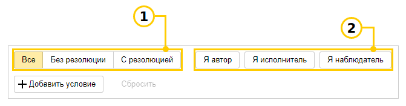
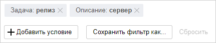

# Создать фильтр задач

Если для поиска задач в {{ tracker-name }} вам не хватает [системных фильтров](default-filters.md), вы можете создать свой фильтр и искать задачи по любым параметрам: названию, описанию, текстам комментариев, значениям полей, дате изменения и так далее. Например, с помощью фильтра можно найти все задачи в заданной очереди, у которых вы автор или исполнитель.

Сохраненные фильтры можно использовать, чтобы отбирать задачи для [дашбордов](dashboard.md) и [Agile-досок](../manager/create-agile-board.md).

## Создать фильтр {#create}

### Шаг 1. Откройте список задач {#open-tasks}

Чтобы открыть все задачи, которые доступны вам в {{ tracker-name }}: 

 * на панели слева откройте  **Задачи**, затем в нижней части окна нажмите кнопку **Все задачи**;

 * или перейдите по [прямой ссылке]({{ link-tracker }}issues).

### Шаг 2. Задайте условия фильтрации {#set-conditions}

Чтобы задать условия фильтра, можно использовать несколько способов:

- **Быстрая фильтрация**

    Используйте кнопки управления быстрыми фильтрами, которые расположены над списком задач. Чтобы отфильтровать задачи по [резолюции](../manager/create-resolution.md), нажмите кнопку **Резолюция** и выберите нужные значения из списка.

      

    
        
    1. Фильтр по резолюции. Выберите одну из опций:

        - **Все** — на странице отображаются все задачи, независимо от наличия резолюции.

        - **Без резолюции** — на странице отображаются только задачи без резолюции (не решенные).

        - **С резолюцией** — на странице отображаются только задачи с резолюцией (решенные).

    1. Группа фильтров для поиска задач по вашей роли. Вы можете включить несколько фильтров одновременно:

        - **Я автор**.

        - **Я исполнитель**.

        - **Я наблюдатель**.

    В результате в списке останутся только те задачи, которые удовлетворяют выбранным фильтрам.

    

- **Условия поиска по параметрам**

    Добавьте параметры задачи и укажите их возможные значения:

    1. Над списком задач нажмите кнопку  **Добавить поле для фильтрации**.

    1. Выберите параметр задачи, затем задайте его значение. 

        В списке останутся только те задачи, параметры которых удовлетворяют заданному условию.
		

        

        [Локальное поле задачи](../local-fields.md) можно выбрать, только если в условиях поиска указана очередь, к которой привязано поле.

        

        
    1. Если нужно уточнить условия поиска, добавьте еще несколько параметров.

    Например, вы можете искать задачи по названию или описанию: 

    - Чтобы найти задачи, названия которых содержат заданную фразу, добавьте в условия поиска параметр **Задача** и введите текст для поиска.

    - Чтобы найти задачи, описания которых содержат заданную фразу, добавьте в условия поиска параметр **Описание** и введите текст для поиска.

      

    

    

    

    Если вы зададите несколько условий поиска, будут найдены только те задачи, которые удовлетворяют всем условиям одновременно.

    

- **Язык запросов**

    Язык запросов позволяет задать условия, которые невозможно настроить с помощью параметров. Например, найти задачи, которые были открыты в течение последней недели. Подробнее о языке запросов читайте в разделе [{#T}](query-filter.md).

    1. В правом верхнем углу страницы нажмите  **Язык запросов**. Все параметры поиска, которые вы задали с помощью быстрых фильтров и условий, отобразятся в строке запроса.

    1. Добавьте в строку условия с помощью [языка запросов](query-filter.md).

        В списке останутся только те задачи, параметры которых удовлетворяют заданному условию.

### Шаг 3. Настройте внешний вид списка задач

- Чтобы отобразить или скрыть параметры задач, справа над списком нажмите  **Настройки**, выберите параметры и нажмите кнопку **Применить**.

- Чтобы сгруппировать задачи по определенному параметру, над списком нажмите  **Без группировки** и выберите параметр.

- Чтобы свернуть панель со списком фильтров, в верхнем правом углу нажмите  **Параметры**. 

### Шаг 4. Сохраните фильтр

Если вам часто приходится пользоваться одним и тем же фильтром, сохраните его. Ваши сохраненные фильтры доступны в поле выбора **Все задачи** в разделе **Мои**.

1. Над списком задач нажмите кнопку **Сохранить**.

1. Задайте название фильтра и выберите категорию для сохранения.

1. Нажмите кнопку **Сохранить**.

Чтобы сохранить список задач, найденных с помощью фильтра, в правом верхнем углу нажмите кнопку  **Экспортировать** и выберите формат файла для загрузки или скопируйте список в буфер обмена.

## Редактировать фильтр {#edit}

#### Изменить условия фильтра

1. В верхней части окна в поле **Все задачи** выберите ваш фильтр.

1. [Измените условия поиска задач](#set-conditions) с помощью быстрых фильтров, параметров или языка запросов.

1. Над списком задач нажмите кнопку **Сохранить**:

    * Чтобы сохранить фильтр под текущим именем, нажмите кнопку **Сохранить**.

    * Чтобы сохранить фильтр под другим именем, нажмите кнопку **Сохранить как новый**. Затем задайте имя фильтра, выберите категорию и нажмите кнопку **Сохранить**.

  

#### Настроить доступ к фильтру

Вы можете делиться с коллегами сохраненными фильтрами. По умолчанию другие сотрудники смогут просматривать ваши фильтры, только если вы поделитесь с ними ссылкой на них. Чтобы изменить настройки:

1. На верхней панели {{ tracker-name }} в меню **Задачи** → **Мои фильтры** выберите ваш фильтр.

1. На панели слева наведите указатель на фильтр и нажмите значок .

1. По умолчанию доступ к фильтру есть у всех сотрудников. Чтобы закрыть доступ к фильтру, удалите из списка группу **Все сотрудники**.

1. Добавьте пользователей, отделы или команды, которым вы хотите предоставить доступ.

1. В столбце **Права доступа** укажите, какие права вы хотите предоставить пользователям:

    - **Просмотр** — пользователи смогут просматривать фильтр, если вы поделитесь с ними ссылкой. Изменить фильтр они не смогут.

    - **Редактирование** — пользователи смогут просматривать и редактировать фильтр, если вы поделитесь с ними ссылкой.

    - **Добавить в общую папку** — фильтр появится у пользователей в папке **Общие** на панели слева. Это никак не повлияет на права доступа к фильтру.

1. Нажмите кнопку **Сохранить**.



#### Удалить фильтр

1. В верхней части окна в поле **Все задачи** выберите ваш фильтр.

1. Удалите фильтр одним из способов:

    * Справа от названия фильтра нажмите значок  **Удалить**. 

    * В верхнем правом углу страницы нажмите значок  **Действия над фильтром** и выберите  **Удалить**. 