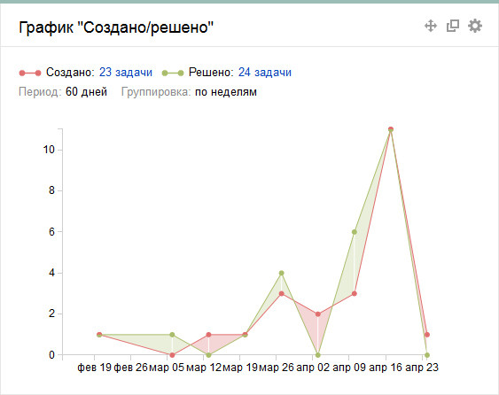

# График «Создано/Решено»

График позволяет сравнить количество созданных и закрытых задач. Вы можете указать период и шаг для сбора статистики.

Чтобы настроить виджет, задайте параметры:

- **Название виджета** — название, которое отображается в заголовке виджета.

- **Источник задач** — фильтр, на основе которого формируется список задач. Вы можете выбрать [системный](default-filters.md) или [созданный ранее](create-filter.md) фильтр из списка или задать фильтр с помощью [языка запросов](query-filter.md) или параметров.

- **Группировка** — выберите шаг и укажите период для сбора статистики.

- **Отображать тренд** — если опция включена, под графиком отображается линия тренда.

- **Суммировать значения** — если опция включена, в каждом последующем шаге учитываются данные, накопленные за предыдущие.

- **Показать версии** — если опция включена, на графике отображаются версии, к которым относятся задачи.

