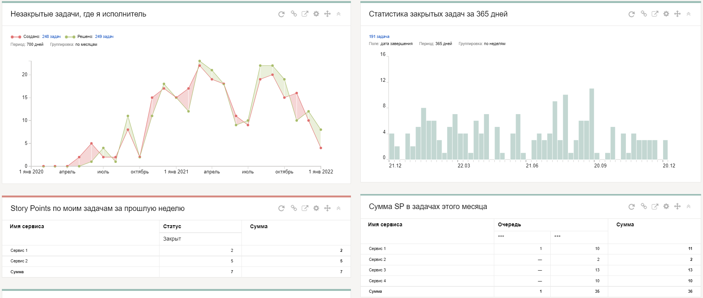

# Дашборды

_Дашборды_ позволяют отслеживать состояние важных задач на одной странице. На дашборде вы можете разместить [виджеты](widgets.md) — небольшие карточки с полезной информацией. Это могут быть списки задач, статистика их выполнения, сводные таблицы или заметки.

Содержимое виджетов генерируется автоматически. Список задач, на основе которого формируется виджет, задается с помощью [фильтра](create-filter.md). Примеры виджетов для дашборда службы поддержки можно найти в разделе [{#T}](../support-process-dashboards.md).



На дашборд не попадут задачи, к которым у вас нет доступа.



Вы можете создать несколько дашбордов с разным набором виджетов и, при необходимости, переключаться между ними. Любой ваш дашборд вы можете [сделать стартовой страницей](startpage-dashboard.md) или [поделиться](share-dashboard.md) им с коллегой.

- [{#T}](create-dashboard.md)
- [{#T}](edit-dashboard.md)
- [{#T}](share-dashboard.md)
- [{#T}](startpage-dashboard.md)
- [{#T}](widgets.md)

