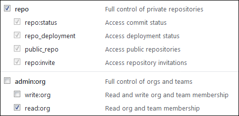

# GitHub

В [задачах {{ tracker-name }}](../about-tracker.md#zadacha) можно автоматически добавлять ссылки на коммиты из GitHub, указывая [ключ](../glossary.md#key) нужной задачи в комментарии к коммиту. Ссылки будут размещаться на вкладке **{{ ui-key.startrek-backend.fields.issue.commits-key-value }}**.

## Подключить репозиторий {#repo}

Чтобы подключить репозиторий на [GitHub](https://github.com) к {{ tracker-name }}:



- Публичный репозиторий

    1. 

    1.  

    1. В поле **{{ ui-key.startrek.blocks-desktop_repository-modal.platform }}** выберите GitHub.

    1. Укажите адрес публичного репозитория в формате `https://github.com/<логин_владельца_репозитория>/<имя_репозитория>`. Поле **{{ ui-key.startrek.blocks-desktop_repository-modal.token }}** оставьте пустым.

    1. Нажмите кнопку **{{ ui-key.startrek.blocks-desktop_repository-modal.button--connect }}**.

    1. Убедитесь, что статус репозитория отображается в {{ tracker-name }} как **{{ ui-key.startrek.blocks-desktop_page-admin-tab_type_repositories.status--success }}**.

- Закрытый репозиторий

    1. 

    1. 

    1. В поле **{{ ui-key.startrek.blocks-desktop_repository-modal.platform }}** выберите GitHub.

    1. Получите на GitHub OAuth-токен для своего репозитория:

        - Авторизуйтесь на GitHub. Если репозиторий прикреплен к GitHub-организации, убедитесь, что у вас есть права администратора.

        - Нажмите на свое фото в правом верхнем углу и выберите **Settings**.
        - На панели слева выберите **Developer settings** → **Personal access token** → **Tokens (classic)**.
        - Нажмите кнопку **Generate new token**.

        - Придумайте название для токена.

        - Настройте разрешения для токена. Для правильной работы с {{ tracker-name }} необходимо, чтобы опции **repo** и **read:org** были включены:

            

        - Нажмите кнопку **Generate token**.

        - Скопируйте токен в буфер обмена.

            

            Значение токена отображается только один раз. Если закрыть страницу, вы больше не сможете его просмотреть.

            

    1. Укажите адрес репозитория в формате `https://github.com/<логин_владельца_репозитория>/<имя_репозитория>` и токен для подключения.

    1. Нажмите кнопку **{{ ui-key.startrek.blocks-desktop_repository-modal.button--connect }}**.

    1. Убедитесь, что статус репозитория отображается в {{ tracker-name }} как **{{ ui-key.startrek.blocks-desktop_page-admin-tab_type_repositories.status--success }}**.





## Собственный сервер {#on-premise}


