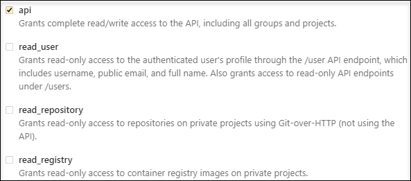

# {{ GL }}

## Настроить связь {#relation}

В [задачах {{ tracker-name }}](../about-tracker.md#zadacha) можно автоматически добавлять ссылки на [Merge Requests]({{ gl.docs }}/ee/user/project/merge_requests/) из {{ GL }}, указывая [ключ](../glossary.md#key) нужной задачи в названии или описании нового Merge Request. Ссылки будут размещаться в разделе [{{ ui-key.startrek.ui_components_issue-links_ExternalLinksCollapse.external-relations}}](../external-links.md).

Дополнительно можно включить автоматическое создание комментариев в задаче с информацией о Merge Requests. Автоматическое комментирование доступно только для [{{ mgl-name }}](../../managed-gitlab/).





### См. также {#see-also}

* [Практическое руководство по интеграции {{ GL }} с {{ tracker-full-name }}](../../managed-gitlab/tutorials/tracker-integration.md).

## Подключить репозиторий {#repo}

Чтобы подключить репозиторий на [GitLab](https://gitlab.com) к {{ tracker-name }}:



Закрытый репозиторий доступен только авторизованным пользователям GitLab (**Internal project**) или команде проекта (**Private project**).



1. 

1. 

1. В поле **{{ ui-key.startrek.blocks-desktop_repository-modal.platform }}** выберите GitLab.

1. Получите на GitLab OAuth-токен для своего репозитория:

    - Авторизуйтесь на GitLab.

    - Нажмите на свое фото в правом верхнем углу и выберите **Settings**.

    - На панели слева выберите **Access Tokens**.

    - Введите название токена в поле **Name**.

    - Задайте срок действия токена в поле **Expires at**.

    - Настройте разрешение для токена. Для правильной работы с {{ tracker-name }} необходимо, чтобы опция **api** была включена:

        

    - Нажмите кнопку **Create personal access token**.

    - Скопируйте токен в буфер обмена.

        

        Значение токена отображается только один раз. Если закрыть страницу, вы больше не сможете его просмотреть.

        

1. Укажите адрес репозитория в формате `https://gitlab.com/<логин владельца репозитория>/<имя репозитория>` и токен для подключения.

1. Нажмите кнопку **{{ ui-key.startrek.blocks-desktop_repository-modal.button--connect }}**.

1. Убедитесь, что статус репозитория отображается в {{ tracker-name }} как **{{ ui-key.startrek.blocks-desktop_page-admin-tab_type_repositories.status--success }}**.



## Собственный сервер {#on-premise}



