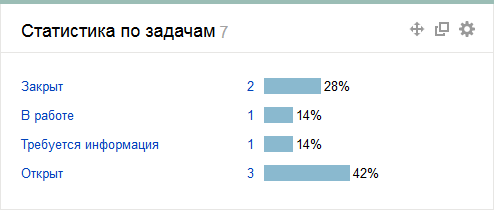

# Статистика по задачам

Виджет отображает распределение задач по значениям определенного параметра.



Не рекомендуется использовать в поле **Ключевой параметр** значение **{{ ui-key.startrek.ui_components_dashboard.summary-field-name }}**, так как виджеты с такими настройками скоро будут отключены. [Подробнее](../faq.md#section_del_widget).



Чтобы настроить виджет, задайте параметры:

- **Название виджета** — название, которое отображается в заголовке виджета.

- **Источник задач** — фильтр, на основе которого формируется список задач. Вы можете выбрать [системный](default-filters.md) или [созданный ранее](create-filter.md) фильтр из списка или задать фильтр с помощью [языка запросов](query-filter.md) или параметров.

- **Количество строк на странице** — максимальное количество строк диаграммы, которые отображаются в виджете. Если строк окажется больше, вы сможете воспользоваться кнопкой **{{ ui-key.startrek.ui_components_dashboard_TableWidget.show-all }}** в нижней части виджета.

- **Ключевой параметр** — параметр задач, по которому собирается статистика.

- **Сортировка** — порядок сортировки столбцов диаграммы.

