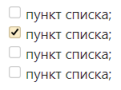

# Форматировать текст в задаче

Чтобы форматировать текст в описании задачи и в комментариях, используйте синтаксис {{ yfm }}. Например, вы можете выделять текст курсивом или полужирным шрифтом, вставлять списки и таблицы.

Чтобы увидеть, как будет выглядеть текст описания задачи или комментарий с форматированием, под полем ввода текста нажмите кнопку **Предпросмотр**. Чтобы продолжить форматирование, нажмите кнопку **Правка**.

## Строчное форматирование {#line}

Элемент | Разметка | Результат
----- | ----- | -----
Полужирный текст | ```**Полужирный текст**``` | **Полужирный текст**
Курсив | ```_Курсив_``` | _Курсив_
Полужирный курсив | ```**_Полужирный курсив_**``` | **_Полужирный курсив_**
Тоже полужирный курсив | ```_**Тоже полужирный курсив**_``` | _**Тоже полужирный курсив**_
Зачеркнутый текст | ```~~Зачеркнутый текст~~``` | ~~Зачеркнутый текст~~
Подчеркнутый текст | ```++Подчеркнутый текст++``` | <u>Подчеркнутый текст</u>
Верхний индекс | ```Верхний^индекс^``` | Верхний^индекс^
Нижний индекс | ```Нижнийvvиндексvv``` | Нижний<sub>индекс</sub>
Моноширинный текст | ```##Моноширинный текст##``` | <samp>Моноширинный текст</samp>
Цветной текст:<br/><ul><li>`red` — красный;<li>`green` — зеленый;<li>`blue` — синий;<li>`gray` — серый;<li>`yellow` — желтый. | ```{blue}(Текст синего цвета)``` | <font color="blue">Текст синего цвета</font>
Исходный код | ``` `фрагмент кода` ``` | `фрагмент кода`
Экранирование элементов разметки | ```\*\*экранирование** _элемента разметки_``` | \*\*экранирование** _элемента разметки_

## Заголовки {#headers}

```
# Заголовок первого уровня 

#### Заголовок четвертого уровня

##### Заголовок пятого уровня
```



# Заголовок первого уровня

#### Заголовок четвертого уровня

##### Заголовок пятого уровня



## Ссылки {#links}

Элемент | Разметка | Результат 
----- | ----- | -----
Ссылка | ```[текст_ссылки]({{ link-yandex }})``` | [текст_ссылки]({{ link-yandex }})
URL | Чтобы преобразовать URL или адрес<br/>электронной почты в ссылку,<br/>добавьте с двух сторон угловые скобки `<>`:<br/>```<{{ link-yandex }}>``` | <{{ link-yandex }}>
Ссылка на задачу | ``` TEST-123 ``` | 

## Списки {#lists}

#|
|| **Элемент** | **Разметка** | **Результат** ||
|| Нумерованный список | 
```
1. пункт списка;
1. пункт списка:
    1. подпункт;
    1. подпункт;
1. пункт списка.
```
|
1. пункт списка;
1. пункт списка:
    1. подпункт;
    1. подпункт;
1. пункт списка. ||
|| Маркированный список | 
```
* пункт списка;
* пункт списка:
    * подпункт;
    * подпункт;
* пункт списка.
```
| 
* пункт списка;
* пункт списка:
    * подпункт;
    * подпункт;
* пункт списка. ||
|| Список задач | 
```
[ ] пункт списка;
[x] пункт списка;
[ ] пункт списка;
[ ] пункт списка;
```
|
 ||
|#

## Блочное форматирование {#blocks}

#|
|| **Элемент** | **Разметка** | **Результат** ||
|| Цитирование текста |
```
> Цитирование
>> Вложенное цитирование
```
|
> Цитирование
>> Вложенное цитирование ||
|| Многострочный блок кода |
````
```php
<?
phpinfo();
$s = "Hello, World!\n";
print $s;
``` 
````
| 
```php
<?
phpinfo();
$s = "Hello, World!\n";
print $s;
``` 
||
|| Текст под катом | 
```


Текст, который отобразится
по нажатию


``` 
| 

Текст, который отобразится по нажатию

 ||
|#

## Таблицы {#tables}

### Простая таблица {#simple-table}

В ячейки этой таблицы можно вставить только одну строку текста или изображение.

```
| Заголовок1 | Заголовок2 |
| ---------- | ---------- |
| Текст      | Текст      |
| Текст      | Текст      |
```



| Заголовок1 | Заголовок2 |
| ---------- | ---------- |
| Текст      | Текст      |
| Текст      | Текст      |



### Многострочная таблица {#multiline-table}

В ячейки этой таблицы можно написать несколько строк текста, вставить изображение, списки, таблицы или исходный код.

```
#|
|| **Заголовок1** | **Заголовок2**||
|| Текст
на двух строчках | Текст ||
|| Текст | Текст ||
|#
```



#|
|| **Заголовок1** | **Заголовок2** ||
|| Текст
на  двух строчках | Текст ||
|| Текст | Текст ||
|#


