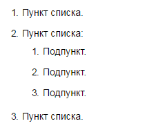
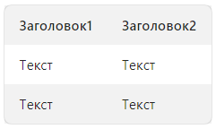

# Форматировать текст в задаче

Чтобы форматировать текст в описании задачи и в комментариях, используйте cинтаксис Yandex Flavored Markdown. Например, вы можете выделять текст курсивом или полужирным шрифтом, вставлять списки и таблицы.

Чтобы увидеть, как будет выглядеть текст описания задачи или комментарий с форматированием, под полем ввода текста нажмите кнопку **Предпросмотр**. Чтобы продолжить форматирование, нажмите кнопку **Правка**.

Основные элементы разметки перечислены в таблице.

Элемент | Разметка | Результат
----- | ----- | -----
Заголовки | ```# Заголовок первого уровня```<br/>```## Заголовок второго уровня```<br/>```### Заголовок третьего уровня``` | 
Полужирный текст | ```**Полужирный текст**``` | **Полужирный текст**
Курсив | ```_Курсив_``` | _Курсив_
Полужирный курсив | ```**_Полужирный курсив_**``` | **_Полужирный курсив_**
Тоже полужирный курсив | ```_**Тоже полужирный курсив**_``` | _**Тоже полужирный курсив**_
Зачеркнутый текст | ```~~Зачеркнутый текст~~``` | ~~Зачеркнутый текст~~
Подчеркнутый текст | ```++Подчеркнутый текст++``` | 
Верхний регистр | ```Верхний^регистр^``` | Верхний^регистр^
Моноширинный текст | ```##Моноширинный текст##``` | 
Цветной текст.<br/><br/>Поддерживаются цвета:<br/><br/>`red`;<br/>`green`;<br/>`blue`;<br/>`gray`;<br/>`yellow`. | ```{blue}(Текст синего цвета)``` | 
Нумерованный список | ```1. Пункт списка.```<br/>```1. Пункт списка.```<br/>&nbsp;&nbsp;&nbsp;&nbsp;`1. Подпункт.`<br/>&nbsp;&nbsp;&nbsp;&nbsp;`1. Подпункт.`<br/>&nbsp;&nbsp;&nbsp;&nbsp;`1. Подпункт.`<br/>```1. Пункт списка.``` | 
Маркированный список | ```* пункт списка;```<br/>```* пункт списка:```<br/>&nbsp;&nbsp;&nbsp;&nbsp;`* подпункт;`<br/>&nbsp;&nbsp;&nbsp;&nbsp;`* подпункт;`<br/>```* пункт списка.``` | 
Ссылка | ```[текст_ссылки]({{ link-yandex }})``` | [текст_ссылки]({{ link-yandex }})
URL | Чтобы преобразовать URL или адрес электронной почты в ссылку, добавьте с двух сторон угловые скобки <>.<br/>```<{{ link-yandex }}>``` | <{{ link-yandex }}>
Ссылка на задачу | ``` TEST-123 ``` | 
Цитирование текста | ```> Цитирование```<br/>```>> Вложенное цитирование``` | 
Текст под катом | ``````<br/>```Контент, который отобразится по нажатию.```<br/>`````` | 
Таблица | ```\| Заголовок1 \| Заголовок2  \|```<br/>```\| ---------- \| ---------- \|```<br/>```\| Текст       \| Текст       \|```<br/>```\| Текст       \| Текст       \|``` | 
Многострочная таблица | ```#\|```<br/>```\|\| **Заголовок1** \| **Заголовок2** \|\|```<br/>```\|\| Текст ```<br/>```на двух строчках```<br/>```\| Текст \|\|```<br/>```\|#``` | 
Исходный код | ``` `фрагмент кода` ``` | `фрагмент кода`
Многострочный блок кода | ` ```php`<br/>`<?`<br/>`phpinfo();`<br/>`$s = "Hello, World!\n";`<br/>`print $s;`<br/>` ``` ` | 
Экранирование элементов разметки | ```\*\*экранирование** _элемента разметки_``` | \*\*экранирование** _элемента разметки_