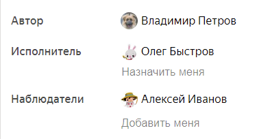
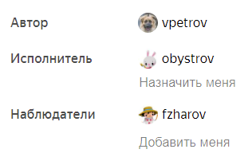
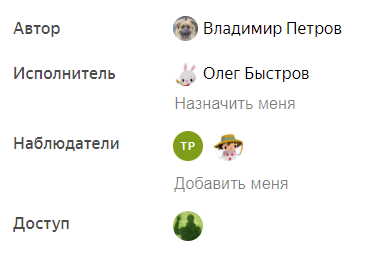

---

__system: {"dislikeVariants":["Нет ответа на мой вопрос","Рекомендации не помогли","Содержание не соответствует заголовку","Другое"]}
---
# Персональные настройки

Чтобы вам было удобнее работать с задачами, вы можете настроить интерфейс {{ tracker-name }} на ваш вкус.

## Настроить начальную страницу {#sec_my_page}

Вы можете настроить вашу [начальную страницу](startpage.md) так, чтобы на ней отображался любой [фильтр](filters.md), [дашборд](dashboard.md) или [доска задач](../manager/create-agile-board.md):

1. 

1. В блоке **Моя страница** укажите какой фильтр, дашборд или доску задач вы хотите видеть на главной странице.

1. Нажмите кнопку **Сохранить**.

## Настроить язык интерфейса {#choose-language}

Для работы в {{ tracker-name }} вы можете выбрать русский и английский язык. Для этого:

1. 

1. В блоке **Язык интерфейса** выберите нужный язык.

1. Нажмите кнопку **Сохранить**.

## Настроить отображение пользователей {#sec_display}

По умолчанию в полях **Автор**, **Исполнитель** и **Наблюдатели** отображаются имена и фамилии пользователей. Чтобы на странице задачи вместо имен и фамилий отображались логины или портреты, измените способ отображения пользователей.





Чтобы изменить способ отображения:

1. 

1. В блоке **Отображение пользователей** выберите удобный для вас способ:
    - Выберите **Показывать логин вместо имени**, чтобы в системных полях задачи вместо имен и фамилий отображались логины.

        

        

        

    - Выберите **Включить режим портретов для списков пользователей**, чтобы вместо имен или логинов в поле **Наблюдатели** отображались аватары пользователей.

        

        

        

1. Нажмите кнопку **Сохранить**.

## Настроить отображение дат {#sec_display_date}

Параметры, содержащие дату, и время могут отображаться в задаче в полном (день, месяц, год и время) и сокращенном (день и месяц) форматах.

Чтобы изменить формат отображения таких параметров:

1. 

1. В блоке **Формат дат** выберите нужный формат.

1. Нажмите кнопку **Сохранить**.

## Настроить уведомления {#sec_notifications}

{{ tracker-name }} отправляет по почте уведомления об изменениях в задачах, на которые вы подписаны. На странице персональных настроек вы можете настроить параметры уведомлений:

1. 

1. Задайте настройки уведомлений: 
    - Включите или отключите [регулярные отчеты об изменениях задач, на которые вы подписаны](notification-digest.md).
    - Настройте [отображение имен и типа события в письмах](notification-settings.md#section_u1f_3w5_xgb).
    - Включите или отключите [уведомления об изменениях, которые вы сделали в задачах](subscribe.md#sec_self).

1. Нажмите кнопку **Сохранить**.

Подробнее об уведомлениях читайте в разделах:

- [{#T}](subscribe.md)
- [Настройки уведомлений](notification-settings.md)

## Настроить порядок отображения комментариев {#sec_mssg_sort}

По умолчанию комментарии в задаче сортируются от старых к новым. Вы можете включить сортировку комментариев от новых к старым на странице персональных настроек:

1. 

1. В блоке **Порядок сообщений в задаче** включите опцию **Сначала новые**.

1. Нажмите кнопку **Сохранить**.