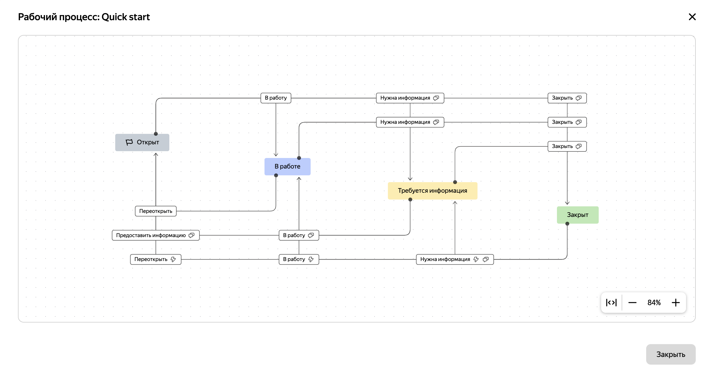

# Просмотр рабочего процесса на странице задачи

{{ tracker-name }} позволяет просматривать [рабочий процесс](../manager/workflow.md) очереди прямо на странице задачи. Если у пользователя есть права на [просмотр задач очереди](../manager/queue-access.md#acces-types), то он сможет увидеть набор статусов, а также посмотреть переходы, но только те, которые доступны в рамках настроенного процесса.

Чтобы посмотреть рабочий процесс, на странице задачи, на панели справа, в поле **Статус**, нажмите  → **Посмотреть рабочий процесс**.

