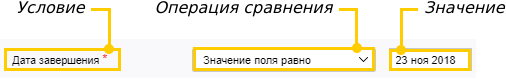
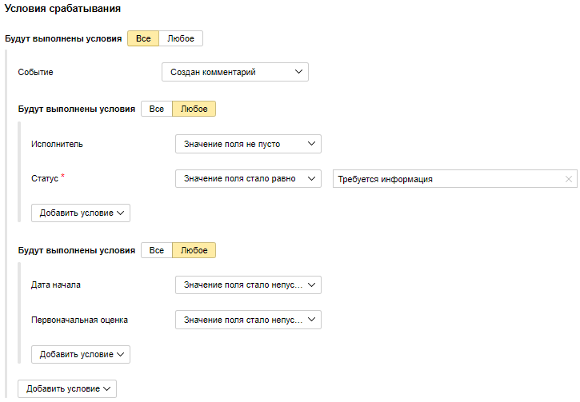

# Задать условие срабатывания триггера

## Добавить условие {#section_set_condition}

Чтобы установить, на какое изменение в задаче будет реагировать триггер, задайте условие:

1. В блоке **{{ ui-key.startrek.blocks-desktop_b-page-queue-admin-tab_type_trigger-editor.label_conditions }}** нажмите кнопку **{{ ui-key.startrek.blocks-desktop_b-page-queue-admin-tab_type_autoaction-editor.action_add-condition }}** и выберите его из списка. 

    Тип условия | Описание
    ----- | -----
    {{ ui-key.startrek.blocks-desktop_trigger-condition.condition-type--event }} | Триггер сработает при наступлении заданного события. Например, при создании задачи, при любом изменении задачи или при изменении полей, которые используются для [вычисления значения по формуле](set-action.md#section_calc_field). 
    {{ ui-key.startrek.blocks-desktop_trigger-condition.condition-type--checklist }} | Триггер сработает при выполнении всех пунктов в [чеклисте](checklist.md) задачи.
    {{ ui-key.startrek.blocks-desktop_trigger-condition.condition-type--comment }} | Триггер сработает, если комментарий содержит заданный фрагмент.
    {{ ui-key.startrek.blocks-desktop_trigger-condition.condition-type--comment-author }} | Триггер сработает, если комментарий добавил указанный пользователь.
    {{ ui-key.startrek.blocks-desktop_trigger-condition.condition-type--comment-type }} | Триггер сработает: <ul><li>**{{ ui-key.startrek-backend.messages.trigger.condition.type.CommentMessage.Internal }}** — если создан комментарий через интерфейс {{ tracker-name }}.</li><li>**{{ ui-key.startrek-backend.messages.trigger.condition.type.CommentMessage.External }}** — если комментарий создан с помощью письма.</li></ul>
    {{ ui-key.startrek.blocks-desktop_trigger-condition.condition-type--links }} | Триггер сработает, если связи задачи изменились.
    Поля задачи | Триггер сработает при изменении в поле, которое входит в одну из групп полей: **{{ ui-key.startrek-backend.fields.issue.fields.system }}**, **{{ ui-key.startrek-backend.fields.issue.fields.timetracking }}**, **{{ ui-key.startrek-backend.fields.issue.fields.agile }}**, **{{ ui-key.startrek-backend.fields.issue.fields.email }}**.
    
1. В зависимости от типа условия, выберите событие или [операцию сравнения](#section_cdn_d4j_wfb).

1. Если выбрана операция сравнения, укажите значение для сравнения.
    
    
    
1. При необходимости добавьте к триггеру несколько условий. По умолчанию триггер сработает, если все условия выполняются одновременно. Чтобы триггер сработал при выполнении хотя бы одного условия, нажмите кнопку **{{ ui-key.startrek.blocks-desktop_trigger-condition.condition-type--or_short }}**.
   
   Вы можете добавить группу условий (два и более), которые будут подчиняться логическому И или логическому ИЛИ.

> **Пример**
>
> 
>
> Триггер сработает при соблюдении группы условий: Создан комментарий И (выполнено одно из двух условий: У задачи есть исполнитель ИЛИ задача переведена в статус Требуется информация) И (выполнено одно из двух условий: задана Дата начала ИЛИ задана Первоначальная оценка).

## Операции сравнения {#section_cdn_d4j_wfb}

- Если в условии срабатывания триггера задана операция сравнения, условие будет проверяться каждый раз после изменения задачи. Если условие выполнено, триггер сработает.
- Для разных типов полей доступны разные операции сравнения.
- Для некоторых операций сравнения можно задать дополнительные опции: 

  - **{{ ui-key.startrek-backend.fields.trigger.condition.property.noMatchBefore }}** — триггер сработает, если выполнена операция сравнения и изменилось значение поля.
  - **{{ ui-key.startrek-backend.fields.trigger.condition.property.ignoreCase }}** — считать, что символ в верхнем регистре совпадает с тем же символом в нижнем регистре.
  - **{{ ui-key.startrek-backend.fields.trigger.condition.property.removeMarkup }}** — не учитывать разметку в тексте.

Примеры доступных операций сравнения приведены в таблице.

Операции сравнения  | Описание
----- | -----
Равно, больше, больше или равно, меньше, меньше или равно | Операции сравнения для полей с числовыми значениями.
Стало равно, стало больше, стало больше или равно, стало меньше, стало меньше или равно | Триггер сработает, если выполнено сравнение и изменилось значение поля.
Позднее, позднее или равно, раньше, раньше или равно | Операции сравнения для полей с датами.
Значение поля пусто, значение поля не пусто | Операции проверяют, заполнено ли поле.
Значение поля установлено, значение поля изменилось, значение поля удалено | Операции проверяют добавление, изменение или удаление значения поля.
Количество элементов равно, количество элементов больше, количество элементов меньше | Операции сравнения для полей, которые могут содержать несколько элементов, например **{{ ui-key.startrek-backend.fields.issue.tags-key-value }}**.
Не содержит ни одного элемента, содержит все элементы, содержит любой из элементов | Операции сравнения для полей, которые могут содержать несколько элементов, например **{{ ui-key.startrek-backend.fields.issue.tags-key-value }}**.
Не содержит ни одного из фрагментов, не содержит фрагмент, совпадает с, содержит любой из фрагментов, содержит фрагмент | Операции сравнения для условия **{{ ui-key.startrek-backend.fields.trigger.condition.field.comment }}**, проверяют наличие заданных фрагментов текста в комментариях.