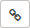

# Использовать общие шаблоны

Чтобы другие пользователи могли применять ваш шаблон:

1. [Настройте общий доступ к шаблону](share-template.md#section_nmn_prs_zz). Вы можете настроить доступ для отдельных пользователей или всей организации.

1. Попросите коллег [подключить шаблон в персональных настройках](share-template.md#section_vkg_trs_zz).

## Как настроить доступ к шаблону {#section_nmn_prs_zz}

Чтобы изменить настройки доступа к шаблону:

1. Выберите нужную опцию:
    - [Задачи]({{ link-settings }}/templates/issues), чтобы изменить шаблон задачи.
    - [Комментарии]({{ link-settings }}/templates/comments), чтобы изменить шаблон комментария.

1. При необходимости отфильтруйте лишние шаблоны с помощью кнопки .

1. Возле нужного шаблона нажмите кнопку **Права доступа**.

1. Настройте разрешения **Чтение**, **Запись** и **Настройка прав** для категорий:
    - **Люди и роботы** — индивидуальные настройки для отдельных пользователей. Чтобы добавить пользователя в эту категорию, введите его логин или имя в строку поиска в верхней части таблицы.
    - **Группы** — настройки для всех сотрудников.

    - **Роли** — настройки для пользователей, обладающих определенными ролями по отношению к шаблону:
        - **Владелец** — владелец шаблона. По умолчанию владелец — это создатель шаблона и только у него есть разрешения **Запись** и **Настройка прав**.
        - **Участник команды очереди** — пользователи-участники команды очереди, к которой привязана задача.

Общие шаблоны доступны для подключения всем пользователям на вкладке **Подключение**.

## Как поделиться шаблоном {#section_ucr_rrs_zz}

Чтобы поделиться шаблоном с коллегой, отправьте ему ссылку на шаблон:

1.  

1. В правом верхнем углу нажмите  **Настройки очереди**.

1. На верхней панели {{ tracker-name }} нажмите  → **Управление шаблонами**.

1. Выберите нужную опцию:
    - **Задачи**, чтобы изменить шаблон задачи.
    - **Комментарии**, чтобы изменить шаблон комментария.

1. При необходимости отфильтруйте лишние шаблоны с помощью кнопки .

1. Возле нужного шаблона выберите  → **Ссылка на шаблон**.

1. Скопируйте содержимое адресной строки браузера и отправьте его пользователю, с которым хотите поделиться.



Пользователь сможет увидеть шаблон, только если у него есть к нему [доступ на чтение](#section_nmn_prs_zz).



## Как подключить общий шаблон {#section_vkg_trs_zz}

Если у вас есть [доступ на чтение](#section_nmn_prs_zz) к нужному шаблону, вы можете использовать его для создания задач или комментариев. Для этого подключите шаблон:

1.  

1. В правом верхнем углу нажмите  **Настройки очереди**.

1. На верхней панели {{ tracker-name }} нажмите  → **Управление шаблонами**.

1. Выберите нужную опцию:
    - **Задачи**, чтобы изменить шаблон задачи.
    - **Комментарии**, чтобы изменить шаблон комментария.

1. При необходимости отфильтруйте лишние шаблоны с помощью кнопки .

1. Возле нужного шаблона нажмите переключатель, чтобы он перешел в положение .

