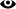

# Подписаться на уведомления

Подписки помогут вам не пропустить изменения важных для вас задач. Если кто-то отредактирует задачу, на которую вы подписаны, вы получите уведомление по почте.

Вы можете подписаться как на конкретную задачу, так и на все задачи, относящиеся к определенной очереди, версии или компоненту.

Для ваших уведомлений и подписок вы можете [настроить содержимое](notification-settings.md), чтобы получать письма только об интересующих вас событиях.



Уведомления о призыве в комментарии отображаются также в [центре уведомлений](#notif_call_comments) {{ tracker-name }}.



## Как подписаться на задачу {#section_xt5_xrv_jz}

Если вы хотите получать уведомления об изменениях определенной задачи, подпишитесь на нее:

1. Откройте страницу задачи.

1. На правой панели в поле **Наблюдатели** нажмите **Добавить меня**. Если поля **Наблюдатели** нет, добавьте его с помощью кнопки &nbsp;**Изменить список параметров**.

Если вы все сделали правильно, в поле наблюдатели появится ваше имя. Теперь вы будете получать письма с уведомлениями о любых изменениях этой задачи.



Вы также можете добавить других пользователей в список наблюдателей. Для этого нажмите на слово **Наблюдатели** и введите логин или имя пользователя.



## Как подписаться на очередь {#section_k13_z5v_jz}

Подпишитесь на изменения очереди, чтобы отслеживать изменения всех ее задач:

1. Откройте [страницу очереди](queue.md).

1. В правом верхнем углу нажмите значок . Затем нажмите &nbsp;**Подписаться** и выберите значение:
    - **Подписаться на создание задач**, чтобы получать уведомления о создании новых задач в очереди. Вы также будете подписаны на все события, которые указаны в [настройках уведомлений](user-notifications.md#sec_add_role) для роли **Подписчик очереди**.
    - **Подписаться на все уведомления**, чтобы получать уведомления о любых изменениях задач очереди.
    
Вы также можете [выбрать события](user-subscriptions.md), уведомления о которых хотите получать.

## Как подписаться на компонент {#section_km3_jnf_qz}

Вы можете подписаться не только на очередь, но и на отдельные ее компоненты. Так вы будете получать уведомления только о задачах, связанных с интересующими вас компонентами.

Чтобы подписаться на компонент:

1. Откройте [страницу очереди](queue.md).

1. В правом верхнем углу нажмите значок , затем нажмите &nbsp;**Компоненты**.

1. Наведите курсор на компонент.

1. Выберите  → **Подписаться на задачи с этим компонентом**.

Если вы все сделали правильно, рядом с названием компонента появится значок 

По умолчанию на почту будут приходить все уведомления. Вы можете [выбрать события](user-subscriptions.md), уведомления о которых хотите получать.

## Как подписаться на версию {#section_n2y_jnf_qz}

Чтобы отслеживать задачи, связанные с определенной версией, подпишитесь на нее:

1. Откройте [страницу очереди](queue.md).

1. В правом верхнем углу нажмите значок , затем нажмите &nbsp;**Версии**.

1. Наведите курсор на версию.

1. Выберите  → **Подписаться**.

Если вы все сделали правильно, рядом с номером версии появится значок 

По умолчанию на почту будут приходить все уведомления. Вы можете [выбрать события](user-subscriptions.md), уведомления о которых хотите получать.

## Получать уведомления о своих действиях {#sec_self}

По умолчанию вы не получаете уведомления о ваших собственных действиях над задачами. Чтобы включить уведомления о своих действиях: 

1. Перейдите по ссылке [{{link-tracker}}settings]({{ link-settings }}).

1. Включите опцию **Получать письма о моих действиях**.

1. Нажмите кнопку **Сохранить**.

## Уведомление о призыве в комментарии {#notif_call_comments}

Если вас призвали в комментарии к задаче, уведомление об этом придет не только на вашу почту, но и в [центр уведомлений](notifications.md#notif_center) {{ tracker-name }}.

Чтобы отключить уведомления:
1. На панели слева нажмите &nbsp;**Уведомления**, откроется центр уведомлений.
1. В правом верхнем углу центра уведомлений нажмите значок  → **Настройки**.
1. Снимите отметку напротив пункта **Призыв в комментарии**.

