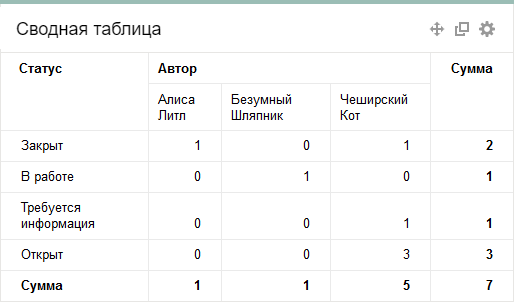

# Сводная таблица

Простая сводная таблица, которая позволяет просматривать статистику задач по двум любым параметрам. На пересечениях таблицы приводится количество задач, удовлетворяющих параметрам. С помощью такой таблицы вы можете, например, отслеживать количество и статусы задач определенной группы исполнителей.

Чтобы настроить виджет, задайте его параметры:

- **Название виджета** — название, которое отображается в заголовке виджета.

- **Источник задач** — фильтр, на основе которого формируется список задач. Вы можете выбрать [системный](default-filters.md) или [созданный ранее](create-filter.md) фильтр из списка или задать фильтр с помощью [языка запросов](query-filter.md) или параметров.

- **Столбцы** — параметр, по которому строятся столбцы таблицы.

- **Строки** — параметр, по которому строятся строки таблицы.

- **Количество строк на странице** — максимальное количество строк таблицы, которые отображаются в виджете. Если строк окажется больше, вы сможете воспользоваться кнопкой **Показать все** в нижней части виджета.

- **Сортировка** — порядок сортировки строк таблицы.

- **Показывать сумму** — если опция включена, таблица содержит сумму значений по строкам и столбцам.

