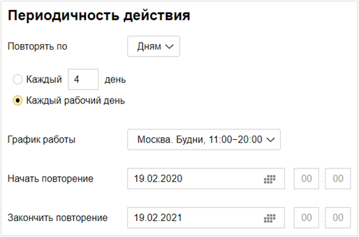

# Создание задач по расписанию

В {{ tracker-name }} можно настроить регулярное создание задач по определенному шаблону. Например, каждую неделю создавать задачу на резервное копирование данных.

Задачи будут создаваться в очереди, в которой настроено автообновление. Автором задачи будет Робот сервиса Tracker.



Убедитесь, что у робота есть права на создание задач в выбранной очереди.



Чтобы настроить создание задач по расписанию:

1.  

1. В правом верхнем углу нажмите  **Настройки очереди**.

1. На панели слева выберите **Автоматизация** → **Автодействия** и нажмите кнопку **Создать автодействие**.

1. Выберите тип **Создание задач**.

1. Настройте периодичность создания задач:

    1. Выберите, в каких единицах будет задан период создания задач: часах, днях или неделях.

    1. Укажите период создания задач в выбранных единицах. Для этого в поле **Каждый (Каждую)** введите число от 1 до 1000.

       Например, если вы укажете период <q>Каждый 4 день</q>, задача будет создаваться раз в четыре дня.

       

       Если вы задали период создания задач в днях, вы можете выбрать вариант **Каждый рабочий день** и [график работы](../manager/schedule.md).

       Если вы задали период создания задач в неделях, выберите дни недели, в которые будут создаваться задачи.

    1. Укажите даты и время, когда автоматическое создание задач начнет и закончит действовать. Если вы не укажете даты начала и окончания, автоматическое создание задач будет действовать постоянно.

1. В блоке **Действие в очереди** нажмите кнопку **Создать задачу**.

1. В окне **Создание задачи** заполните поля шаблона для автоматического создания задач и нажмите кнопку **Сохранить**.
 
1. Если вы хотите создавать несколько задач в одном автодействии, снова нажмите кнопку **Создать задачу** и заполните поля новой задачи.

1. Чтобы сохранить автодействие, нажмите кнопку **Создать**.

