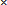

# Уведомления о ваших задачах

Для каждой роли в {{ tracker-name }} можно настроить список событий, уведомления о которых вы хотите получать. Например, вы можете получать уведомления об изменении статуса задачи или добавлении к задаче комментария. 

## Настроить список событий {#section_iqn_y55_xgb}

1. На панели слева нажмите  **Настройки**. Затем выберите &nbsp;**Интерфейс** и нажмите **Настройки уведомлений**. Вы также можете перейти по ссылке [{{link-tracker}}subscriptions/roles]({{ link-sub-roles }}).

1. Выберите роль и настройте список событий, уведомления о которых хотите получать по почте или в [отчете об изменениях](notification-digest.md):
    - чтобы добавить событие, нажмите кнопку ;
    - чтобы удалить событие, нажмите на значок ;
    - чтобы удалить все уведомления для роли, нажмите кнопку **Удалить уведомления**.

    

    Для наиболее важных событий (например, изменен исполнитель или дедлайн) уведомления отключить нельзя.

    

## Добавить роли для уведомлений {#sec_add_role}

При необходимости вы можете выбрать дополнительные роли и настроить для них уведомления:

- **Автор изменения** — вы изменяли задачу;
- **Доступ** — вы перечислены в поле **Доступ** задачи;
- **Владелец очереди** — вы владелец очереди, в которую входит задача;
- **Участник команды** — вы участник команды очереди, в которую входит задача;
- **Ответственный за компонент** — вы ответственный за компонент, к которому относится задача;
- **Избранное** — вы добавили задачу в избранное.

В списке могут быть доступны и другие роли, которые настроены в вашей организации.

Чтобы добавить роли и настроить для них уведомления:

1. На панели слева нажмите  **Настройки**. Затем выберите &nbsp;**Интерфейс** и нажмите **Настройки уведомлений**. Вы также можете перейти по ссылке [{{link-tracker}}subscriptions/roles]({{ link-sub-roles }}).

1. В нижней части страницы нажмите кнопку **Добавить роль** и выберите роль. Чтобы удалить роль, нажмите на значок  возле названия роли.

1. Для роли [настройте список событий](notification-settings.md#section_iqn_y55_xgb), уведомления о которых вы хотите получать.