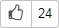

---

__system: {"dislikeVariants":["Нет ответа на мой вопрос","Рекомендации не помогли","Содержание не соответсвует заголовку","Другое"]}
---
# Проголосовать за задачу



Голосование за задачи доступно, только если оно разрешено настройками очереди.



Пользователи {{ tracker-name }} могут голосовать за задачи, чтобы помочь командам выбрать наиболее приоритетные из них. Число голосов отображается под названием задачи рядом со значком: .

Чтобы проголосовать за задачу, нажмите кнопку . Если вы хотите отозвать свой голос, нажмите кнопку еще раз.



Чтобы найти задачи, за которые вы голосовали, воспользуйтесь [языком запросов](query-filter.md):

1. На верхней панели {{ tracker-name }} выберите  **Задачи** → **Найти задачи**.

1. В правом верхнем углу страницы нажмите кнопку **Язык запросов**.

1. Введите в строку запрос:

    ```
    "Voted By": me()
    ```
    


#### Особенности голосования

- Вы можете просмотреть список проголосовавших, нажав на кнопку с числом голосов.

- Голосовать могут все пользователи, у которых есть доступ к задаче.

- Если задачу, за которую отданы голоса, закрыть как дубликат, все голоса будут перенесены в задачу-оригинал.


