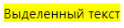
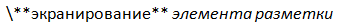

# Форматировать текст в задаче

Чтобы форматировать текст в описании задачи и в комментариях, используйте вики-разметку. Например, вы можете выделять текст курсивом или полужирным шрифтом, вставлять списки и таблицы.

Чтобы увидеть, как будет выглядеть текст описания задачи или комментарий с форматированием, под полем ввода текста нажмите кнопку **Предпросмотр**. Чтобы продолжить форматирование, нажмите кнопку **Правка**.

Основные элементы разметки перечислены в таблице.

Элемент | Разметка | Результат
----- | ----- | -----
Заголовки | ```== Заголовок первого уровня```<br/>```=== Заголовок второго уровня```<br/>```==== Заголовок третьего уровня``````== The first level header```<br/>```=== The second level header```<br/>```The third level header``` | 
Горизонтальная линия | ``` ---- ``` | 
Полужирный текст | ```**Полужирный текст**``````**Bold text**``` | 
Курсив | ```*Курсив*````*Italic text*` | 
Подчеркнутый текст | ```__Подчеркнутый текст__``````__Underlined text__``` | 
Зачеркнутый текст | ```--Зачеркнутый текст--``````--Strikethrough text--``` | 
Мелкий текст | ```++Мелкий текст++``````++Small font++``` | 
Выделенный текст | ```??Выделенный текст??``````??Highlighted text??``` | 
Цветной текст.<br/><br/>Поддерживаются цвета:<br/><br/>`red` / `крас` / `красный`;<br/>`green` / `зел` / `зеленый`;<br/>`blue` / `син` / `синий`;<br/>`grey` / `gray` / `сер`;<br/>`yellow` / `жел` | ```!!(син)Текст синего цвета!!``````!!(blue)Blue text!!``` | 
Нумерованный список | ```1. Пункт списка.```<br/>```2. Пункт списка.```<br/>&nbsp;&nbsp;&nbsp;&nbsp;`1. Подпункт.`<br/>&nbsp;&nbsp;&nbsp;&nbsp;`2. Подпункт.`<br/>&nbsp;&nbsp;&nbsp;&nbsp;`3. Подпункт.`<br/>```3. Пункт списка.``````1. list item;```<br/>```2. list item;```<br/>&nbsp;&nbsp;&nbsp;&nbsp;`1. nested list item;`<br/>&nbsp;&nbsp;&nbsp;&nbsp;`2. nested list item;`<br/>&nbsp;&nbsp;&nbsp;&nbsp;`3. nested list item;`<br/>```3. list item.``` | 
Маркированный список | ```* пункт списка;```<br/>```* пункт списка:```<br/>&nbsp;&nbsp;&nbsp;&nbsp;`* подпункт;`<br/>&nbsp;&nbsp;&nbsp;&nbsp;`* подпункт;`<br/>```* пункт списка.``````* list item;```<br/>```* list item:```<br/>&nbsp;&nbsp;&nbsp;&nbsp;`* nested list item;`<br/>&nbsp;&nbsp;&nbsp;&nbsp;`* nested list item;`<br/>```* list item.``` | 
Ссылка | ```((http://example.com/ текст ссылки))``````((http://example.com/ link text))``` | 
Ссылка на задачу | ``` TEST-123 ``` | 
Цитирование текста | ```<[Цитирование текста,```<br/>```длинного,```<br/>```с переносами]>``````<[Quoting of long```<br/>```text```<br/>```with linebreaks]>``` | 
Однострочное цитирование | ```>Однострочное цитирование```<br/>```>>Цитата второго уровня``````>Single-line quoting```<br/>```>>Second-level quote``` | 
Текст под катом | ```<{Прочитать целиком```<br/>```Этот текст можно увидеть, кликнув```<br/>```по ссылке "прочитать целиком".```<br/>```}>``````<{Read the entire text```<br/>```This text can be seen by clicking```<br/>```the link "Read the entire text".```<br/>```}>``` | 
Таблица | ```#|```<br/>```||cell 11|cell 12|cell 13||```<br/>```||cell 21|cell 22||```<br/>```#|``` | 
Исходный код | ```%%фрагмент кода%%``````%%piece of code%%``` | 
Экранирование элементов вики-разметки | ```""**Экранирование всех элементов**```<br/>```//разметки в тексте//""```<br/>```~**Экранирование одного** //элемента разметки//``````""**Escaping all markup**```<br/>```//elements in this text//""```<br/>```~**Escaping single** //markup element//``` | 

