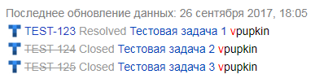

# {{ wiki-full-name }}

Вы можете вставлять на вики-страницы _магические ссылки_ на отдельные задачи и списки задач. Такие ссылки всегда содержат ключ, название, статус задачи и логин исполнителя.

## Вставить ссылку на задачу {#section_hws_qzr_3bb}

Чтобы вставить ссылку на задачу, скопируйте ее ключ и вставьте в текст страницы:

Пример | Результат
----- | -----
``` TEST-123 ``` | 


Магические ссылки на задачи работают не только на страницах {{ wiki-full-name }}, но и в других интранет-сервисах, поддерживающих Вики-разметку.

## Вставить список задач со страницы очереди {#section_oj5_scs_3bb}

Вы можете разместить на {{ wiki-full-name }} список задач со страницы любой очереди:

1. Откройте страницу очереди.

1. В левом верхнем углу страницы выберите  → **Получить код для Вики**.

1. Скопируйте код.

1. Разместите код на вики-странице.

## Вставить список задач со страницы фильтра {#section_filter_link}

Чтобы разместить на {{ wiki-full-name }} отфильтрованный список задач:	

1. Откройте [список задач]({{ link-tracker }}issues) и [настройте фильтры](create-filter.md). 

1. Скопируйте ссылку из адресной строки.

1. На вики-странице разместите ссылку в формате ``` {{tasks url="<ссылка_из_браузера>"}} ```.

Пример | Результат
----- | -----
``` {{tasks url="{{ link-tracker }}filters/<фильтр>"}} ``` | 



Параметр `url` блока `tasks` не поддерживает символ `"`. Если в ссылке на фильтр из адресной строки встречается такой символ, замените его на `%22`.

	
