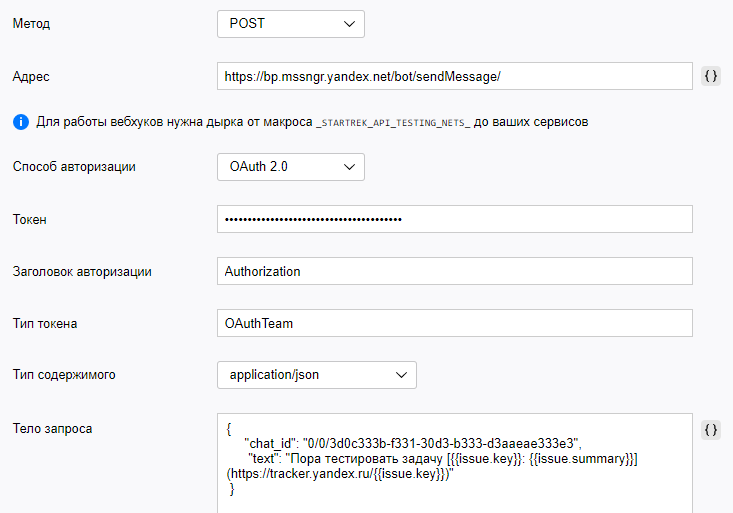

# Яндекс&#160;Мессенджер

Предположим, что нужно автоматически отправлять уведомления в мессенджер, когда у задачи меняется статус. Например, чтобы отслеживать готовность релизов к тестированию. Для этого можно [настроить триггер](user/trigger.md), который будет отслеживать статусы задач типа <q>Релиз</q> и отправлять HTTP-запрос, когда статус задачи изменится на <q>Можно тестировать</q>.

Для отправки уведомлений из {{ tracker-name }} в Яндекс&#160;Мессенджер вам понадобится аккаунт робота, от имени которого будут отправляться сообщения. Зарегистрируйте робота в Мессенджере, добавьте его в чат и настройте триггер, который будет отправлять сообщения от имени робота с помощью HTTP-запросов.

## Шаг 1. Зарегистрируйте робота в Мессенджере {#robot-setup}

1. Если у вас нет аккаунта робота, которым вы можете управлять, [создайте нового робота](https://staff.yandex-team.ru/preprofile/create/robot/).

1. Войдите в аккаунт робота на [https://passport.yandex-team.ru](https://passport.yandex-team.ru/).

1. Чтобы получить токен для авторизации робота в Мессенджере, под аккаунтом робота перейдите по ссылке: [https://oauth.yandex-team.ru/authorize?response_type=token&client_id=f45aca80c81144dd95dc150319c327a3](https://oauth.yandex-team.ru/authorize?response_type=token&client_id=f45aca80c81144dd95dc150319c327a3)
    Сохраните значение токена, которое отобразится на открывшейся странице.

1. Чтобы зарегистрировать робота в Мессенджере, выполните POST-запрос на адрес `https://bp.mssngr.yandex.net/team/register/` с полученным токеном в заголовке: 
    ```
    curl -X POST 'https://bp.mssngr.yandex.net/team/register/' -H 'Authorization: OAuthTeam <значение_токена>'
    ```

## Шаг 2. Добавьте робота в чат {#add-chat}

1. В Яндекс&#160;Мессенджере добавьте робота в чат, в который нужно отправлять оповещения из {{ tracker-name }}.

1. После добавления робота отправьте в чат любое сообщение.

1. Узнайте идентификатор чата, который потребуется для отправки оповещений из {{ tracker-name }}:
 
    1. Откройте [веб-версию Мессенджера](https://q.yandex-team.ru/) и найдите ваш чат.

    1. На странице чата перейдите в адресную строку. Вы увидите URL чата, например: 
        ```
        https://q.yandex-team.ru/#/chats/0%2F0%2F3d0c333b-f333-33d3-b333-d3aaeae333e3
        ```

    1.  Скопируйте последнюю часть URL и замените символы `%2F` на прямой слэш `/`. Получится идентификатор чата, например: 
        ```
        0/0/3d0c333b-f333-33d3-b333-d3aaeae333e3
        ```

## Шаг 3. Настройте триггер в {{ tracker-name }} {#tracker-setup}

1. Авторизуйтесь в {{ tracker-name }}. У вас должны быть права на администрирование очереди, для которой вы будете настраивать триггер.

1. Перейдите в настройки очереди и в разделе **Триггеры** нажмите кнопку [**Создать триггер**](user/create-trigger.md).

1. Введите название триггера, например <q>Уведомления в Мессенджер</q>.

1. Настройте условия срабатывания триггера так, чтобы он срабатывал, когда задача типа **Релиз** переходит в статус **Можно тестировать**:
 
    1. Выберите опцию **Будут выполнены условия** → **Все**.

    1. Добавьте условие **Тип** → **равно** → **Релиз**.

    1. Добавьте условие **Статус** → **стало равно** → **Можно тестировать**.

    

1. Нажмите кнопку **Добавить действие** и выберите **HTTP-запрос**.

1. Настройте запрос:
    - Метод — **POST**.
    - Адрес: `https://bp.mssngr.yandex.net/bot/sendMessage/`
    - Способ авторизации: **OAuth 2.0**.
    - Токен: значение токена, который вы получили при [регистрации робота](#robot-setup).
    - Тип токена: `OAuthTeam`.
    - Тип содержимого: **application/json**.
    - Тело запроса:
        ```
        {
            "chat_id": "<ID чата>",
            "text": "Пора тестировать задачу [not_var{{issue.key}}: not_var{{issue.summary}}](https://tracker.yandex.ru/not_var{{issue.key}})"
        }
        ```
        В качестве значения параметра `chat_id` укажите идентификатор чата, который вы [получили из URL чата](#add-chat).
        Чтобы добавить в тело запроса значения полей задачи, справа от поля ввода нажмите кнопку **{ }** и выберите имя поля.
    - Заголовки оставьте пустыми.

    

1. Сохраните триггер.

Чтобы проверить работу триггера, переведите задачу типа **Релиз** в статус **Можно тестировать**. Триггер отправит в Яндекс&#160;Мессенджер сообщение c текстом: <q>Пора тестировать задачу TEST-123: Настроить триггеры</q>.

