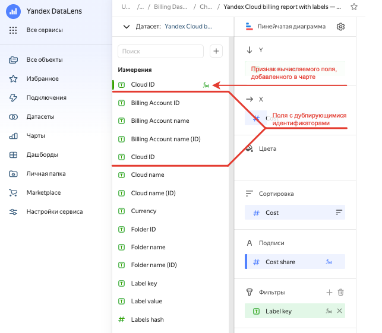

# Устранение ошибки ERR.DS_API.FIELD.TITLE.CONFLICT в DataLens

## Описание проблемы {#issue-description}
При валидации датасета возникает ошибка "Датасет не прошел валидацию".

## Диагностика и воспроизведение {#issue-diagnostics-and-reproduction}
При возникновении ошибки в разделе "Дополнительная информация" имеются сообщения `"Field title conflicts with another field"` и `"ERR.DS_API.FIELD.TITLE.CONFLICT"`.

## Решение {#issue-solution}

Проблема возникает из-за конфликта в названиях полей. Добавленное поле не должно иметь такое же название, как у какого-либо уже существующего поля в датасете.
Проверьте, что у поля задано уникальное название в рамках датасета.

Возможно, поле с таким названием было ранее добавлено в чарт, затем было добавлено в датасет, по которому был построен чарт.
В этой ситуации следут переименовать поле, добавленное в чарте.

