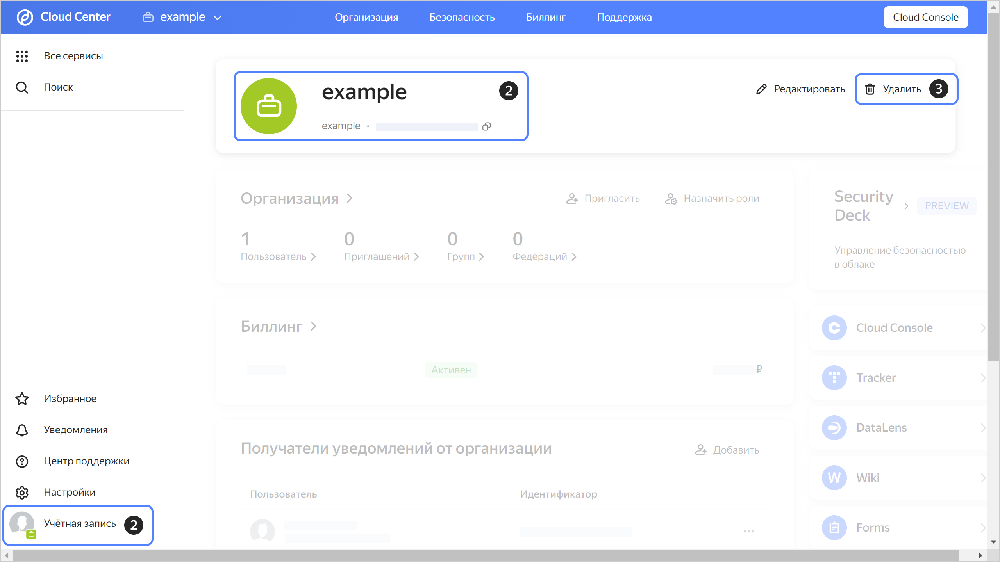
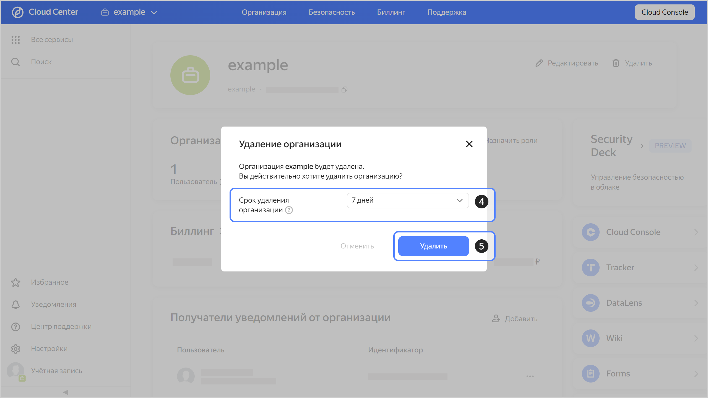

# Как удалить организацию

## Описание задачи {#case-description}

Необходимо удалить организацию.

## Решение {#case-resolution}

Перед удалением организации проверьте список облаков в организации, перейдя на страницу [по этой ссылке]({{ link-org-main }}). 

Убедитесь, что выбрана нужная вам организация, нажав на фото профиля в левом нижнем углу страницы. Если список не пуст, ресурсы потребуется [удалить](../../../resource-manager/operations/cloud/delete.md) либо [переместить в другую организацию](../../../resource-manager/operations/cloud/change-organization.md).

В противном случае организацию удалить не получится.



В этом материале идет речь об удалении организаций {{ yandex-cloud }}. Если вас интересует удаление организации {{ yandex-360 }}, воспользуйтесь инструкцией [по этой ссылке](https://yandex.ru/support/business/delete-organisation.html).



Затем выполните следующие действия для удаления организации:

1. Перейдите в [Cloud Center](https://center.yandex.cloud/).
1. Убедитесь, что на экране отображается информация о той организации, которую вы хотите удалить. Если организация не та, переключитесь на нужную, нажав на кнопку **Учетная запись** в левом нижнем углу.
1. В правом верхнем углу страницы нажмите кнопку **{{ ui-key.yacloud.common.delete }}**.

   

1. В открывшемся окне выберите срок удаления организации. По умолчанию удаление организации происходит через 7 суток с нажатия кнопки **{{ ui-key.yacloud.common.delete }}**.

1. Нажмите кнопку **{{ ui-key.yacloud.common.delete }}**.

   