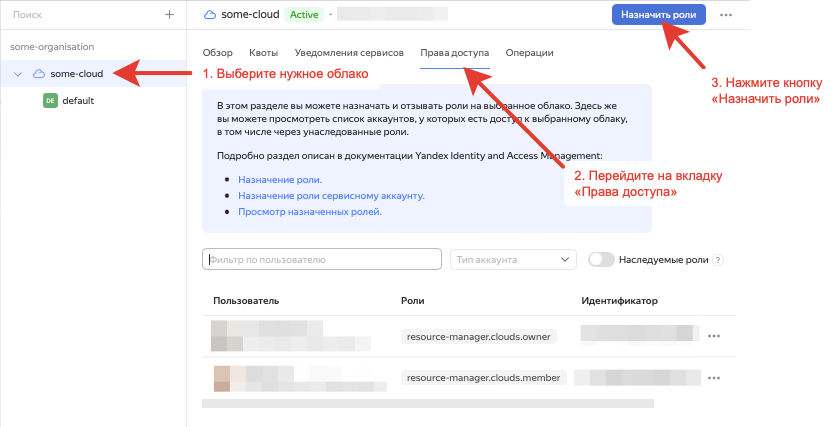

# Устранение ошибок при назначении роли resource-manager.clouds.owner пользователю облака

## Описание проблемы {#issue-description}
При попытке назначить учетной записи роль resource-manager.clouds.owner возникает ошибка вида:
```
Не удалось обновить права доступа
Role 'resource-manager.clouds.owner' is only applicable to resources of type 'resource-manager.cloud'
```

## Решение проблемы {#case-resolution}
Вероятно, вы пытаетесь назначить пользователю роль из вкладки "Права доступа" на уровне каталога или организации.
Права `resource-manager.clouds.owner` необходимо назначать из вкладки "Права доступа" на уровне облака:

