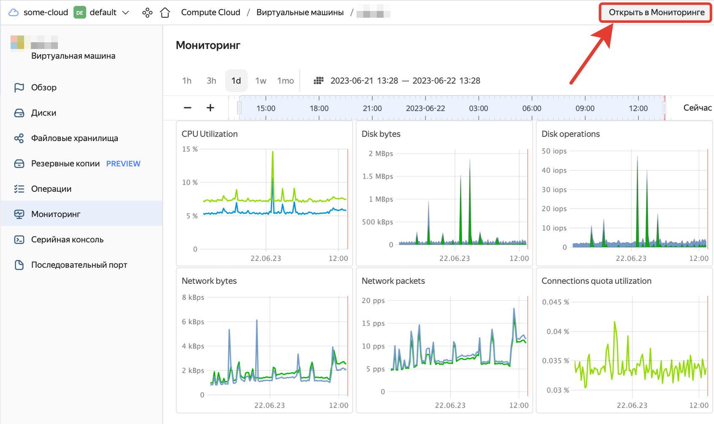
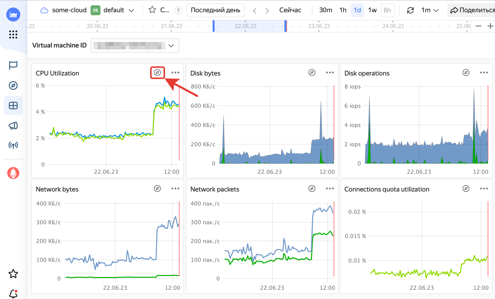
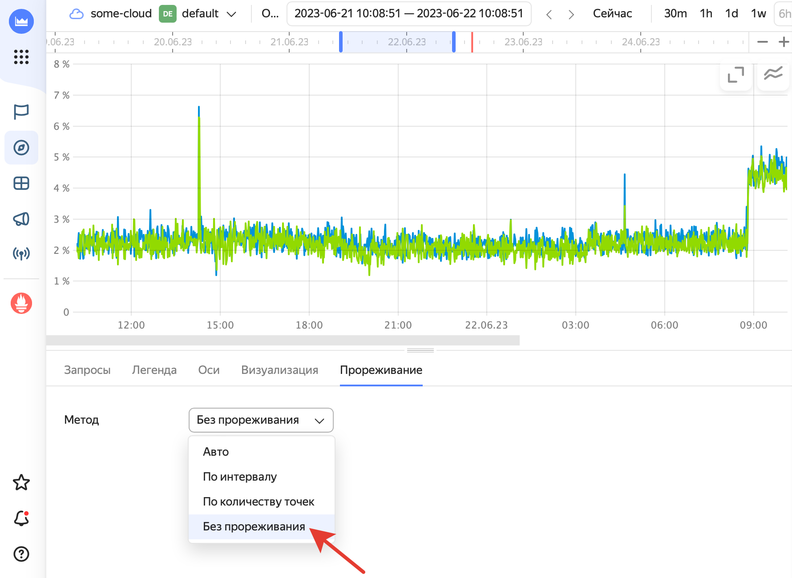

# Графики мониторинга имеют разрывы и пустоты при нормальной работе облачных ресурсов

## Описание проблемы {#issue-description}
На странице мониторинга облачного ресурса имеются пустоты и прерывания линии одного или нескольких графиков, однако сам облачный ресурс работает корректно.

## Решение {#issue-resolution}
Прерывание линии графика мониторинга связано с особенностями его отображения для определенных типов облачных ресурсов.
Такая ситуация может наблюдаться, если в настройках отображения графика включено прореживание.

Эта технология существенно ускоряет отрисовку странице при агрегации на ней большого количества метрик мониторинга. 
Однако если в мониторинг поступают низкие значения определенных метрик, (которые отображаются на оси Y), в линии графика с включенным прореживанием могут появиться разрывы. Как правило, такие разрывы не сигнализируют о проблемах с облачным ресурсом.

Вы можете отключить прореживание при просмотре графика в сервисе Yandex Monitoring:
1. Перейдите в раздел «Мониторинг» со страницы интересующего вас облачного ресурса.

2. Нажмите на кнопку **«Открыть в мониторинге»** в правом верхнем углу страницы:

3. Нажмите на кнопку справа от наименования интересующего вас графика:

4. Перейдите на вкладку **«Прореживание»** и выберите для поля **Метод** значение **«Без прореживания»**:

