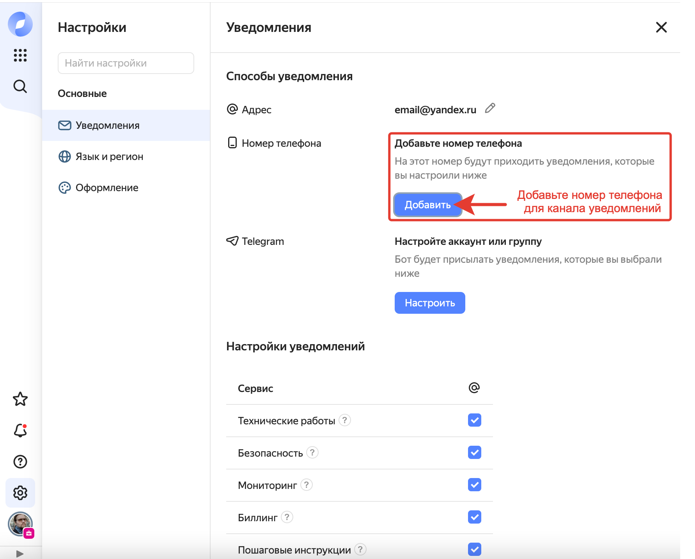

# Не приходят оповещения о событиях после настройки канала уведомлений в {{ monitoring-name }}

## Описание проблемы {#issue-description}

В сервисе {{ monitoring-name }} настроены оповещения с методом **{{ ui-key.yacloud_monitoring.alert.method_sms }}** или **{{ ui-key.yacloud_monitoring.alert.method_email }}**, однако при срабатывании условий уведомления на указанный в канале номер телефона или email не приходят.

## Решение {#issue-resolution}

Причин для такого поведения может быть несколько:

1. Отсутствуют контакты для отправки уведомлений.

    Перейдите в раздел [**Настройки**]({{ link-console-settings }}) в [Консоли управления]({{ link-console-main }}) и проверьте, правильно ли указан адрес электронной почты и номер телефона для вашего аккаунта, отображаемый в разделе **{{ ui-key.yacloud.component.navigation-menu.label_notifications }}**. В разделах **{{ ui-key.yacloud_components.settings.section_phone }}** и **{{ ui-key.yacloud_components.settings.section_email }}** должна быть включена опция **{{ ui-key.yacloud_components.settings.label_alerting-name }}**:
    

    Подробнее об этом мы пишем в разделе [**Алерты/уведомления**](../../../monitoring/qa/alerts.md#alert-receive-failed) в документации сервиса {{ monitoring-name }}.

1. В настройках профиля пользователя Яндекс ID или федеративного аккаунта указан некорректный почтовый адрес.

1. Превышен лимит в 50 SMS для одного номера в сутки, поэтому алерт не был отправлен на указанный номер.

    О лимитах в сервисе Мониторинга мы пишем в разделе [**Квоты и лимиты**](../../../monitoring/concepts/limits.md#monitoring-alerting-limits) нашей документации.

1. Сообщение попало в спам или не дошло.

    Проверьте SMS в папке **Спам** на вашем телефоне, а также номера, указанные черном списке. Для проверки поступающих уведомлений отключите антиспам-фильтр, если он установлен. Также рекомендуем удалить старые сообщения и перезагрузить устройство. Если это не поможет, проверьте детализацию у оператора мобильной связи на предмет поступления SMS.

1. Учетная запись не имеет нужных прав.

    Для получения уведомлений от сервиса мониторинга учетная запись должна иметь минимальные права на просмотр метрик в сервисе {{ monitoring-name }}. Это роль `{{ roles-monitoring-viewer }}` на каталог, в котором настроен канал уведомлений. 
    
    Подробнее со списком ролей в сервисе можно ознакомиться в разделе [**Управление доступом в {{ monitoring-name }}**](../../../monitoring/security/index.md#monitoring-viewer).