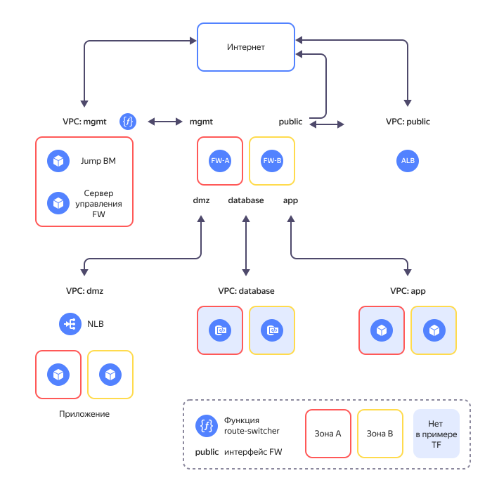

# Реализация защищенной высокодоступной сетевой инфраструктуры с выделением DMZ на основе Next-Generation Firewall


С помощью руководства вы развернете высокодоступную отказоустойчивую сетевую инфраструктуру с выделенным [DMZ](https://ru.wikipedia.org/wiki/DMZ_(компьютерные_сети)) сегментом и комплексной защитой на основе [Next-Generation Firewall](https://en.wikipedia.org/wiki/Next-generation_firewall). Элементы инфраструктуры размещаются в двух [зонах доступности](../../overview/concepts/geo-scope.md) и группируются по назначению в отдельные [каталоги](../../resource-manager/concepts/resources-hierarchy.md#folder). Такое решение позволит публиковать общедоступные веб-ресурсы (например, фронтенд-приложения) в изолированной от внутренней инфраструктуры DMZ зоне, а также обеспечит защищенность и высокую доступность всего периметра.

Схема решения представлена ниже.



Решение включает следующие основные сегменты (каталоги):

* Каталог **public** содержит [{{ alb-name }}](../../application-load-balancer/) для организации публичного доступа из сети интернет к опубликованным в DMZ приложениям.
* Каталог **mgmt** предназначен для размещения межсетевых экранов NGFW и ресурсов управления облачной инфраструктурой. Включает в себя две ВМ с межсетевыми экранами (fw-a, fw-b), ВМ сервера централизованного управления межсетевыми экранами (mgmt-server) и ВМ доступа к сегменту управления по VPN (jump-vm).
* Каталог **dmz** предоставляет возможность публикации приложений с открытым доступом из внешней сети интернет.
* Каталоги **app** и **database** могут быть использованы для размещения бизнес-логики приложений (в руководстве ВМ в них не устанавливаются).

Более подробное описание приведено в [репозитории проекта](https://github.com/yandex-cloud-examples/yc-dmz-with-high-available-ngfw/blob/main/README.md).

Чтобы развернуть защищенную высокодоступную сетевую инфраструктуру с выделением DMZ на основе Next-Generation Firewall:

1. [Подготовьте облако к работе](#prepare-cloud).
1. [Подготовьте окружение](#prepare-environment).
1. [Разверните ресурсы](#create-resources).
1. [Настройте шлюзы межсетевых экранов](#configure-gateways).
1. [Включите работу модуля route-switcher](#enable-route-switcher).
1. [Протестируйте работоспособность и отказоустойчивость решения](#test-accessibility).

Если созданные ресурсы вам больше не нужны, [удалите их](#clear-out).

## Подготовьте облако к работе {#prepare-cloud}




### Необходимые платные ресурсы {#paid-resources}

В стоимость поддержки инфраструктуры входит:

* плата за постоянно работающие ВМ (см. [тарифы {{ compute-full-name }}](../../compute/pricing.md));
* плата за использование {{ alb-name }} (см. [тарифы {{ alb-full-name }}](../../application-load-balancer/pricing.md));
* плата за использование {{ network-load-balancer-name }} (см. [тарифы {{ network-load-balancer-full-name }}](../../network-load-balancer/pricing.md));
* плата за использование публичных IP-адресов и исходящий трафик (см. [тарифы {{ vpc-full-name }}](../../vpc/pricing.md));
* плата за использование функций (см. [тарифы {{ sf-full-name }}](../../functions/pricing.md));
* плата за использование [CheckPoint NGFW](/marketplace/products/checkpoint/cloudguard-iaas-firewall-tp-payg-m).


### Необходимые квоты {#required-quotes}



В руководстве предполагается развертывание ресурсоемкой инфраструктуры.



Убедитесь, что в облаке достаточно [квот](../../overview/concepts/quotas-limits.md) и они не заняты ресурсами для других задач.



   | Ресурс | Количество |
   | ----------- | ----------- |
   | Каталоги | 7 |
   | Группы виртуальных машин | 1 |
   | Виртуальные машины | 6 |
   | vCPU виртуальных машин | 18 |
   | RAM виртуальных машин | 30 ГБ |
   | Диски | 6 |
   | Объем SSD дисков | 360 ГБ |
   | Объем HDD дисков | 30 ГБ |
   | Облачные сети | 7 |
   | Подсети | 14 |
   | Таблицы маршрутизации | 4 |
   | Группы безопасности | 10 |
   | Статические публичные IP-адреса | 2 |
   | Публичные IP-адреса | 2 |
   | Статические маршруты | 17 |
   | Бакеты | 1 |
   | Cloud функции | 1 |
   | Триггеры для cloud функций | 1 |
   | Общий объём RAM всех запущенных функций | 128 МБ |
   | Балансировщики NLB | 2 |
   | Целевые группы для NLB | 2 |
   | Балансировщики ALB | 1 |
   | Группы бэкендов для ALB | 1 |
   | Целевые группы для ALB | 1 |



## Подготовьте окружение {#prepare-environment}

В руководстве используется программное обеспечение для ОС Windows и подсистема [Windows Subsystem for Linux](https://ru.wikipedia.org/wiki/Windows_Subsystem_for_Linux).
Инфраструктура разворачивается с помощью [{{ TF }}](https://www.terraform.io/).

### Настройте WSL {#setup-wsl}

1. Проверьте, установлена ли подсистема WSL на вашем компьютере. Для этого выполните в терминале интерфейса командной строки команду:

   ```bash
   wsl -l
   ```

   При установленной WSL терминал выведет список доступных дистрибутивов, например:

   ```bash
   Windows Subsystem for Linux Distributions:
   docker-desktop (Default)
   docker-desktop-data
   Ubuntu
   ```

1. Если WSL не установлена, [установите](https://learn.microsoft.com/en-us/windows/wsl/install) ее и повторите предыдущий шаг.
1. Дополнительно можно установить на подсистему WSL привычный вам дистрибутив ОС Linux, например, [Ubuntu](https://ubuntu.com/tutorials/install-ubuntu-on-wsl2-on-windows-11-with-gui-support#1-overview).

1. Чтобы сделать установленный дистрибутив системой по умолчанию, выполните:

   ```bash
   wsl --setdefault ubuntu
   ```

1. Переведите терминал в режим работы в подсистеме Linux, выполнив команду:

   ```bash
   wsl ~
   ```



Все описанные далее действия в терминале выполняются в ОС Linux.



### Создайте сервисный аккаунт с правами администратора на облако {#create-account}



- Консоль управления

   1. В [консоли управления]({{ link-console-main }}) выберите каталог, в котором хотите создать сервисный аккаунт.
   1. В списке сервисов выберите **{{ ui-key.yacloud.iam.folder.dashboard.label_iam }}**.
   1. Нажмите кнопку **{{ ui-key.yacloud.iam.folder.service-accounts.button_add }}**.
   1. Введите имя сервисного аккаунта, например, `sa-terraform`.

      Требования к формату имени:

      

   1. Нажмите кнопку **Создать**.

   1. Назначьте аккаунту [роль](../../iam/concepts/access-control/roles.md)  администратора:

         1. На [стартовой странице]({{ link-console-main }}) консоли управления выберите облако.
         1. Перейдите на вкладку **Права доступа**.
         1. Найдите аккаунт `sa-terraform` в списке и нажмите значок .
         1. Нажмите кнопку **Изменить роли**.
         1. В открывшемся диалоге нажмите кнопку **Добавить роль** и выберите роль `admin`.

- CLI

   

   

   1. Создайте сервисный аккаунт:

         ```bash
         yc iam service-account create --name sa-terraform
         ```

         Где `name` — имя сервисного аккаунта. Требования к имени:

         

         Результат:

         ```text
         id: ajehr0to1g8bh0la8c8r
         folder_id: b1gv87ssvu497lpgjh5o
         created_at: "2023-03-04T09:03:11.665153755Z"
         name: sa-terraform
         ```

   1. Назначьте аккаунту [роль](../../iam/concepts/access-control/roles.md) администратора:

         ```bash
         yc resource-manager cloud add-access-binding <идентификатор_облака> \
           --role admin \
           --subject serviceAccount:<идентификатор_сервисного_аккаунта>
         ```

         Результат:

         ```text
         done (1s)
         ```

- API

   Чтобы создать сервисный аккаунт, воспользуйтесь методом REST API [create](../../iam/api-ref/ServiceAccount/create.md) для ресурса [ServiceAccount](../../iam/api-ref/ServiceAccount/index.md) или вызовом gRPC API [ServiceAccountService/Create](../../iam/api-ref/grpc/service_account_service.md#Create).

   



### Установите необходимые утилиты {#install-utilities}

1. Установите [Git](https://ru.wikipedia.org/wiki/Git) с помощью команды:

   ```bash
   sudo apt install git
   ```

1. Установите {{ TF }}:

   1. Перейдите в корневую папку:

      ```bash
      cd ~
      ```

   1. Создайте папку `terraform` и перейдите в нее:

      ```bash
      mkdir terraform
      cd terraform
      ```

   1. Скачайте файл `terraform_1.3.9_linux_amd64.zip` с официального сайта, выполнив команду:

      ```bash
      curl --location --remote-name https://hashicorp-releases.yandexcloud.net/terraform/1.3.9/terraform_1.3.9_linux_amd64.zip
      ```

   1. Установите утилиту `zip` и распакуйте zip-архив:

      ```bash
      apt install zip
      unzip terraform_1.3.9_linux_amd64.zip
      ```

   1. Добавьте путь к папке, в которой находится исполняемый файл, в переменную `PATH`:

      ```bash
      export PATH=$PATH:~/terraform
      ```

   1. Проверьте, что {{ TF }} установлен, выполнив команду:

      ```bash
      terraform -help
      ```

1. Создайте конфигурационный файл с указанием источника провайдеров для {{ TF }}:

   1. Создайте файл `.terraformrc` с помощью встроенного редактора `nano`:

      ```bash
      cd ~
      nano .terraformrc
      ```

   1. Добавьте в него следующий блок:

      ```text
      provider_installation {
        network_mirror {
          url = "https://terraform-mirror.yandexcloud.net/"
          include = ["registry.terraform.io/*/*"]
        }
        direct {
          exclude = ["registry.terraform.io/*/*"]
        }
      }
      ```

      Подробнее о настройках зеркал см. в [документации {{ TF }}](https://www.terraform.io/cli/config/config-file#explicit-installation-method-configuration).

## Разверните ресурсы {#create-resources}

1. Склонируйте репозиторий `yandex-cloud-examples/yc-dmz-with-high-available-ngfw` из GitHub и перейдите в папку сценария `yc-dmz-with-high-available-ngfw`:

    ```bash
    git clone https://github.com/yandex-cloud-examples/yc-dmz-with-high-available-ngfw.git
    cd yc-dmz-with-high-available-ngfw
    ```

1. Настройте профиль CLI для выполнения операций от имени сервисного аккаунта:

   

   - CLI

      

      

      1. Создайте [авторизованный ключ](../../iam/concepts/authorization/key.md) для сервисного аккаунта и запишите его файл:

         ```bash
         yc iam key create \
           --service-account-id <идентификатор_сервисного_аккаунта> \
           --folder-id <id_каталога_с_сервисным_аккаунтом> \
           --output key.json
         ```

         Где:

         * `service-account-id` — идентификатор сервисного аккаунта.
         * `folder-id` — идентификатор каталога, в котором создан сервисный аккаунт.
         * `output` — имя файла с авторизованным ключом.

         Результат:

         ```text
         id: aje8nn871qo4a8bbopvb
         service_account_id: ajehr0to1g8bh0la8c8r
         created_at: "2023-03-04T09:16:43.479156798Z"
         key_algorithm: RSA_2048
         ```

      1. Создайте профиль CLI для выполнения операций от имени сервисного аккаунта:

         ```bash
         yc config profile create sa-terraform
         ```

         Результат:

         ```text
         Profile 'sa-terraform' created and activated
         ```

      1. Задайте конфигурацию профиля:

         ```bash
         yc config set service-account-key key.json
         yc config set cloud-id <идентификатор_облака>
         yc config set folder-id <идентификатор_каталога>
         ```

         Где:

         * `service-account-key` — файл с авторизованным ключом сервисного аккаунта.
         * `cloud-id` — [идентификатор облака](../../resource-manager/operations/cloud/get-id.md).
         * `folder-id` — [идентификатор каталога](../../resource-manager/operations/folder/get-id.md).

      1. Добавьте аутентификационные данные в переменные окружения:

         ```bash
         export YC_TOKEN=$(yc iam create-token)
         export YC_CLOUD_ID=$(yc config get cloud-id)
         export YC_FOLDER_ID=$(yc config get folder-id)
         ```

    

1. Получите IP вашего ПК:

      ```bash
      curl 2ip.ru
      ```

      Результат:

      ```text
      192.240.24.87
      ```

1. Откройте файл `terraform.tfvars` с помощью редактора `nano` и отредактируйте:

   1. Строку, содержащую идентификатор облака:

      ```text
      cloud_id = "<идентификатор_облака>"
      ```

   1. Строку, содержащую список разрешенных публичных IP-адресов для доступа к ВМ `jump-vm`:

      ```text
      trusted_ip_for_access_jump-vm = ["<внешний_IP_ПК>/32"]
      ```

1. Разверните ресурсы в облаке с помощью {{ TF }}:

   1. Выполните инициализацию {{ TF }}:

       ```bash
       terraform init
       ```

   1. Проверьте конфигурацию {{ TF }} файлов:

       ```bash
       terraform validate
       ```

   1. Проверьте список создаваемых облачных ресурсов:

       ```bash
       terraform plan
       ```

   1. Создайте ресурсы:

       ```bash
       terraform apply
       ```

## Настройте шлюзы межсетевых экранов {#configure-gateways}

В руководстве в качестве примера приводятся шаги настройки шлюзов межсетевых экранов FW-A и FW-B с базовыми политиками доступа (Access Control) и NAT, необходимыми для проверки работоспособности и тестирования отказоустойчивости, но не являющимися достаточными для развертывания инфраструктуры в продуктивной среде.

### Подключитесь к сегменту управления через VPN {#connect-via-vpn}

После развертывания инфраструктуры в каталоге `mgmt` появится ВМ `jump-vm` на основе образа Ubuntu с настроенным [WireGuard VPN](https://www.wireguard.com/) для защищенного подключения. Настройте VPN туннель к ВМ `jump-vm` на вашем ПК для доступа к подсетям сегментов `mgmt`, `dmz`, `app`, `database`.

Чтобы настроить VPN туннель:

1. Получите имя пользователя в подсистеме Linux:

   ```bash
   whoami
   ```

1. [Установите](https://download.wireguard.com/windows-client/wireguard-installer.exe) на ваш ПК приложение WireGuard.
1. Откройте приложение WireGuard и нажмите кнопку **Add Tunnel**.
1. В появившемся диалоге выберите файл `jump-vm-wg.conf` в папке `yc-dmz-with-high-available-ngfw`.
   Чтобы найти папку, созданную в подсистеме Linux, например, Ubuntu, введите в адресной строке диалога путь к файлу:

   ```bash
   \\wsl$\Ubuntu\home\<имя_пользователя_Ubuntu>\yc-dmz-with-high-available-ngfw
   ```

   Где `<имя_пользователя_Ubuntu>` — имя пользователя текущего дистрибутива ОС Linux.

1. Активируйте туннель нажатием на кнопку **Activate**.
1. Проверьте сетевую связность с сервером управления через VPN туннель WireGuard, выполнив в терминале команду:

   ```bash
   ping 192.168.1.100
   ```

   

   Если пакеты не достигают сервера управления, проверьте, что в [группе безопасности](../../vpc/concepts/security-groups.md) `mgmt-jump-vm-sg` в правилах входящего трафика прописан верный внешний IP-адрес ПК.

   


### Запустите консоль управления SmartConsole {#setup-smartconsole}

Для управления и настройки решения [Check Point](https://ru.wikipedia.org/wiki/Check_Point) установите и запустите графическое приложение SmartConsole: 

1. Подключитесь к серверу управления NGFW, перейдя в браузере по адресу https://192.168.1.100.
1. Авторизируйтесь используя логин `admin` и пароль `admin`.
1. В открывшемся интерфейсе Gaia Portal скачайте графическое приложение SmartConsole. Для этого нажмите **Manage Software Blades using SmartConsole. Download Now!**.
1. Установите приложение SmartConsole на ПК.
1. Получите пароль доступа к SmartConsole:

    ```bash
    terraform output fw_smartconsole_mgmt-server_password
    ```

1. Откройте SmartConsole и авторизируйтесь, указав логин `admin`, IP-адрес сервера управления `192.168.1.100` и пароль доступа к SmartConsole.

### Добавьте шлюзы межсетевых экранов {#add-gateways}

Добавьте шлюз межсетевого экрана FW-A в сервер управления, используя Wizard:

1. Слева сверху в выпадающем списке **Objects** выберите **More object types → Network Object → Gateways and Servers → New Gateway...**.
1. Нажмите **Wizard Mode**.
1. В открывшемся диалоге введите:
   * **Gateway name**: `FW-A`
   * **Gateway platform**: `CloudGuard IaaS`
   * **IPv4**: `192.168.1.10`
1. Нажмите **Next**.
1. Получите пароль доступа к межсетевым экранам:

    ```bash
    terraform output fw_sic-password
    ```

1. В поле **One-time password** введите пароль, полученный ранее.
1. Нажмите **Next** и **Finish**.

Аналогично добавьте шлюз межсетевого экрана FW-B в сервер управления, используя следующие значения:
   * **Gateway name**: `FW-B`
   * **IPv4**: `192.168.2.10`

### Настройте сетевые интерфейсы шлюза FW-A {#setup-gateways-fw-a}

Настройте сетевой интерфейс `eth0` шлюза FW-A:

1. На вкладке **Gateways & Servers** откройте диалог настроек шлюза FW-A.
1. На вкладке **Network Management** в таблице **Topology** выберите интерфейс `eth0` и нажмите **Modify...**.
1. В разделе **Leads To** выберите **Override**.
1. Напротив опции **Specific** наведите курсор на имя интерфейса `FW-A-eth0` и нажмите иконку редактирования в появившемся окне.
1. В открывшемся диалоге переименуйте `FW-A-eth0` в `mgmt`.
1. В разделе **Security Zone** активируйте **Specify Security Zone** и выберите **InternalZone**.

Аналогично настройте сетевые интерфейсы `eth1`, `eth2`, `eth3` и `eth4`:

1. Для интерфейса `eth1` укажите в разделе **Security Zone** зону **ExternalZone**. Переименовывать интерфейс не нужно.
1. Интерфейс `eth2` переименуйте в `dmz`, активируйте **Interface leads to DMZ** и укажите зону **DMZZone**.
   Настройте Automatic Hide NAT, чтобы скрыть адреса ВМ, которые находятся в DMZ-сегменте и выходят в интернет. Для этого:
      1. В диалоге редактирования интерфейса `dmz` кликните на сеть `Net_10.160.1.0` и перейдите вкладку **NAT**.
      1. Активируйте **Add automatic address translation rules**, выберите **Hide** из выпадающего списка и опцию **Hide behind gateway**.
      1. Повторите те же действия для сети `Net_10.160.2.0`.
1. Интерфейс `eth3` переименуйте в `app` и укажите зону **InternalZone**.
1. Интерфейс `eth4` переименуйте в `database` и укажите зону **InternalZone**.

### Настройте сетевые интерфейсы шлюза FW-B {#setup-gateways-fw-b}

Настройте сетевые интерфейсы шлюза FW-B аналогично шлюзу FW-A. При названии интерфейсов выбирайте существующие имена из списка.
Чтобы выбрать имя интерфейса из уже заданных:
   1. В разделе **Leads To** выберите **Override**.
   1. Напротив опции **Specific** в выпадающем списке найдите нужное имя.



Повторное переименование интерфейсов приведет к ошибке реплицирования имен сетевых объектов во время установки политик безопасности.




### Создайте сетевые объекты {#create-network-objects}

1. Слева сверху в выпадающем списке **Objects** выберите **New Network...** и создайте сети `public - a` и `public - b` со следующми данными:

    | Name | Network address | Net mask |
    | ----------- | ----------- | ----------- |
    | public - a | 172.16.1.0 | 255.255.255.0 |
    | public - b | 172.16.2.0 | 255.255.255.0 |

1. Выберите **New Network Group...** и создайте группу `public`, добавив в нее сети `public - a` и `public - b`.
1. Выберите **New Host...** и создайте хосты со следующими данными:

    | Name | IPv4 address |
    | ----------- | ----------- |
    | dmz-web-server | 10.160.1.100 |
    | FW-a-dmz-IP | 10.160.1.10 |
    | FW-a-public-IP | 172.16.1.10 |
    | FW-b-dmz-IP | 10.160.2.10 |
    | FW-b-public-IP | 172.16.2.10 |

1. Выберите **More object types → Network Object → Service → New TCP...** и создайте TCP-сервис для развернутого приложения в DMZ-сегменте, указав имя `TCP_8080` и порт `8080`.

### Определите правила политики безопасности {#define-policies}

Чтобы добавить правило безопасности:

1. На вкладке **Security policies** в разделе **Access Control** выберите подраздел **Policy**.
1. В таблице правил нажмите правую кнопку мыши и напротив опции **New Rule** контекстного меню выберите **Above** или **Below**.
1. В новой строке:
   * в колонке **Name** впишите `Web-server port forwarding on FW-a`;
   * в колонке **Source** нажмите иконку `+` и выберите объект `public`;
   * в колонке **Destination** выберите объект `FW-a-public-IP`;
   * в колонке **Services & Applications** выберите объект `TCP_8080`;
   * в колонке **Action** выберите опцию `Accept`;
   * в колонке **Track** выберите опцию `Log`;
   * в колонке **Install On** выберите объект `FW-a`.


Аналогично внесите остальные правила из ниже приведенной таблицы базовых правил для проверки работы политик межсетевых экранов, прохождения NLB healtcheck, публикации тестового приложения из DMZ-сегмента и тестирования отказоустойчивости.

   | No | Name | Source | Destination | VPN | Services & Applications | Action | Track | Install On |
   | ----------- | ----------- | ----------- | ----------- | ----------- | ----------- | ----------- | ----------- | ----------- |
   | 1 | Web-server port forwarding on FW-a | public | FW-a-public-IP | Any | TCP_8080 | Accept | Log | FW-a |
   | 2 | Web-server port forwarding on FW-b | public | FW-b-public-IP | Any | TCP_8080 | Accept | Log | FW-b |
   | 3 | FW management & NLB healthcheck | mgmt | FW-a, FW-b, mgmt-server | Any | https, ssh | Accept | Log | Policy Targets (All gateways)  |
   | 4 | Stealth | Any | FW-a, FW-b, mgmt-server | Any | Any | Drop | Log | Policy Targets (All gateways) |
   | 5 | mgmt to DMZ | mgmt | dmz | Any | Any | Accept | Log | Policy Targets (All gateways) |
   | 6 | mgmt to app | mgmt | app | Any | Any | Accept | Log | Policy Targets (All gateways) |
   | 7 | mgmt to database | mgmt | database | Any | Any | Accept | Log | Policy Targets (All gateways) |
   | 8 | ping from dmz to internet | dmz | ExternalZone | Any | icmp-reguests (Group) | Accept | Log | Policy Targets (All gateways) |
   | 9 | Cleanup rule | Any | Any | Any | Any | Drop | Log | Policy Targets (All gateways) |

### Настройте статическую таблицу трансляции NAT {#setup-static-nat}

Source NAT трансляции обеспечивают прохождение ответа от приложения через тот же межсетевой экран, через который поступил запрос от пользователя. Destination NAT трансляции направляют запросы пользователей на сетевой балансировщик трафика, за которым находится группа веб-серверов приложения.

Заголовки пакетов, приходящих от {{ alb-name }}, с запросами от пользователей к опубликованному в DMZ приложению будут транслироваться в Source IP DMZ-интерфейсов межсетевых экранов и в Destination IP балансировщика трафика для веб-серверов.

Чтобы настроить таблицы трансляции NAT шлюза FW-A:

1. Перейдите в подраздел **NAT** раздела **Access Control**;
1. В таблице правил нажмите правую кнопку мыши и напротив опции **New Rule** контекстного меню выберите **Above** или **Below**.
1. В новой строке:
   * в колонке **Original Source** нажмите иконку `+` и выберите объект `public`;
   * в колонке **Original Destination** выберите объект `FW-a-public-IP `;
   * в колонке **Original Services** выберите объект `TCP_8080`;
   * в колонке **Translated Source** выберите объект `FW-a-dmz-IP`;
   * в колонке **Translated Destination** выберите объект `dmz-web-server`;
   * в колонке **Install On** выберите объект `FW-a`;
1. Обязательно поменяйте метод NAT для `FW-a-dmz-IP`. Для этого нажмите правой кнопкой мышки по объекту `FW-a-dmz-IP` в таблице и выберите в контекстном меню **NAT Method > Hide**.

Аналогично настройте статическую таблицу трансляции NAT для шлюза FW-B в соответствии с таблицей:

   | No | Original Source | Original Destination | Original Services | Translated Source | Translated Destination | Translated Services | Install On |
   | ----------- | ----------- | ----------- | ----------- | ----------- | ----------- | ----------- | ----------- |
   | 1 | public | FW-a-public-IP | TCP_8080 | FW-a-dmz-IP (Hide) | dmz-web-server | Original | FW-a |
   | 2 | public | FW-b-public-IP | TCP_8080 | FW-b-dmz-IP (Hide) | dmz-web-server | Original | FW-b |

### Примените правила политик безопасности {#apply-policies}

1. Вверху слева нажмите **Install Policy**.
1. В открывшемся диалоге нажмите **Push & Install**.
1. В следующем диалоге нажмите **Install** и дождитесь завершения процесса.

## Включите работу модуля route-switcher {#enable-route-switcher}

После завершения настройки NGFW убедитесь, что проверка состояния FW-A и FW-B выдает значение `Healthy`. Для этого в [консоли управления]({{ link-console-main }}) {{ yandex-cloud }} в каталоге `mgmt` выберите сервис **{{ network-load-balancer-name }}** и перейдите на страницу сетевого балансировщика `route-switcher-lb-...`. Раскройте целевую группу и убедитесь, что состояния целевых ресурсов `Healthy`. Если состояние их `Unhealthy`, то необходимо проверить, что FW-A и FW-B запущены, функционируют и [настроены](#configure-gateways).

Когда статус FW-A и FW-B изменится на `Healthy`, в файле `route-switcher.tf` измените значение параметра `start_module` модуля `route-switcher` на `true`. Для включения работы модуля и выполните команды:

```bash
terraform plan
terraform apply
```

В течение 5 минут модуль route-switcher начнет работу по обеспечению отказоустойчивости исходящего трафика в сегментах.

## Протестируйте работоспособность и отказоустойчивость решения {#test-accessibility}

### Проверьте работоспособность системы {#test-accessibility}

1. Чтобы узнать публичный IP-адрес балансировщика, выполните в терминале команду:

    ```bash
    terraform output fw-alb_public_ip_address
    ```

1. Проверьте, что сетевая инфраструктура доступна извне, перейдя в браузере по адресу:

    ```bash
    http://<Публичный_ip_адрес_балансировщика_ALB>
    ```
    Если система доступна извне, должна открыться страница `Welcome to nginx!`.

1. Проверьте, что активны разрешающие правила политики безопасности межсетевых экранов. Для этого на вашем ПК перейдите в папку `yc-dmz-with-high-available-ngfw` и подключитесь к одной из ВМ в DMZ-сегменте по SSH:

    ```bash
    cd ~/yc-dmz-with-high-available-ngfw
    ssh -i pt_key.pem admin@<Внутренний_ip_адрес_ВМ_в_DMZ_сегменте>
    ```

1. Чтобы проверить наличие доступа из ВМ в DMZ сегменте к публичному ресурсу в сети интернет, выполните команду:

    ```bash
    ping ya.ru
    ```

    Команда должна выполниться в соответствие с разрешающим правилом `ping from dmz to internet`.

1. Проверьте, что выполняются запрещающие правила политики безопасности.
   Чтобы проверить отсутствие доступа к ВМ `Jump ВМ` в сегменте `mgmt` из сегмента `dmz`, выполните команду:

   ```bash
   ping 192.168.1.101
   ```
   Команда должна выполниться с ошибкой в соответствие с запрещающим правилом `Cleanup rule`.

### Проверка отказоустойчивости {#fault-tolerance-check}

1. На вашем ПК установите утилиту `httping` для выполнения периодических http-запросов:

    ```bash
    sudo apt-get install httping
    ```

1. Чтобы узнать публичный IP-адрес балансировщика, выполните в терминале команду:

    ```bash
    terraform output fw-alb_public_ip_address
    ```

1. Запустите входящий трафик к опубликованному в DMZ-сегменте приложению с помощью запроса к публичному IP-адресу балансировщика ALB:

    ```bash
    httping http://<Публичный_ip_адрес_балансировщика_ALB>
    ```

1. Откройте еще один терминал и подключитесь по SSH к одной из ВМ в DMZ-сегменте по SSH:

    ```bash
    ssh -i pt_key.pem admin@<Внутренний_ip_адрес_ВМ_в_DMZ_сегменте>
    ```

1. Установите пароль для пользователя `admin`:

    ```bash
    sudo passwd admin
    ```

1. В [консоли управления]({{ link-console-main }}) {{ yandex-cloud }} измените параметры этой ВМ:

    1. В списке сервисов выберите **{{ compute-name }}**.
    1. В списке ВМ выберите нужную, нажмите  и выберите **Редактировать**.
    1. В графе **Дополнительно** выберите опцию **Разрешить доступ к серийной консоли**.

1. Подключитесь к серийной консоли ВМ, введите логин `admin` и пароль созданный ранее.

1. Запустите исходящий трафик из ВМ в DMZ-сегменте с помощью `ping` к ресурсу в сети интернет:

    ```bash
    ping ya.ru
    ```

1. В консоли {{ yandex-cloud }} в каталоге `mgmt` [остановите](../../compute/operations/vm-control/vm-stop-and-start.md#stop) ВМ `fw-a`, эмулируя отказ основного межсетевого экрана.

1. Наблюдайте за пропаданием пакетов, отправляемых `httping` и `ping`. После отказа FW-A может наблюдаться пропадание трафика в среднем в течение 1 мин, после чего трафик должен восстановиться.
1. Проверьте, что в таблице маршрутизации `dmz-rt` в каталоге `dmz` используется адрес FW-B для next hop.
1. В [консоли управления]({{ link-console-main }}) {{ yandex-cloud }} [запустите](../../compute/operations/vm-control/vm-stop-and-start.md#start) ВМ `fw-a`, эмулируя восстановление основного межсетевого экрана.
1. Наблюдайте за пропаданием пакетов, отправляемых `httping` и `ping`. После восстановления FW-A может наблюдаться пропадание трафика в среднем в течение 1 мин, после чего трафик должен восстановиться.
1. Проверьте, что в таблице маршрутизации `dmz-rt` в каталоге `dmz` используется адрес FW-A для next hop.

## Как удалить созданные ресурсы {#clear-out}

Чтобы перестать платить за созданные ресурсы выполните команду:

  ```bash
  terraform destroy
  ```
  {{ TF }} удалит все ресурсы **без возможности восстановления**: сети, подсети, виртуальные машины, балансировщики, каталоги и т.д.

Так как созданные ресурсы расположены в каталогах, то в качестве более быстрого способа удаления всех ресурсов можно использовать удаление всех каталогов через консоль {{ yandex-cloud }} с дальнейшим удалением файла `terraform.tfstate` из папки `yc-dmz-with-high-available-ngfw` на вашем ПК.
