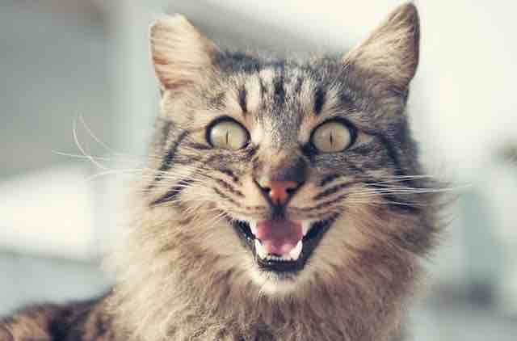

# Поддерживаемые модели



Для классификации изображений в сервисе используется модель, обученная на определенном наборе изображений. Модель указывается в запросе в конфигурации `classificationConfig`.

В модель могут входить признаки только одного из двух типов:

* взаимоисключающие — сумма вероятностей всех признаков модели равна единице;
* независимые — вероятность каждого признака равна любому значению от 0 до 1.

Сейчас поддерживаются модели:

* [quality](#quality) — оценивает качество изображения;
* [moderation](#moderation) — оценивает соответствие признакам, используемым при модерации изображений.

## quality {#quality}

Оценивает качество изображения.

**С помощью этой модели вы сможете**:

* Фильтровать изображения низкого качества, например, чтобы не показывать их в результатах поиска.
* Модерировать изображения для фотоконкурса, отбирать только изображения высокого качества.
* Сравнивать похожие изображения и выбирать то, которое лучшего качества.

[Попробуйте эту модель](../../operations/classification/quality.md).

**Тип признаков**: взаимоисключающие.

**Признаки**:

* `low` — изображение низкого качества с явно заметными артефактами;
* `medium` — изображение нормального качества с незначительными артефактами;
* `high` — изображение высокого качества без визуально заметных артефактов.

**Примеры результатов классификации**:



- high

  

  ```json
  "properties": [
      {
          "name": "low",
          "probability": 0.00039277845644392073
      },
      {
          "name": "high",
          "probability": 0.93234682083129883
      },
      {
          "name": "medium",
          "probability": 0.06726035475730896
      }
  ]
  ```

- medium

  

  ```json
  "properties": [
      {
          "name": "low",
          "probability": 0.072797946631908417
      },
      {
          "name": "high",
          "probability": 0.19245840609073639
      },
      {
          "name": "medium",
          "probability": 0.73474365472793579
      }
  ]
  ```

- low

  

  ```json
  "properties": [
      {
          "name": "low",
          "probability": 0.7901121973991394
      },
      {
          "name": "high",
          "probability": 0.004683326929807663
      },
      {
          "name": "medium",
          "probability": 0.20520441234111786
      }
  ]
  ```



## moderation {#moderation}

Оценивает, насколько соответствует изображение признакам, используемым при модерации.

**С помощью этой модели вы сможете**:

* Фильтровать контент для взрослых.
* Следить за размещением незаконного контента.
* Показывать предупреждение о нарушении авторских прав для изображений с водяными знаками.
* Проверять наличие текста на изображении, чтобы после воспользоваться [возможностью распознавания текста](../ocr/index.md).

[Попробуйте эту модель](../../operations/classification/moderation.md).

**Тип признаков**: независимые.

**Признаки**:

* `adult` — на изображении есть контент для взрослых.
* `gruesome` — изображение содержит шок-контент.
* `text` — изображение содержит текст.
* `watermarks` — изображение содержит водяные знаки.

**Пример результата классификации**:

```json
"properties": [
    {
        "name": "adult",
        "probability": 0.0017486262368038297
    },
    {
        "name": "gruesome",
        "probability": 0.0002884353743866086
    },
    {
        "name": "text",
        "probability": 0.13789896667003632
    },
    {
        "name": "watermarks",
        "probability": 0.99908816814422607
    }
]
```