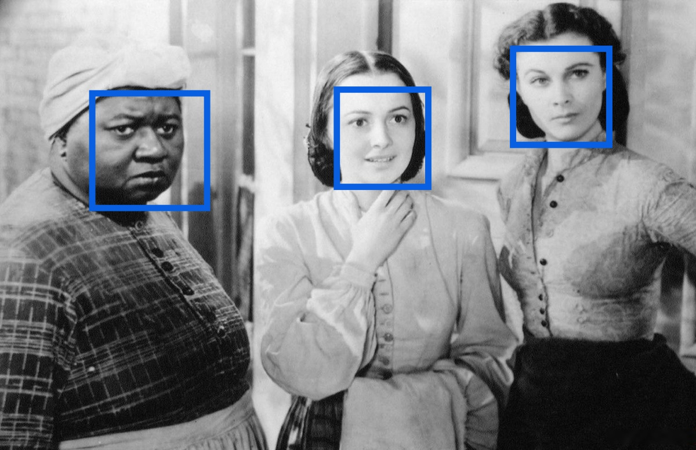

# Обнаружение лиц

_Обнаружение лиц сейчас находится на [стадии Preview](../../../overview/concepts/launch-stages.md)._

В этом разделе описано, как работает возможность _обнаружение лиц_ в сервисе.

Эта возможность позволяет находить лица людей на изображении. Например, чтобы отметить людей на фотографии или найти все фото с портретами.



Эта возможность не умеет распознавать лица. Вы не сможете находить похожие лица или идентифицировать личность человека с ее помощью.



## Формат запроса {#request-format}

В типе возможности укажите `FACE_DETECTION`:

```json
{
  "folderId": "b1gvmob95yys********",
  "analyze_specs": [{
    "content": "iVBORw0KGgo...",
    "features": [{
      "type": "FACE_DETECTION"
    }]
  }]
}
```

## Ответ сервиса {#servise-response}

Сервис ищет лица людей на изображении и выделяет их прямоугольниками. В ответе сервис возвращает координаты прямоугольников для всех найденных лиц:



Если два лица расположены рядом, то прямоугольники могут пересекаться.



Пример ответа с координатами обнаруженного лица:

```json
{
  "results": [{
    "results": [{
      "faceDetection": {
        "faces": [{
          "boundingBox": {
            "vertices": [{
              "x": "410",
              "y": "404"
            },
            {
              "x": "410",
              "y": "467"
            },
            {
              "x": "559",
              "y": "467"
            },
            {
              "x": "559",
              "y": "404"
            }]
          }
        }]
      }
    }]
  }]
}
```

## Требования к изображению {#image-requirements}

Изображение в запросе должно соответствовать следующим требованиям:



#### Что дальше {#what-is-next}

* [Попробуйте обнаружить лица на изображении](../../operations/face-detection/index.md).
* [Посмотрите, как обрабатывать ошибки](../../api-ref/errors-handling.md).