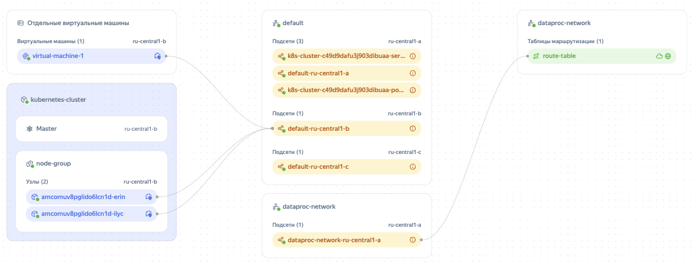

# Облачные сети и подсети

## Облачные сети {#network}

_Облачная сеть_ — это аналог традиционной локальной сети в дата-центре. Облачные сети [создаются](../operations/network-create.md) в каталогах и используются для передачи информации между облачными ресурсами и связи ресурсов с интернетом.

Для виртуальных машин {{ compute-full-name }} и хостов баз данных доступ из интернета и в интернет открыт через [публичные IP-адреса](address.md#public-addresses).

Управлять трафиком в облачных сетях и подсетях можно с помощью [групп безопасности](security-groups.md). Они содержат правила, которые определяют протоколы и IP-адреса для приема и отправки трафика.

## Подсети {#subnet}

_Подсеть_ — это диапазон IP-адресов в облачной сети. Адреса из этого диапазона могут назначаться облачным ресурсам — ВМ и кластерам баз данных. [Создавать подсети](../operations/subnet-create.md) можно только в том каталоге, которому принадлежит облачная сеть.

Размер подсети задается по методу бесклассовой адресации (CIDR). В подсетях можно использовать только частные IPv4-адреса из диапазонов, определенных в [RFC 1918](https://tools.ietf.org/html/rfc1918):
* `10.0.0.0/8`
* `172.16.0.0/12`
* `192.168.0.0/16`

Максимальный размер CIDR в этих диапазонах — `/16`, минимальный — `/28`.

Подсети должны иметь непересекающиеся диапазоны IP-адресов в пределах одной облачной сети. Первые два адреса из любого диапазона выделяются под шлюз (x.x.x.1) и [DNS-сервер](../../glossary/dns.md#dns-server) (x.x.x.2).

Трафик может передаваться между подсетями одной сети, но не может передаваться между подсетями разных сетей. Для передачи трафика между подсетями разных сетей необходимо использовать публичные IP-адреса.

Для подключения ресурса к подсети необходимо, чтобы он находился в той же зоне доступности, что и подсеть.

Сеть и подсеть можно [перемещать](../operations/network-move.md) между каталогами в пределах одного [облака](../../resource-manager/concepts/resources-hierarchy.md). Перемещать подсети между сетями или зонами доступности нельзя.

## Карта облачной сети {#map}

Карта облачной сети отображает взаимосвязи между ресурсами в каталоге, сетями и подсетями, куда входят ресурсы. Пример карты:

Карту можно использовать, чтобы получить визуальное представление о сетях. Например, с помощью карты можно узнать, какие подсети наиболее нагружены или для каких подсетей настроены таблицы маршрутизации. Из ресурсов на карте отображаются:

* [группы виртуальных машин](../../compute/concepts/instance-groups/index.md);
* [виртуальные машины](../../compute/concepts/vm.md);
* кластеры [{{ managed-k8s-full-name }}](../../managed-kubernetes/concepts/index.md#kubernetes-cluster);
* [группы узлов {{ managed-k8s-name }}](../../managed-kubernetes/concepts/index.md#node-group);
* узлы {{ managed-k8s-name }};
* [облачные сети](#network);
* [подсети](#subnet);
* [таблицы маршрутизации](routing.md).

На карте можно отобразить взаимосвязи с сетями только нужных ресурсов. Это удобно, если настроена обширная сеть с множеством ресурсов. Также из карты можно перейти на страницу ресурса за один клик. Подробнее о работе с картой см. в [инструкции](../operations/network-map.md).

#### См. также {#see-also} 

* [{#T}](software-accelerated-network.md)
