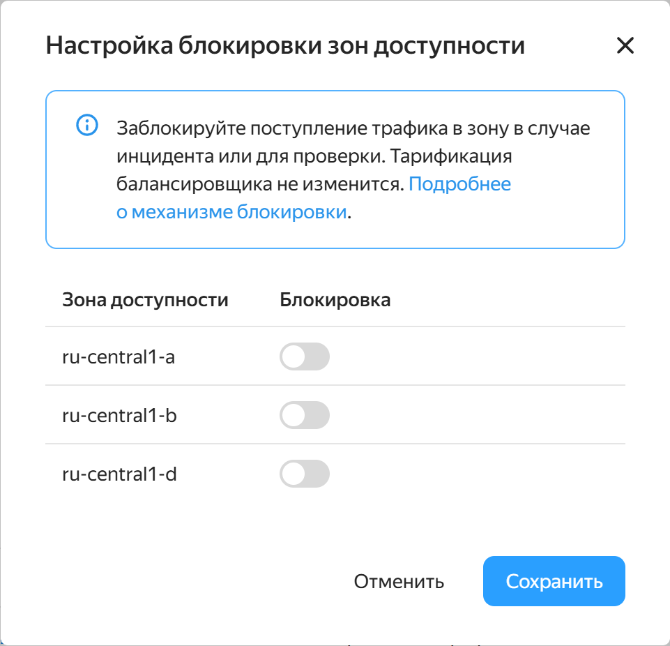
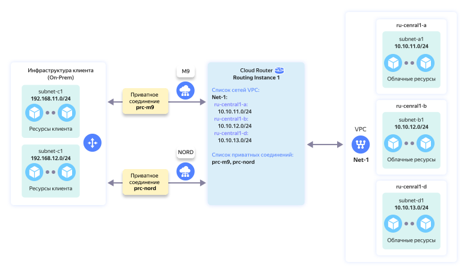

# История изменений в {{ vpc-full-name }}

<!-- Changelog begin -->


```
date: 2025-03
index: 1
```

### Точный контроль зон доступности



Снижайте нагрузку на зону доступности при локальных проблемах и тестируйте отказоустойчивость балансировщика, отключая зоны — по одной или несколько сразу.

### Защита от создания ВМ без сети

Будьте уверены в надежности ваших ресурсов: теперь виртуальные машины создаются только при гарантированно работающей сети.

### {{ interconnect-name }} для {{ vpc-name }} и {{ baremetal-name }}




Объединяйте облачную и выделенную инфраструктуру в единую частную сеть с помощью {{ interconnect-name }}.



<!-- Changelog end -->

## I квартал 2025 {#q1-2025}

* Ускорено развертывание data plane виртуальной сети. Время недоступности сети при обновлении data plane снижено с 60 секунд до 1 секунды и менее.
* Реализовано отключение зоны доступности от сетевых балансировщиков.
* Виртуальные машины больше не создаются, если при их старте гарантированно не будет работать сеть.
* Реализована работа {{ interconnect-name }} между {{ vpc-name }} и {{ baremetal-name }}.
* Оптимизированы работа gRPC API и обращения к базе данных control plane сетевых балансировщиков: увеличена скорость обновления статусов балансировщиков и реагирование групп ВМ на проблемы. Ускорено изменение правил балансировки, например, при проблемах в сети или изменении целевых групп.

## III квартал 2024 {#q3-2024}

* Добавлена возможность создавать [сервисные подключения](./concepts/private-endpoint.md). Возможность на стадии Preview, чтобы запросить доступ, [обратитесь в поддержку](../support/overview.md). 
* Реализована интеграция с {{ dns-name }} для указания DNS-записей в спецификациях публичных адресов.

## II квартал 2024 {#q2-2024}

* Увеличены [лимиты](../compute/concepts/limits.md) сетевых соединений.
* Добавлена валидация имен и меток ресурсов.

## I квартал 2024 {#q1-2024}

* Добавлены метрики сетевых соединений.
* Добавлена роль `vpc.publicUser`.
