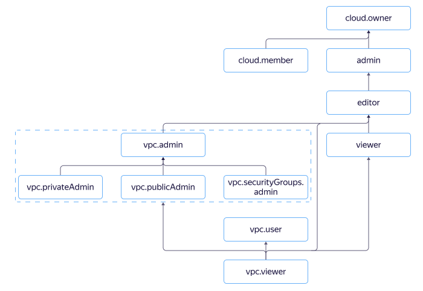

# Управление доступом в {{ vpc-name }}

В этом разделе вы узнаете:
* [на какие ресурсы можно назначить роль](#resources);
* [какие роли действуют в сервисе](#roles-list);
* [какие роли необходимы](#choosing-roles) для того или иного действия.



## На какие ресурсы можно назначить роль {#resources}



## Какие роли действуют в сервисе {#roles-list}

На диаграмме показано, какие роли есть в сервисе и как они наследуют разрешения друг друга. Например, в `editor` входят все разрешения `viewer`. После диаграммы дано описание каждой роли.

Роли, действующие в сервисе:

* Сервисные роли:
    * 
    * 
    * 
    * 
    * 
    * 
    * 
    * 
* Примитивные роли:
    * 
    * 
    * 

## Какие роли мне необходимы {#choosing-roles}

В таблице ниже перечислено, какие роли нужны для выполнения указанного действия. Вы всегда можете назначить роль, которая дает более широкие разрешения, нежели указанная. Например, назначить `editor` вместо `viewer` или `vpc.admin` вместо `vpc.publicAdmin`.

Действие | Методы | Необходимые роли
----- | ----- | -----
**Просмотр информации** | |
Просмотр информации о любом ресурсе | `get`, `list`, `listOperations` | `vpc.viewer` или `viewer` на этот ресурс
Получение списка подсетей в сети | `listSubnets` | `vpc.viewer` или `viewer` на сеть
**Использование ресурсов** | |
Назначение ресурсов {{ vpc-short-name }} другим ресурсам {{ yandex-cloud }} (например, назначение адреса на интерфейс или подключение сетевого интерфейса к подсети) | Различные | `vpc.user` на ресурс, а также право на изменение принимающего его объекта, если операция назначения ресурса мутирующая
Назначение/удаление публичного адреса на интерфейсе | различные | `vpc.publicAdmin` на сеть
Создание ВМ, подключенной к нескольким сетям | `create` | `vpc.publicAdmin` на каждую сеть, к которой подключается ВМ
**Управление ресурсами** | |
[Создание сетей в каталоге](../operations/network-create.md) | `create` | `vpc.privateAdmin` или `editor` на каталог
[Изменение](../operations/network-update.md), [удаление сетей](../operations/network-delete.md) | `update`, `delete` | `vpc.privateAdmin` или `editor` на сеть
[Создание подсетей в каталоге](../operations/subnet-create.md) | `create` | `vpc.privateAdmin` или `editor` на каталог и на сеть
[Изменение](../operations/subnet-update.md), [удаление подсетей](../operations/subnet-delete.md) | `update`, `delete` | `vpc.privateAdmin` или `editor` на каталог
[Создание таблицы маршрутизации](../operations/static-route-create.md) | `create` | `vpc.privateAdmin` или `editor` на каталог
Изменение, удаление таблицы маршрутизации | `update`, `delete` | `vpc.privateAdmin` или `editor` на таблицу маршрутизации
[Создание публичных адресов](../operations/get-static-ip.md) | `create` | `vpc.publicAdmin` или `editor` на каталог
[Удаление публичных адресов](../operations/address-delete.md) | `delete` | `vpc.publicAdmin` или `editor` на адрес
[Включение NAT в интернет](../operations/enable-nat.md) | | `vpc.publicAdmin` или `editor` на подсеть
[Создание шлюзов](../operations/create-nat-gateway.md) | `create` | `vpc.gateways.editor`
Подключение шлюза в таблице маршрутизации | `create`, `update` |  `vpc.gateways.user`
Создание групп безопасности | `create` | `vpc.securityGroups.admin` или `editor` на каталог и на сеть
Изменение, удаление групп безопасности | `update`, `delete` | `vpc.securityGroups.admin` или `editor` на сеть и на группу безопасности
**Управление доступом к ресурсам** | |
[Назначение роли](../../iam/operations/roles/grant.md), [отзыв роли](../../iam/operations/roles/revoke.md) и просмотр назначенных ролей на ресурс | `setAccessBindings`, `updateAccessBindings`, `listAccessBindings` | `admin` на этот ресурс

#### Что дальше {#what-is-next}

* [Как назначить роль](../../iam/operations/roles/grant.md).
* [Как отозвать роль](../../iam/operations/roles/revoke.md).
* [Подробнее об управлении доступом в {{ yandex-cloud }}](../../iam/concepts/access-control/index.md).
* [Подробнее о наследовании ролей](../../resource-manager/concepts/resources-hierarchy.md#access-rights-inheritance).
