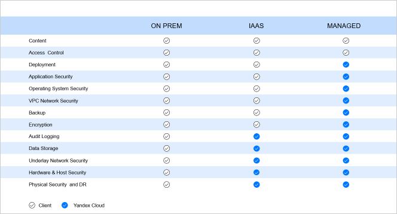

# Безопасность облачной платформы Яндекс.Облако

## Введение {#introduction}

### Зачем и для кого этот документ {#why-and-for-whom}

Данный документ предназначен для руководителей компаний, директоров служб информационной безопасности и представителей любых других должностей, которым важно понять процессы и технологии обеспечения информационной безопасности провайдера облачных сервисов Яндекс.Облако. Документ содержит информацию по следующим темам:
- Ключевые принципы безопасности облачных сервисов.
- Организация защиты облачной инфраструктуры и сервисов.
- Соответствие требования законодательства и международным стандартам.
- Клиентские инструменты обеспечения безопасности системы, использующей облачные ресурсы.

Документ будет полезен в случаях, когда необходимо:
- Получить общее представление о применяемых подходах к обеспечению безопасности на стороне провайдера.
- Спланировать защиту собственных ресурсов или приложений, размещенных или использующих облачные сервисы.
- Получить информацию о соответствии облачных сервисов требованиям международных стандартов и законодательства в области защиты данных.

### Ключевые принципы безопасности Яндекс.Облака {#key-principle}

**Открытость и прозрачность.** Работа с любыми облачными сервисами невозможна без определенного уровня доверия поставщику. Информация о внутреннем устройстве облачной платформы и действующих процессах помогает улучшать лояльность клиентов. Яндекс.Облако прилагает усилия по информированию заказчиков о том:
- Как устроены ключевые процесс обеспечения безопасности облачной инфраструктуры.
- Каким образом обеспечивается безопасность данных пользователей, и кто и при каких обстоятельствах имеет к ним доступ.
- Как обеспечивается соответствие мировым стандартам в области ИБ и требованиям законодательства.

**Следование рекомендациям международных стандартов и требований законодательства.** Важным аспектом защиты облачной инфраструктуры является следование рекомендациям общепринятых международных стандартов в области информационной безопасности и требований законодательства в части категорий данных, доступ к которым должен быть ограничен в соответствии с федеральным законами. Выполнение данного принципа обеспечивается с помощью регулярных внутренних и внешних аудитов, в рамках которых проводится оценка соответствия требованиям законодательства и ключевым стандартам
 
**Должное внимание вопросам практической безопасности.** Процессы разработки облачных сервисов реализуют лучшие практики жизненного цикла безопасной разработки (SDLC), предписывающие выстраивать защиту начиная с самых ранних этапов любого проекта, формируя основу безопасности облачных сервисов — Security by Design (безопасность по умолчанию). Дополняющая эту основу концепция Defense in Depth (эшелонированная оборона) создает многослойную защиту, препятствующую действиям злоумышленников и способствующую раскрытию их деятельности на ранних этапах подготовки атаки.

## Яндекс.Облако {#yandex-cloud}

Яндекс.Облако — это публичная облачная инфраструктурная платформа от Яндекс, где каждая организация может создавать или развивать свои цифровые продукты и решения, собирая и используя данные. На платформе доступны сервисы трёх типов: Infrastructure as a Service, Platform as a Service и Software as a Service. Фокус платформы – это инструменты разработки, аналитики и управления данными, искусственного интеллекта и машинного обучения. В основе – уникальные и трудно воспроизводимые технологии, которые развернуты в трех собственных дата-центрах Яндекса.

## Разделение ответственности за обеспечение безопасности {#responsibility}

Безопасность систем, использующих облачные сервисы, требует разделения ответственности между клиентом — владельцем конечной системой и провайдером — владельцем облачной инфраструктуры, используемой конечной системой. В зависимости от модели облачных сервисов, используемой клиентской системой (IaaS, PaaS, SaaS), данное разделение меняется. Визуально его можно представить следующим образом: 

Как видно, в случае собственной инфраструктуры полная ответственность за обеспечение безопасности на всех уровнях лежит на владельце инфраструктуры. При использовании облачных сервисов по модели Infrastructure as a Service, определенные спектр задач, связанных с безопасностью платформы, поверх которой работают виртуальные машины клиентов, обеспечивает провайдер. В частности, провайдер отвечает за физическую безопасность и отказоустойчивость самой платформы, защищает сеть, собирает и анализирует события безопасности гипервизоров и других компонентов инфраструктуры. Клиент же отвечает за безопасность гостевых машин и всех элементов, которые он контролирует. То есть службы ИТ и ИБ организаций, использующих облачные сервисы должны осуществлять резервное копирование виртуальных машин, защищать виртуальную сеть, обеспечивать безопасность гостевых операционных систем, контролировать доступ и оберегать от компрометации учетные записи пользователей облака. При использовании управляемых сервисов (managed) забот на стороне конечного пользователя становится еще меньше, так как в этом случае провайдер уже обеспечивает защиту и более высокоуровневых слоев инфраструктуры, включая виртуальные машины, реализующие определенные сервисы. Например, в случае использования managed database провайдер выполняет резервное копирование базы данных.  Но в любой из ситуаций клиент не может полностью отказаться от реализации мер безопасности, так как он контролирует права доступа к своему контенту и должен соответствующим образом управлять этим доступом. Ответственность за реагирование на инциденты ИБ также распределяется между провайдером и Клиентом. Провайдер обеспечивает реагирование на инциденты, связанные с его зоной ответственности (системами, которые он непосредственно контролирует). Клиент должен выстроить процесс реагирования на инциденты, охватывающий системы, которые тем или иным образом используют облачные сервисы. Провайдер обязуется связываться с Клиентом в случае, когда ему становится известно, что инцидент повлиял на системы Клиента, использующие Облако или размещенные в Облаке. Также для помощи с расследованием инцидента, выявленным самостоятельно, Клиент имеет возможность завести запрос в техническую поддержку. 

## Следование лучшим практикам и стандартам {best-practices}

В данном разделе представлена информация о том, как организованы процессы, связанные с эксплуатацией и защитой облачной платформой. Также рассматриваются вопросы соответствия международным стандартам и требованиям законодательства.

### Система Управления Информационной безопасности {#security-management-system}

Провайдер внедрил и поддерживает Систему Управления Информационной Безопасности, которая включает принятие и применение внутренних политик и процедур, направленных на минимизацию рисков информационной безопасности. В команде безопасности Яндекс есть роли, отвечающие за мониторинг и развитие внедренных процессов, а политика управления рисками предписывает ежегодную оценку рисков и выполнение планов по снижению рисков. 

### Инвентаризация активов {asset-inventory}

В компании выстроен процесс инвентаризации активов, включая учет систем, обрабатывающих данные клиентов. Правила допустимого использования информации и активов, связанных с обработкой информации, задокументированы и доводятся до сведений сотрудников на регулярной основе. Сотрудники возвращают все корпоративные активы при увольнении, доступы к системам отзываются автоматически. Активы классифицируются в соответствии с требованиями законодательства, с учетом ценности информации и негативных последствий в случае несанкционированного доступа, изменения или раскрытия данных. Требования по обращению данных различных классов указаны в правилах допустимого использования информации и активов. Непригодные или ненужные для дальнейшего использования носители данных выводятся из эксплуатации безопасным образом в соответствие с формальными регламентами

### Контроль доступа {#access-control}

Провайдер разработал и использует политику контроля доступа, которая гарантирует, что только авторизованный персонал получает доступ к помещениям, зонам безопасности, серверным и сетевым ресурсам. У сотрудников Яндекс.Облака есть доступ только к тем ресурсам, которые они уполномочены использовать исходя из должности (Principle of need to know), права предоставляются по принципу наименьших привилегий (Principle of least privilege). Права на доступ ко всем помещениям, зонам безопасности, серверным и сетевым ресурсам утверждаются руководителями организации. Интерфейсы управления аппаратными и сетевыми ресурсами находятся в отдельно выделенной сети, доступ к которой сильно ограничен. Исходный код предоставляется только авторизованному персоналу в соответствие с действующей политикой безопасности. 

### Организация физической безопасности {#physical-security}
 
Компания принимает следующие меры обеспечения физической безопасности:
- Аппаратные ресурсы Яндекс.Облака располагаются в собственных ЦОДа-х.
- Доступ на территорию ЦОД-в строго регламентирован и требует заранее согласованной заявке для гостей и сотрудников Яндекс.Облако, которые не работают в ЦОД на постоянной основе.
- Объекты облачных сервисов (стойки, железные ящики, зона диагностики) находятся под постоянным видео наблюдением.
- Записи видеокамер хранятся на серверах, принадлежащих Яндексу, не менее трех месяцев в оперативном доступе. В архиве записи хранятся не менее 3 лет.
- Сотрудники службы безопасности Я.Облака следят за всеми доступами в защищенную зону и к стойкам сервиса.
- Для доступа к серверам сервиса обязательным условием является запрос с обоснованием необходимости доступа, который утверждается руководством сотрудника, запросившего доступ.
- Сохраняемые на дисках данные клиентов Облака в обязательном порядке шифруется вне зависимости от используемого сервиса.
- Замена вышедшего из строя оборудования осуществляется строго по заявке. Правила использования активов предусматривают надежное удаление данных с носителей в рамках их вывода из эксплуатации или при переиспользовании.
- Неисправное оборудование хранится в сейфах, в специальных сейф-пакетах. Оборудование не выносится из помещений без одобренной заявки. При этом учитываются всевозможные риски, связанные с выносом оборудования из охраняемой зоны.

### Процесс безопасной разработки {#safe-development}

Неотъемлемой частью создания новых и развития существующих сервисов является процесс безопасной разработки, известный в мире как Security Development Lifecycle. В Яндексе реализованы и постоянно развиваются ключевые компоненты данного цикла:
- Обучение. Регулярное информирование сотрудников, занимающих разработкой облачных сервисов включает в себя:
    - Обязательный ежегодный тренинг для всех специалистов. Все сотрудники разработки должны сдать теоретический и практический тесты.
    - Внутреннее руководство. В нем описаны базовые принципы безопасной разработки, перечень возможных уязвимостей для разного типа приложений, показаны типичные примеры уязвимого кода и исправлений. Также там есть информация о том, как использовать различные техники и технологии снижения вероятности эксплуатации уязвимости (так называемые mitigations). Регламенты указывают минимальные требования к использованию криптографии, которым должны следовать при разработке всех сервисов и приложений.
    - Постоянный процесс обмена знаниями с экспертами. Обычно, в рамках таким собраний глубоко обсуждаются конкретные темы, новые угрозы и методы противодействия.
    - Ежегодная игра Capture The Flag, на которой разработчикам предлагают на практике проверить свои знания в области информационной безопасности. Практический тренинг такого рода помогает командам избегать ошибок при проектировании и разработке реальных сервисов.
- Архитектурное планирование. Как и предписывает классический SDLC перед созданием любого продукта или до изменения архитектуры действующего сервиса проводятся серия совещаний с экспертами в области безопасности, на которых рассматриваются всевозможные угрозы и способы атак на создаваемый сервис. В результате таких встреч сервис обретает "иммунную систему", что вкупе с другими мерами defense in depth стратегии обеспечивает надежную защиту функционирования самого сервиса и безопасность обрабатываемых им данных
- Статический и динамический анализ. В процессе разработки репозитории регулярно сканируются системами статического анализа кода. Проверяется качество кода, покрытие кода тестами, команды также используют инструменты динамического анализа в рамках sanity и fuzzy тестирования
- Финальный анализ безопасности. Несмотря на название данная процедура осуществляется не единожды, а перед каждым крупным этапом проекта, например, выход сервиса в стадию Preview. Финальный анализ безопасности — это whitebox тестирование, по сути тест на проникновение, с доступом к документации, команде разработки, тестовому стенду и так далее. Проверяется не только сам сервис, но и окружение, в котором он функционирует. Также по итогам, проводится оценка рисков и дополнительно производится аудит по соответствию внешним требованиям исходя из обрабатываемых сервисом данных

Помимо непосредственно процесса безопасной разработки внимание также уделяется защите самого окружения разработки. Провайдер разделяет среды разработки, тестирования и промышленной эксплуатации. Внедрены контроли, гарантирующие невозможность репликации данных из промышленного контура в другие окружения.

### Управление обновлениями {#update-management}

Яндекс.Облако разработала политику управления обновлениями, которая регламентирует максимально возможный интервал, в рамках которого необходимо установить выпущенное производителем ПО обновление.

### Управление уязвимостями {#vulnerability-management}

Провайдер регулярно проводит проверку уязвимостей предпроизводственных серверных систем с выходом в интернет и сетевых устройств перед перемещением этих систем/устройств в промышленный контур. Все найденные уязвимости устраняются до перемещения систем. При обнаружении уязвимостей в компонентах промышленной среды, проводится анализ сложности эксплуатации и серьезности последствий, после чего командами разработки готовится обновление с учетом данных, установленных в ходе анализа уязвимости.

### Внутренний и внешний аудиты, тесты на проникновение {#audits-and-tests}

В целях проверки работоспособности действующих процессов обеспечения ИБ и их развития компания проводит периодические внутренние, внешние аудиты и тесты на проникновения:
- Система Управления Информационной Безопасностью (СУИБ), внедренная в ООО «Яндекс.Облако», проходит процедуру регулярного внутреннего аудита с учетом рекомендаций ISO 19011. 
- В рамках внутреннего аудита проверяются такие процессы и группы контролей ИБ как управления активами, физическая безопасность, управление изменениями, управление инцидентами ИБ, мониторинг и многие другие. 
- Для достижения целей аудита при проведении внутреннего аудита СУИБ внутренним аудитором могут использоваться следующие методы и их комбинации: проведение интервью, заполнение чек-листов, проведение проверки документированной информации с участием проверяемого, наблюдение за выполняемой деятельностью, формирование репрезентативной выборки.
- Все несоответствия, выявленные в ходе внутреннего аудита, подлежат анализу на предмет установления корневых причин возникновения несоответствий и вносятся в план корректирующих действий.
- В соответствии с требованиями законодательства в области защиты ПД и стандартов ISO в компании есть план проведения внешних аудитов на соответствие требованиям стандартов ISO 27001, ISO 27017, ISO 27018, а также план контрольным мероприятий проверки соответствия процессов и контролей ИБ 21-му приказу ФСТЭК.
- Команда безопасности Яндекс.Облака использует практики Red Teaming. Найденные уязвимости в рамках регулярных тестов на проникновение исправляются командами разработки или, при невозможности быстрого выпуска обновления, закрываются соответствующими средствами защиты до выхода исправления.

### Процессы реагирования на инциденты {#incident}

В компании существует политика управления инцидентами. Реализация процесса управления инцидентами ИБ осуществляется Центром операционной безопасности (Security Operations Center, SOC) в составе Службы информационной безопасности. При необходимости привлекаются сотрудники профильных структурных подразделений для оказания правовой, административной и экспертной поддержки. Основной задачей SOC является повышение уровня безопасности Компании путем реализации следующих процедур управления инцидентами ИБ:
- Обнаружение событий ИБ. С помощью мониторинга событий СБ и получения сообщения от пользователей.
- Выявление инцидентов ИБ. Для выявления используются автоматизированные средства и экспертиза сотрудников SOC.
- Реагирование на инциденты ИБ. Осуществляется по типовому плану реагирования или при отсутствии такового за счет привлечения необходимых специалистов к разрешению инцидента. В зависимости от типа и критичности инцидента предпринимаются различные меры, например в случае, когда источником угрозы является кто-то из пользователей облака:
    - Для устранения инцидента провайдер может заблокировать доступ в сеть виртуальных хостов пользователя. 
    - При повторном нарушении или значительной угрозе безопасности Облака или клиентов Облака, может быть заблокирован аккаунт пользователя с отправкой нотификации по электронной почте.
- Анализ инцидентов ИБ. Анализ произошедшего инцидента проводится сотрудниками SOC незамедлительно после устранения последствий инцидента.
- Применение корректирующих действий. По результатам проведенного анализа сотрудник SOC принимает решение о необходимости применения корректирующих действий и/или коррекции.

#### Уведомление Клиентов {#notification}

Критерии уведомления Клиента об инцидентах указаны в оферте (договоре). В случаях, когда Клиенты, затронутые инцидентом, должны быть проинформированы, уведомление высылается в течение 24 часов. Уведомления высылаются в виде электронного письма, за подготовку которого отвечает инцидент-менеджер, назначенный в момент регистрации инцидента. В уведомлении указывается характер инцидента, описываются возможные последствия и принятые (или предполагаемые) меры по устранению инцидента и возможных последствий. Письмо согласуется с ответственными лицами и передается в службу поддержку для рассылки клиентам. Письма высылаются на русском и английском языке. Если соответствующие меры на стороне клиента могут воспрепятствовать реализации инцидента или снизить его последствия, то о таких мерах будет сообщено в уведомлении.

### Сотрудники Яндекс.Облака {#staff}

В целях минимизации рисков в области информационной безопасности, связанных с действиями работников Yandex.Cloud, проводятся различные мероприятия и процедуры, включающие, но не ограничивающиеся следующими примерами:
- Проводится проверка всех кандидатов на трудоустройство.
- Мероприятия по повышению осведомлённости специалистов, в рамках которых сотрудники знакомятся с требованиями внутренних политик и регламентов, включая <q>Политику информационной безопасности Яндекс.Облака</q> и <q>Положение об обработке персональных данных Яндекс.Облака</q>.
- Сотрудники ЦОД-ов, администраторы и разработчики на регулярной основе проходят дополнительные курсы, связанные с безопасной разработкой и регламентами администрирования и эксплуатации облачных сервисов с учетом требования стандартов и внутренних политик.
- Обучение осуществляется как в онлайн, так и очно.
- По результатам обучения необходимо выполнить тестирование в обучающей платформе, подтверждающее уровень знаний сотрудников.
- Результаты процесса контроля практических навыков и теоретических знаний пользователей анализируются и по результатам анализа вырабатываются корректирующие действия в отношении системы обеспечения ИБ Компании.
- Не прошедшие необходимые тренинги в установленный срок сотрудники не допускаются к выполнению своих рабочих обязанностей.
- Права доступа пользователей пересматриваются каждые полгода.
- При увольнении или смене должности права к информационным ресурсам автоматически отзываются.
- Пароли пользователей проверяются на соответствие парольной политике. Регулярно оценивается стойкость паролей и их отсутствие в популярных словарях.

### Непрерывность бизнеса и отказоустойчивость {#continuity-and-resiliency}

В компании реализована система управления непрерывностью бизнеса, в рамках которой сформулированы требования ко всем критичным процессам провайдера, нарушение функционирования которых влияет на выполнение взятых на себя обязательств перед партнерами и клиентами. Система управления непрерывностью бизнеса подразумевает наличие планов, учитывающих сценарии негативного развития событий, в которых приводятся последовательность действий различных ролей сотрудников при наступлении одного из сценариев. Система предусматривает механизмы резервирования для всех критичных компонент облачной платформы, включая гео-резервирование с помощью трех географически распределенных центров обработки данных. Также используются резервирование хранилищ данных, позволяющие восстановить информацию клиентов в случае отказа оборудования. Для отработки эффективности сформированных планов регулярно проводятся тестирования, в том числе включающие в себя шаги по анализу результатов тестирования и выработки мер по устранению недостатков, а также принятие решения о необходимости пересмотра существующих планов.

### Соответствие требованиям {compliance-with-requirements}

#### ФЗ 152 (Закон <q>О персональных данных</q>) {#fz}

Для сервисов информационной системы Яндекс.Облака выполнены меры по защите персональных данных согласно Постановлению №1119 и 21 приказу ФСТЭК в соответствии с требованиями к 3 уровню защищенности (УЗ-3).

При размещении клиентом на ресурсах платформы Яндекс.Облака персональных данных, в отношении которых клиент выступает оператором, клиент поручает Яндексу обработку таких персональных данных. При этом Яндекс.Облако обязуется соблюдать конфиденциальность персональных данных и обеспечивать безопасность персональных данных при их обработке, а также выполнять все необходимые требования к защите обрабатываемых персональных данных, установленные законодательством.

Подробную информацию можно найти по ссылкам в конце документа.

#### GDPR (General Data Protection Regulation) {#gdpr}

Генеральный регламент о защите данных (General Data Protection Regulation, сокращенно GDPR) регулирует сбор и обработку информации о физических лицах — гражданах Европейской экономической зоны. Он призван усилить защиту конфиденциальных данных и сделать прозрачными все элементы сбора, хранения и обработки информации в интернете.

На данный момент платформа Яндекс.Облако выполняет ключевые требования GDPR. В частности, внедрены процессы, отвечающие за обработку обращений субъектов ПД, связанных с получением, изменением и удалением ПД, предприняты всесторонние меры по защите данных и установлена процедура информирования заказчиков в случаях инцидентов.  Дополнительную информацию по этой теме можно найти в Data Processing Addendum по ссылке в конце документа. 

## Технические меры защиты на стороне провайдера {#technical-measure}

### Безопасность инфраструктуры облачной платформы {#infrastructure-security}

**Разделение и изоляция ресурсов**

Изоляция ресурсов административной и пользовательских полезных нагрузок в Яндекс Облаке происходит следующим образом:
- Физическая изоляция при помощи хост-групп. Критичные с точки зрения безопасности сервисы запускаются в виртуальных машинах на отдельной группе физических хостов, на которой не происходит запуска пользовательских виртуальных машин.
- Логическая изоляция на уровне гипервизора и отдельных ядер. В ряде случаев административная нагрузка может запускаться на хостах, на которых располагаются виртуальные машины пользователей. В таких случаях изоляция осуществляется на уровне гипервизора и на уровне отдельных физических ядер.
- Логическая изоляция на уровне IAM. Все административные операции авторизуются при помощи сервиса IAM и для их выполнения требуются специальные права, недоступные обычным пользователям Яндекс Облака. 
- Изоляция на уровне сети. Все административные виртуальные машины запускаются в отдельных физически или логически изолированных сетях. Корпоративная сеть провайдера сегрегирована от сети облачной платформы. Автоматический контроль доступа реализуется посредством списков управления доступа на маршрутизаторах, динамических и хостовых межсетевых экранов.
- В multi-tenant системах изоляция реализуется на уровне приложения, а также при помощи проверки прав доступа и cloud/folder для пользователя, осуществляющего операцию над ресурсами.

### Защита данных {#data-protection}

Владельцем данных, привнесенных в облачные сервисы, всегда является пользователь облачной платформы. Яндекс.Облако не использует информацию и контент клиента, размещенные на ресурсах Платформы, иным образом, кроме как для выполнения целей договора и уведомляет клиента о всех инцидентах, затрагивающих пользовательские данные клиента, за исключением случаев, когда обратное установлено применимым законодательством или договором.

#### Шифрование на уровне Storage {#storage}

Storage является multitenant системой и шифрует свои данные отдельным от остальных систем набором ключей непосредственно перед записью данных на физический диск. Ключи шифрования хранятся на физических хостах, на которых работает Storage.

#### Шифрование на уровне YDB Tenants {#ydb}

В [YDB](../ydb/index.yaml) дополнительно реализован слой шифрования данных на уровне отдельных tenant-ов, которые шифруют данные непосредственно перед их отправкой в Storage. Шифрование на уровне тенантов включено для следующих систем, построенных на базе YDB: Object Storage, YMQ и т.д., а также для данных сервисов Compute, VPC, Load Balancer, сервисов PaaS и т.д.

#### Шифрование резервных копий данных в Managed Services for Databases {#backups}

Все резервные копии, создаваемые сервисами MDB шифруются перед отправкой их в постоянное хранилище. Для этого для каждого пользователя генерируется пара ключей ассиметричного шифрования, которая хранится в сервисе MDB.

#### Шифрование данных при передаче {#transmission}

Для шифрования данных при передаче используется протокол TLS. Ключи для работы протокола TLS хранятся на хостах, на которых он используется.

В сценариях, указанных выше, используются следующие криптографические алгоритмы:
- Симметричные — AES-GCM, ChaCha.
- Ассиметричные — RSA, Ed25519.

Минимальная длина ключа, используемая в симметричных алгоритмах — 128 бит, в ассиметричных — 2048.

#### Удаление данных {#delete-data}

Удаление данных пользователей может быть обусловлено следующими факторами:
- Автоматической блокировкой облака
    - По истечению отведенного времени на разблокировку (в зависимости от причины блокировки) данные безвозвратно удаляют в течение 72 часов.
- Удаление облака пользователем
    - По истечению 30 дней (срок, в рамках которого пользователь может восстановить ресурсы и данные) данные безвозвратно удаляют в течение 72 часов.
- Разрыв контракта
    - При разрыве контракта все облака пользователя, ресурсы и данные в них удаляются в течение 72 часов.

При удалении данных используется надежный способ очистки, гарантирующий невозможность их восстановления. Полный перечень условий удаления данных прописан в Договоре

#### Раскрытие данных 3-й стороне {#compromise}

Яндекс.Облако не раскрывает информацию третьим лицам за исключением тех случаев, когда это предусмотрено действующим законодательством или положениями договора. Всегда, когда это возможно, Яндекс.Облако перенаправляет запрос третьей стороны напрямую клиенту.

### Защита информации о пользователе {#user-information}

Информация о пользователях доступна сотрудникам Облака на основе принципа need to know, то есть эту информацию получают только те подразделения, которым она необходима непосредственно для выполнения своих обязанностей. В системах обработки и хранения данной информации используется аутентификация, авторизация и аккаунтинг действий над записями. 
Информация о пользователях включает в себя:
- Логи действий пользователей (операции).
- Access логи для API и Console.
- Техническая информация о состоянии сервисов (виртуальных машин пользователя, баз данных пользователя и т.д.).
- Финансовая информация и информация о потреблении.

Права на доступ к информации выше по умолчанию ограничены и регулярно пересматриваются сотрудниками службы ИБ. Системы, в которых хранится и обрабатывается данная информация, создаются с использованием процесса SDL (безопасной разработки) и регулярно проходят внутренний тест на проникновение. Везде, где это применимо, информация о пользователях шифруется при хранении и передаче. 

## Средства защиты, доступные пользователям облачных сервисов {#protection-means}

### Сервисы аутентификации {#authentication-service}

На данный момент пользователям доступны следующие виды аккаунтов в Облаке:
- [Учетные записи Яндекс.Паспорт](#passport)
- [Федерированные учетные записи](#saml)
- [Сервисные аккаунты](#service-accounts)

#### Учетные записи в Яндекс.Паспорт {#passport}

Для аутентификации через [Яндекс.Паспорт](https://yandex.ru/support/passport/) необходимо использовать логин и пароль либо пин код и приложение Яндекс.Ключ, в случае настроенной двухфакторной аутентификации. Если аутентификация успешна, то сервис Яндекс.Паспорт устанавливает в браузере пользователя Cookie на домен yandex.TLD. Вся функциональность по аутентификации пользователя и установке cookie проходит целиком в сервисе Yandex Passport, в котором в том числе хранятся криптографические ключи для контроля целостности cookie.

Установленная cookie в последствии используется сервисом IAM для аутентификации пользователя и выдачи ему IAM-токена для доступа к API Яндекс.Облака. Криптографические ключи, использующиеся для контроля целостности IAM-токена хранятся в сервисе IAM. 
Для работы с CLI Яндекс.Паспорт выдает пользователю [OAuth-токен](../iam/concepts/authorization/oauth-token.md), который хранится на диске пользователя и используется CLI для получения временного [IAM-токена](../iam/concepts/authorization/iam-token.md). Во всех случаях время жизни IAM-токена – 24 часа, время жизни OAuth-токена один год с момента выдачи токена. Криптографические ключи, использующиеся для контроля целостности OAuth-токена (где это применимо), хранятся в сервисе Яндекс.Паспорт.

#### Федерированные аккаунты {#saml}

В случае использования [Identity Federation](../iam/concepts/users/identity-federations.md) сервис IAM принимает от стороннего Identity Provider подписанный SAML-токен, который содержит информацию об аутентифицированном пользователе. Ключ криптографической подписи SAML-токенов хранится на стороне Identity Provider-а клиента, поэтому управление этим ключом, безопасное хранение и использование этого ключа является целиком ответственностью клиента. Открытая часть ключа, использующаяся для проверки подписи SAML-токенов устанавливается клиентом при настройке Identity Federation и в последствии хранится в сервисе IAM.

После получения и проверки подписи SAML-токена сервис IAM устанавливает пользователю cookie на домен cloud.yandex.TLD. Криптографические ключи, использующиеся для контроля целостности cookie, хранятся и управляются в сервисе IAM. 

#### Сервисные аккаунты {#service-accounts}

[Сервисные аккаунты](../iam/concepts/users/service-accounts.md) представляют собой особый тип аккаунтов, которые должны использоваться для доступа к ресурсам Облака от имени приложения. Сервисные аккаунты могут аутентифицироваться при помощи:
- [Авторизованных ключей](../iam/concepts/authorization/key.md) — RSA-ключей, которые генерируется в сервисе IAM и становятся доступными для скачивания пользователю один раз сразу после создания. В сервисе IAM хранится только открытый ключ, закрытый ключ хранится у пользователя и обеспечение безопасности закрытого ключа — целиком ответственность пользователя.
- [Статических ключей](../iam/concepts/authorization/access-key.md), которые используются для доступа к сервисам [YMQ](../message-queue/index.yaml) и [Object Storage](../storage/index.yaml). В данном случае копия статических ключей выдается пользователю сразу после их создания сервисом IAM. Статические ключи хранятся в сервисе IAM и служат для проверки целостности запросов к сервисам YMQ и Object Storage. Статические ключи не покидают сервис IAM.
- [API-ключей](../iam/concepts/authorization/api-key.md), которые служат для доступа к ML сервисам. API-ключи хранятся в сервисе IAM.

### Дополнительные инструменты защиты данных {#additional-tools}

Облако защищает данные клиентов в том числе криптографическими средствами. Однако пользователь может дополнительно защищать свои данные с использованием сервиса KMS (Key Management Service), который предназначен для управления криптографическими ключами пользователя в Облаке и предоставляет дополнительные возможности по шифрованию данных. Дополнительную информацию можно узнать из [документации KMS](../kms/index.yaml).

### Полезные ресурсы {#useful-resource}

Данный список ресурсов поможет найти подробности некоторых из тем, рассмотренных в этом документе, и получить больше информации о лучших практиках обеспечения безопасности при использовании облачных сервисов.
- [Заключение о соответствии системы защиты персональных данных требованиям №152-ФЗ <q>О персональных данных</q>](https://storage.yandexcloud.net/yc-compliance/conformance_ru_pdp.pdf)
- [Соглашение об обработке данных](https://yandex.ru/legal/cloud_dpa/)
- [Data Processing Addendum](https://yandex.com/legal/cloud_dpa/)
- [Федеративная аутентификация](https://cloud.yandex.ru/docs/iam/operations/federations/integration-common)
- [Сервисные аккаунты](https://cloud.yandex.ru/docs/iam/concepts/users/service-accounts)
