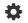

# Динамические таблицы

С помощью блока `grid` вы можете вставить на страницу [динамическую таблицу](../create-grid.md) и настроить ее отображение.

### Вызов блока {#tab-call}

```
{{grid page="адресТаблицы"}}
```


По умолчанию такую таблицу можно редактировать прямо на странице, в которую она встроена. Все изменения будут автоматически применяться к основной таблице и всем ее вхождениям в другие страницы.


### Параметры блока {#tab-params}

Параметр | Описание
--- | ---
`page` | Обязательный параметр. Содержит адрес таблицы, которую вы хотите добавить на страницу.
`width` | Ширина таблицы в процентах от ширины страницы:<br>`{{grid page="адресТаблицы" width="60%"}}`
`readonly` | Если присутствует, таблица встраивается в режиме <q>только для чтения</q>.
`num` | Если присутствует, номера строк таблицы не отображаются.
`sort` | Если присутствует, настройки сортировки исходной таблицы не учитываются.
`filter` | Позволяет задать [фильтр для отображения строк таблицы](#row-filter).
`columns` | Позволяет [задать столбцы для отображения на странице](#col-filter).

## Как задать фильтр для отображения строк {#row-filter}

С помощью параметра `filter` вы можете задать условия для отображения строк динамической таблицы, вставленной на страницу. Например:

```
{{grid page="адресТаблицы" filter="[id1]=значение1, [id2]=значение2"}}
```

Такой фильтр выведет только те строки, для которых одновременно выполнены условия:

- в столбце с идентификатором `[id1]` указано `значение1`;

- в столбце с идентификатором `[id2]` указано `значение2`.

Чтобы узнать идентификатор столбца: 

* Нажмите на значок  в заголовке нужного столбца.

* Выберите  **Настройки**.

Чтобы вывести строки, для которых выполнено хотя бы одно из указанных условий, используйте оператор `OR`.



В зависимости от типа данных столбца, значения для сравнения указываются по-разному:

Тип данных | Пример | Описание
--- | --- | ---
Текст | `'велосипед'` | Текст в одинарных кавычках.
Число | `-7` | Число без кавычек.
Чекбокс | `true` | Поддерживаются различные форматы записи.<br><br>Для логического нуля: `no, off, false, unchecked`.<br><br>Для логической единицы: `yes, on, true, checked, done`.
Дата | `2012-12-12` | Дата в формате `ГОД-МЕСЯЦ-ДЕНЬ`.
Список | `'велосипед'` | Текст в одинарных кавычках.
Множественный список | `'велосипед'` | Текст в одинарных кавычках.
Сотрудник | `login@` | Логин сотрудника без кавычек.
Задача в {{ tracker-name }} | `KEY-1234` | Ключ задачи в {{ tracker-name }} без кавычек.





Операция | Запись | Пример
--- | --- | ---
Равно | `=`, `is` | `[13] is 'велосипед'`
Не равно | `!=`, `is not` | `[13] is not 'велосипед'`
Сравнение | `<`, `>`, `<=`, `>=` | `[13] > 50 `
Содержит подстроку | `~` | `[13] ~ 'вело'`
Не содержит подстроку | `!~` | `[13] !~ 'вело'`
В интервале от ... до ... (работает с числами и датами) | `between ... and ...` | `[13] between 100 and 1000`
Равно одному из ... | `in (...)` | `[13] in ('велосипед', 'мотоцикл', 'вертолет')`
Не равно ни одному из ... | `not in (...)` | `[13] not in ('подлодка', 'космический корабль')`



## Как выбрать столбцы для отображения {#col-filter}

Вы можете отобразить на странице только заданные столбцы динамической таблицы. Для этого:

1. Получите код для вставки таблицы и разместите его в тексте страницы.

1. Добавьте параметр `columns` к коду — он позволяет выводить на страницу только необходимые столбцы:

```
{{grid page="адресТаблицы" columns="id1, id2, id3"}}
```
Такой динамический блок содержит только столбцы с идентификаторами `id1, id2, id3`.

Чтобы узнать идентификатор столбца: 

* Нажмите на значок  в заголовке нужного столбца.

* Выберите  **Настройки**.