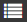

# Оглавление страницы

[Страницы {{ wiki-name }}](../pages-types.md#page), созданные в старом редакторе, могут автоматически формировать оглавление на основе заголовков. Для этого используется динамический блок `toc`.

Чтобы добавить на страницу автоматическое оглавление:

1. Убедитесь, что ваша страница создана в [старом редакторе](../create-page.md).
1. Убедитесь, что заголовки страницы [правильно размечены](../basic-markup.md#markup). Для быстрого просмотра оглавления страницы на панели справа нажмите значок .
    Если на странице есть совпадающие заголовки, ссылки в оглавлении могут работать некорректно.

1. Создайте оглавление с помощью динамического блока:
    
    ```
    not_var{{toc}}
    ```

По умолчанию в оглавление будут попадать все заголовки страницы {{ wiki-name }}. Вы можете настроить вывод оглавления с помощью [дополнительных параметров](#toc-params).

> Пример оглавления, в которое включены заголовки от первого (`h1`) до третьего (`h3`) уровня.
> 
> ```
> {{toc from="h1" to="h3"}}
> ```

## Параметры блока (необязательные) {#toc-params}

Параметр | Описание
--- | ---
`from` | Самый высокий уровень заголовков, начиная с которого они включаются в оглавление.
`to` | Самый низкий уровень заголовков, заканчивая которым они включаются в оглавление.
`page`| Относительный адрес страницы, по заголовкам которой будет построено оглавление. Например: `userName/pageName/`. По умолчанию это адрес страницы, на которую добавлен блок `toc`.