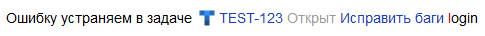
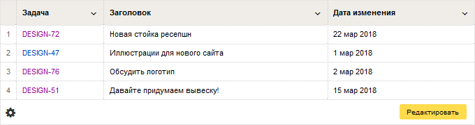

# Задачи из {{ tracker-full-name }}



[{{ tracker-full-name }}]({{ link-tracker }}) — это сервис для управления проектами и процессами. Подробнее о возможностях сервиса читайте в [документации {{ tracker-full-name }}](../../tracker/).

Пользователи {{ tracker-full-name }} могут размещать на страницах {{ wiki-name }} ссылки на отдельные задачи или списки задач.


## Ссылка на задачу {#ticket}

На [страницах, созданных в новом и старом редакторах](../pages-types.md) вы можете вставлять _магические ссылки_ на отдельные задачи. Такие ссылки всегда содержат ключ, название, статус задачи и логин исполнителя. Чтобы вставить ссылку на задачу, скопируйте ее ключ и вставьте в текст страницы. 

Пример:

Разметка | Результат
----- | -----
``` Ошибку устраняем в задаче TEST-123 ``` | 

## Список задач {#ticket-list}

С помощью блока `not_var{{tasks}}` вы можете разместить на странице, созданной в старом редакторе, автоматически сформированный список задач. Например:

```
{{tasks url="<адрес_фильтра_или_очереди>"}}
```

* Чтобы вывести все задачи очереди, в параметре `url` укажите ее [ключ](../../tracker/manager/create-queue.md#key) или ссылку из адресной строки браузера.

* Чтобы вывести [фильтр](../../tracker/user/create-filter.md) задач, в параметре `url` укажите ссылку на фильтр из адресной строки браузера. 

    

    Параметр `url` блока `tasks` не поддерживает символ `"`. Если в ссылке на фильтр из адресной строки встречается такой символ, замените его на `%22`.

    

### Список задач с параметрами {#tasks-vars}

С помощью динамических таблиц вы можете разместить на странице {{ wiki-name }} список задач и их основные параметры:

1. [Создайте](../create-grid.md) динамическую таблицу.

1. Создайте столбец с типом данных  **Задача в {{ tracker-name }}**.

1. Добавьте необходимое количество строк и перечислите в них ключи задач.

1. Создайте дополнительные столбцы. В качестве типа данных выберите  **Параметры задачи**: например, **{{ ui-key.beta-wiki.blocks_common_newgrid.blocks_b-grid-table-head.title }}**, **{{ ui-key.beta-wiki.blocks_common_newgrid.blocks_b-grid-table-head.author }}** или **{{ ui-key.beta-wiki.blocks_common_newgrid.blocks_b-grid-table-head.type }}** задачи.

1. Сохраните таблицу.

В результате столбцы с параметрами задач заполнятся автоматически. Полученную таблицу можно [разместить на странице {{ wiki-name }}](../add-grid.md).

Пример:



