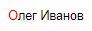
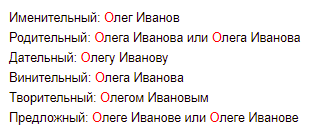
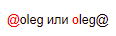

# Ссылки на сотрудников и текущая дата

В {{ wiki-name }} можно добавить ссылку на профиль сотрудника на Стаффе. Если навести указатель на такую ссылку, откроется краткая информация и фото пользователя. Чтобы добавить такую ссылку, нужно [указать логин](#staff-ref) сотрудника.

Если вы хотите добавить на страницу ссылку на профиль авторизованного пользователя или текущую дату, используйте [макросы](#macroses).

## Ссылки на Стафф {#staff-ref}

* Чтобы добавить ссылку на сотрудника на Стаффе, после текста `staff:` укажите его логин:

    `staff:{{ username-oleg }}`

    

    

    



* Чтобы имя и фамилия сотрудника выводились в определенном падеже, укажите перед логином соответствующий падежу текст:

    ```
    Именительный: кто:{{ username-oleg }}
    Родительный: укого:{{ username-oleg }} или ского:{{ username-oleg }}
    Дательный: кому:{{ username-oleg }}
    Винительный: кого:{{ username-oleg }}
    Творительный: кем:{{ username-oleg }}
    Предложный: ком:{{ username-oleg }} или оком:{{ username-oleg }}
    ```

    

    

        



* Чтобы ссылка выглядела как логин сотрудника с символом `@`, используйте синтаксис `@login` или `login@`: 

    ```
    @{{ username-oleg }} или {{ username-oleg }}@
    ```

    

    

    

* Если рядом с символом `@` вместо логина указать название рассылки (например, `tools-dev`), ссылка будет вести на результаты поиска в интранете.

## Макросы: имя пользователя и дата {#macroses}

Макрос — это действие, которое выполняется на странице после ее сохранения. В отличие от элементов вики-разметки, после сохранения страницы макрос заменяется на свое значение в исходном тексте.

Разметка макроса | Значение | Разметка после сохранения |
--- | --- | ---
`::::` | Имя авторизованного пользователя | `staff:{{ username-oleg }}`
`::@::` | Имя авторизованного пользователя и текущая дата в формате `/DD.MM.YYYY hh:mm/` | `staff:{{ username-oleg }} /16.12.2021 21:25/`
`::+::` | Текущая дата в формате `/DD.MM.YYYY hh:mm/` | `/16.12.2021 21:25/`



Макросы не работают в [динамических таблицах](../create-grid.md) и в комментариях к странице.

