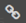

# Вставить изображение

Вставить изображение на страницу можно из буфера обмена, по ссылке с внешнего ресурса или из загруженных на {{ wiki-name }} файлов. Дополнительные параметры вставки изображений описаны в разделе [{#T}](static-markup/files.md).


## Вставить изображение из буфера обмена {#clipboard}

1. Скопируйте изображение в буфер обмена:

    - скопируйте рисунок из графического редактора или сделайте снимок экрана;

    - скопируйте рисунок с веб-страницы;

    - скопируйте файл с изображением из файлового менеджера на вашем компьютере.

    

    Копируйте изображения по одному. {{ wiki-name }} не поддерживает вставку нескольких изображений одновременно.

    

1. Откройте вики-страницу и нажмите кнопку **Редактировать**.

1. Вставьте в текст страницы изображение из буфера обмена. 

Изображение будет автоматически загружено на {{ wiki-name }}, а ссылка на изображение появится в тексте страницы. Также оно будет доступно в списке прикрепленных файлов на панели слева .

## Вставить изображение по ссылке {#link}

Если изображение размещено на веб-ресурсе:

1. Откройте страницу {{ wiki-name }} и нажмите кнопку **Редактировать**.

1. Скопируйте ссылку на изображение.

1. Вставьте ссылку на страницу с помощью разметки:
 
    ```
    
    ```

Например:

Разметка | Результат
--- | ---
`` | 



Если вы вставите в текст страницы ссылку на изображение без элементов разметки, на странице отобразится изображение без альтернативного текста.



## Вставить изображение, которое уже загружено на {{ wiki-name }} {#attach}

1. Загрузите изображение на страницу.

    1. На панели слева нажмите значок .

    1. Нажмите кнопку **Выберите файл**.

    1. Загрузите нужный файл или файлы.

    1. Список всех загруженных файлов будет доступен на панели слева на вкладке .

1. Откройте страницу и нажмите кнопку **Редактировать**.

1. Скопируйте ссылку на изображение:

    1. На панели слева откройте список загруженных файлов ().

    1. Наведите курсор на файл и нажмите значок .

    1. Появится надпись **Ссылка на файл скопирована**. Теперь вы можете вставить ее в текст страницы.

1. Вставьте ссылку на страницу. Например:

    ```
    200x0:/users/login/.files/image.png
    ```


#### См. также

* [{#T}](attach-file.md)

* [{#T}](add-grid.md)

* [{#T}](basic-markup.md)