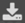

# Прикрепить файл к странице

Вы можете загрузить на страницу файл и разместить в тексте ссылку на скачивание.

Чтобы загрузить файл на страницу:

1. На панели слева нажмите значок .

1. Нажмите кнопку **Выберите файл**.

1. Загрузите нужный файл или файлы.

1. Список всех загруженных файлов будет доступен на панели слева на вкладке .

## Как вставить ссылку на файл {#paste-link}

1. На панели слева откройте список загруженных файлов ().

1. Наведите курсор на файл и нажмите значок .

1. Появится надпись **Ссылка на файл скопирована**. Теперь вы можете вставить ее в текст страницы.



Если таким образом вставить ссылку на изображение, вместо ссылки на странице отобразится само изображение. 


 
## Как скачать файл {#download}

1. На панели слева откройте список загруженных файлов ().

1. Наведите курсор на файл и нажмите значок .

#### См. также

- [{#T}](add-image.md)

- [{#T}](add-grid.md)