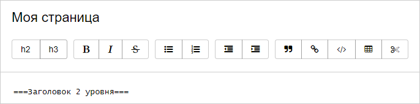
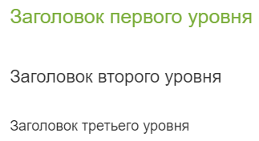
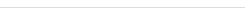
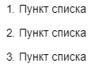
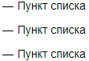
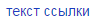
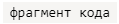
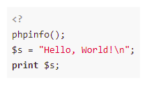

# Форматировать текст

Чтобы форматировать текст [страницы](pages-types.md#page) или [динамической таблицы](pages-types.md#grid), используются специальные символы — элементы разметки. С помощью разметки можно выделить текст полужирным шрифтом или курсивом, добавить на страницу заголовки и списки, вставить ссылки, изображения, таблицы и так далее.

Вы можете добавлять элементы разметки на страницу с помощью [панели форматирования](#buttons) или вводить [символы разметки](#markup) с клавиатуры. Результат можно увидеть справа на панели просмотра.

## Панель форматирования {#buttons}

При редактировании страницы, созданной в старом редакторе, используйте панель форматирования, чтобы добавить в текст часто используемые элементы разметки. 



Существует два способа работы с панелью форматирования:

- Чтобы добавить в текст элемент разметки, поставьте курсор в нужную позицию и нажмите кнопку на панели форматирования. В тексте появится шаблон разметки, добавьте в него ваш текст. Если вы нажали кнопку **Создать ссылку** или **Вставить код**, в появившемся окне введите ваш текст и нажмите кнопку **{{ ui-key.beta-wiki.blocks_common_desktop.blocks_w-page-setting.add }}**.

- Чтобы форматировать текст, который уже добавлен на страницу, выделите фрагмент текста и нажмите кнопку на панели форматирования.

Чтобы отменить форматирование текста, удалите символы разметки вручную.



Вы можете заметить, что с помощью кнопок в текст добавляются символы разметки, которые отличаются от разметки Markdown. Такая разметка поддерживается наряду с Markdown и корректно отображается на странице.



## Элементы разметки {#markup}

{{ wiki-name }} поддерживает [разметку Markdown]({{ link-about-markdown }}) с дополнительными элементами форматирования, которых нет в стандартном синтаксисе Markdown.

В этом разделе приведены часто используемые элементы форматирования. Полный перечень поддерживаемых элементов см. в разделе [{#T}](static-markup.md).

Элемент | Разметка | Результат
--- | --- | ---
Заголовки | `# Заголовок первого уровня`<br/>`## Заголовок второго уровня`<br/>`### Заголовок третьего уровня` | 
Новый абзац | `Первая строка абзаца.`<br/>`Вторая строка абзаца.`<br/><br/>`Новый абзац.` | 
Горизонтальная линия | `---` | 
Полужирный текст | `**Полужирный текст**` | 
Курсив | `*Курсив*` | 
Подчеркнутый текст | `__Подчеркнутый текст__` | 
Зачеркнутый текст | `~~Зачеркнутый текст~~` | 
Выделенный текст | `??Выделенный текст??` | 
Красный текст | `!!Красный текст!!` | 
Цветной текст.<br/><br/>Поддерживаются цвета:<br/><br/><ul><li>`red`/`крас`/`красный`;</li><li>`green`/`зел`/`зеленый`;</li><li>`blue`/`син`/`синий`;</li><li>`grey`/`gray`/`сер`/`серый`;</li><li>`yellow`/`жел`/`желтый`;</li><li>`cyan`/`голуб`/`голубой`;</li><li>`orang`/`оранж`/`оранжевый`;</li><li>`violet`/`фиолет`/`фиолетовый`.</li></ul> | `!!(син)Текст синего цвета!!` | 
Нумерованный список | `1. Пункт списка`<br/>`2. Пункт списка`<br/>`3. Пункт списка` | 
Маркированный список | `- Пункт списка`<br/>`- Пункт списка`<br/>`- Пункт списка` | 
Ссылка | `[текст ссылки](http://example.com/)` | 
Изображение | `` | 
Цитирование | `>Текст цитаты` | 
Текст под катом | `<{Прочитать целиком`<br/>`Чтобы прочитать этот текст,`<br/>`нужно нажать ссылку "прочитать целиком".`<br/>`}>` | 
Код в строке | ``` `фрагмент кода` ``` | 
Блок кода |` ```php`<br/>`<?`<br/>`phpinfo();`<br/>`$s = "Hello, World!\n";`<br/>`print $s;`<br/>` ``` `| 


#### См. также

- [{#T}](add-image.md)

- [{#T}](add-grid.md)

- [{#T}](attach-file.md)

- [{#T}](actions/toc.md)