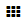

# Создать динамическую таблицу

_Динамическая таблица_ — таблица с возможностью задать тип данных столбца, отсортировать значения или сделать ячейку обязательной для заполнения. Вы можете использовать таблицу напрямую или [встроить ее в страницу {{ wiki-name }}](wysiwyg/tables-format.md#grid).

Вы можете создавать таблицы несколькими способами:

- [с любой страницы {{ wiki-name }}](#create-page), задав адрес новой таблицы вручную;

- [сразу в нужном разделе](#create-subpage), создав подстраницу;

- [в окне редактирования страницы](#add-table-in-page), нажав кнопку на верхней панели.



Максимальное количество страниц для одной организации — 10 000.


 

## Задать адрес таблицы вручную {#create-page}

Чтобы создать новую таблицу:

1. На панели слева нажмите  **Создать страницу**.

1. Выберите тип **{{ ui-key.beta-wiki.blocks_common_desktop.blocks_b-widget.grid }}**.

1. Задайте заголовок и адрес таблицы так же, как при [создании страницы](create-page.md).

1. Нажмите кнопку **{{ ui-key.beta-wiki.blocks_common_desktop.blocks_b-head.create }}**.

1. Заполните таблицу:

    

    1. В правом верхнем углу таблицы нажмите **+** **Добавить столбец**.

    1. Настройте параметры столбца:

        

    1. Для некоторых типов данный можно выбрать дополнительные настройки:
        
        * Для столбцов с типом данных **{{ ui-key.beta-wiki.blocks_common_newgrid.blocks_b-grid-table-head.checkbox }}** включите опцию **{{ ui-key.beta-wiki.blocks_common_newgrid.blocks_b-grid-table-head.mark_made }}**. В этом случае строки, отмеченные чекбоксом, отображаются серыми.

        * Для столбцов с типом данных **{{ ui-key.beta-wiki.blocks_common_newgrid.blocks_b-grid-table-head.list }}** включите опцию **Разрешить выбор нескольких вариантов**. В этом случае список будет заменен на множественный.

        * Для столбцов с типом данных **{{ ui-key.beta-wiki.blocks_common_newgrid.blocks_b-grid-table-head.employee }}** включите опцию **Разрешить выбор нескольких пользователей**. В этом случае будет доступен выбор нескольких сотрудников.

    1. Выберите **{{ ui-key.beta-wiki.blocks_common_newgrid.blocks_b-grid-table-head.add }}**.

    

    После создания столбца нельзя отредактировать **{{ ui-key.beta-wiki.blocks_common_newgrid.blocks_w-grid-preview.data_type }}** и **Уникальный идентификатор**.

    

    

    

    Чтобы создать новую строку, внизу таблицы нажмите  **Добавить строку**.

    

    

    

    

## Создать подстраницу в разделе {#create-subpage}

Вы можете создать таблицу сразу в нужном разделе:

1. Перейдите в раздел, в котором хотите создать таблицу.

1. Создать таблицу в разделе можно двумя способами:

    * В меню  **{{ ui-key.beta-wiki.blocks_common_newgrid.blocks_b-grid-table-options.tree }}** справа от названия страницы нажмите  **{{ ui-key.beta-wiki.blocks_common_desktop.blocks_b-page-more-panel.create_page }}**.

    * На странице раздела в правом верхнем углу страницы нажмите  **Действия** и выберите **{{ ui-key.beta-wiki.blocks_common_desktop.blocks_b-page-more-panel.create_page }}**.

1. Выберите тип **{{ ui-key.beta-wiki.blocks_common_desktop.blocks_b-widget.grid }}**.

1. Придумайте название.

1. Поле **{{ ui-key.beta-wiki.blocks_common_desktop.blocks_b-action-delete.table_address }}** заполнится автоматически. При необходимости вы можете изменить адрес страницы вручную.

1. Нажмите кнопку **{{ ui-key.beta-wiki.blocks_common_desktop.blocks_b-head.create }}**.

## Добавить в окне редактирования страницы {#add-table-in-page}

Чтобы создать таблицу и разместить ее в тексте страницы:

1. Откройте страницу, на которую хотите вставить новую таблицу, и нажмите кнопку **{{ ui-key.beta-wiki.blocks_common_newgrid.blocks_b-grid-table.edit }}**.

1. На верхней панели нажмите значок . В тексте появится [код таблицы](actions/grid-reference.md):
    `{{grid page="{{ wiki-pagename }}/grid-2021-01-24t163048" width="100%"}}`.
    Созданная таблица станет подразделом текущей страницы.

1. Сохраните страницу.

1. [Заполните таблицу](edit-grid-wysiwyg.md).

#### См. также

- [Как вставить простую таблицу](wysiwyg/tables-format.md#simple-table)

- [{#T}](edit-grid-wysiwyg.md)

- [{#T}](create-page.md)

- [{#T}](delete-page.md)

