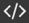

# Отредактировать динамическую таблицу

Чтобы изменить [динамическую таблицу](pages-types.md#grid), откройте ее и в правом нижнем углу нажмите кнопку **Редактировать**.

## Редактировать содержимое ячеек таблицы {#edit-cell}

Выберите ячейку и введите текст. Используйте [разметку Markdown](basic-markup.md) для форматирования текста. Чтобы перейти на новую строку внутри ячейки, нажмите [сочетание клавиш](#shortcuts) **Shift** + **Enter**.

Чтобы сохранить изменения, нажмите кнопку **Завершить**. Каждый раз, когда вы сохраняете таблицу, ее копия помещается в [историю изменений](history.md#grid). С помощью истории вы всегда сможете просмотреть все прежние версии таблицы, сравнить их друг с другом или вернуться к любой из них.

## Настроить параметры столбцов таблицы {#column-params}

1. В верхней ячейке столбца нажмите значок **≡**.

1. Во всплывающем окне измените параметры столбца:

    * В поле сверху введите заголовок столбца.

    * Укажите ширину столбца в процентах от ширины таблицы или в пикселях.
    
    * Чтобы сделать ячейки столбца обязательными к заполнению, включите опцию **Обязательный**.
    
    * Для столбцов с типом данных **Чекбокс** включите опцию **Помечать сделанным**. В этом случае строки, отмеченные чекбоксом, отображаются серыми.

1. Нажмите кнопку **Изменить**, чтобы сохранить изменения.

## Переместить столбец внутри таблицы {#column-transfer}

Чтобы переместить столбец:

1. В правом верхнем углу таблицы нажмите значок .

1. В настройках таблицы выберите  **Настроить столбцы**.

1. В списке выберите название столбца, нажмите значок  и перетащите.



Вы можете перенести только один столбец за раз.

 

## Добавить и удалить столбцы {#edit-column}

Чтобы добавить столбец:

1. В правом верхнем углу таблицы нажмите значок **+**.

1. Настройте параметры столбца:
    
    * В поле сверху введите заголовок столбца.
    
    * В раскрывающемся списке выберите допустимый [тип данных](#data-types) для ячеек столбца. После сохранения тип данных изменить нельзя.
    
    * Укажите ширину столбца в процентах от ширины таблицы или в пикселях.
    
    * Чтобы сделать ячейки столбца обязательными к заполнению, включите опцию **Обязательный**.
    
    * Для столбцов с типом данных **Чекбокс** включите опцию **Помечать сделанным**. В этом случае строки, отмеченные чекбоксом, отображаются серыми.

1. Нажмите кнопку **Добавить**.

Чтобы удалить столбец:

1. В верхней ячейке столбца нажмите значок **≡**.

1. Нажмите кнопку **Удалить столбец**.

### Типы данных {#data-types}

Укажите тип данных для ячеек в столбце таблицы:

* **Текст**. Любой текст, оформленный с помощью [разметки Markdown](basic-markup.md).

* **Число**. 

* **Чекбокс**. Поле, в котором можно поставить отметку. Чтобы отметить всю строку, включите опцию **Помечать сделанным**. В этом случае строки, отмеченные чекбоксом, отображаются серыми.

* **Дата**.

* **Список**. Поле для выбора одного значения из предложенных вариантов.

* **Множественный список**. Поле для выбора нескольких значений из предложенных вариантов.

* **Сотрудник**. Имя и фамилия сотрудника, а также ссылка на его профиль в стаффе.

* **Несколько сотрудников**. Имена и фамилии для списка сотрудников, а также ссылки на их профили в стаффе.

* **Задача в {{ tracker-name }}**. Ключ задачи, который будет работать как ссылка в {{ tracker-name }}.



Тип данных можно выбрать только при создании столбца. 



## Добавить и удалить строки {#edit-line}

* Чтобы добавить строку, выберите **Добавить строку** внизу страницы.

* Чтобы удалить строку, наведите на нее курсор и нажмите значок  справа от строки.

## Переименовать таблицу {#rename-tab}



Переименовывать таблицу можно не переходя в режим редактирования. Для этого нажмите на название вверху страницы и введите новое.



1. На панели слева нажмите значок .

1. Задайте новое название таблицы.

1. Нажмите кнопку **Сохранить**.

## Отсортировать строки таблицы {#sort-line}

Строки динамической таблицы можно быстро отсортировать по любому из столбцов:
    
1. Чтобы отсортировать строки по значениям одного из столбцов, нажмите на заголовок столбца.

1. Чтобы отсортировать строки в обратном порядке, нажмите на заголовок столбца еще раз.

## Сортировать по нескольким столбцам одновременно {#sort-multi-column}

Вы можете задать несколько сортировок одновременно. Сортировки задаются в порядке убывания приоритета.

Чтобы создать новую сортировку:

1. На панели слева нажмите значок .

1. Нажмите **Добавить сортировку**.

1. Выберите столбец и порядок сортировки.

## Фильтровать таблицу {#filter}

Вы можете задать условия отображения строк или столбцов в таблице, если она встроена на вики-страницу при помощи [динамического блока `grid`](actions/grid-reference.md).

Чтобы отфильтровать таблицу:

1. Получите код динамической таблицы. Для этого на панели слева нажмите значок .

1. Скопируйте код и вставьте на вики-страницу.

1. Укажите условия фильтрации:

    * Чтобы настроить отображение строк, используйте [параметр `filter`](actions/grid-reference.md#row-filter).
    
    * Чтобы настроить отображение столбцов, используйте [параметр `column`](actions/grid-reference.md#col-filter).

## Сочетания клавиш в динамических таблицах {#shortcuts}

Используйте сочетания клавиш, чтобы управлять данными в динамических таблицах.

**Действие** | **Windows, Linux** | **MacOS**
--- | --- | --- |
Добавление строки | **Ctrl** + **Enter** | **⌘** + **Enter**
Сохранение строки | **Enter** | **Enter**
Выход из режима редактирования | **Esc** | **Esc**
Перемещение между столбцами | **Tab** | **Tab**
Обратное перемещение между столбцами | **Shift** + **Tab** | **Shift** + **Tab**
Перемещение между ячейками | **Ctrl** + **→** **←** **↑** **↓** | **⌘** + **→** **←** **↑** **↓**
Перемещение в начало строки | **Home** (нажать дважды) | —
Перемещение в конец строки | **End** (нажать дважды) | —
Перемещение в начало ячейки | **↑** | **↑**
Перемещение в конец ячейки | **↓** | **↓**
Новая строка внутри ячейки | **Shift** + **Enter** | **Shift** + **Enter** 
Поставить галочку в ячейке с типом **Чекбокс** | **Space** | **Space**

#### См. также

* [{#T}](create-grid.md)

* [{#T}](add-grid.md)

* [{#T}](import-page.md)
